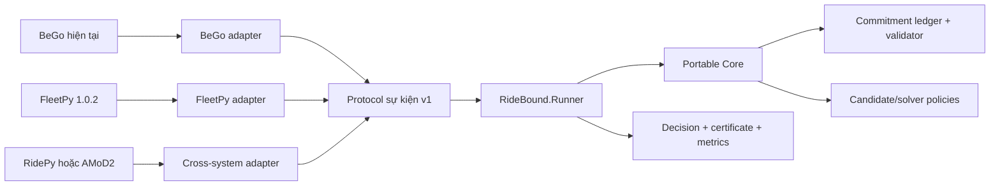

# RideBound — bản đồ tài liệu

> Trạng thái: WP0–WP10 hoàn thành; WP9 là kết quả confirmatory âm dưới `H6`, WP10 là negative Layer 3 capability result
> Cập nhật: 2026-08-23
> Nguồn sự thật về tiến độ: [18-status-and-decision-log.md](18-status-and-decision-log.md)

## 1. Mục đích của bộ tài liệu

RideBound là một hệ thống độc lập để nghiên cứu **ridepooling trực tuyến có giới hạn thay đổi lời hứa**. Hệ thống vẫn có thể gắn vào BeGo, nhưng phần lõi phải chạy được trong BeGo, FleetPy và ít nhất một simulator độc lập khác mà không viết lại thuật toán.

Bộ tài liệu này trả lời năm câu hỏi:

1. BeGo hiện tại có gì và thiếu gì?
2. Câu hỏi nghiên cứu nào còn bảo vệ được sau khi đối chiếu paper, patent và sản phẩm?
3. Mô hình toán, thuật toán, dữ liệu và tiêu chí đánh giá là gì?
4. Cần xây những project, adapter, API, bảng dữ liệu và test nào?
5. Agent hoặc thành viên tiếp theo phải đọc gì, làm gì và cập nhật ở đâu?

Đây là **kế hoạch thực thi**, không phải tuyên bố rằng các hạng mục đã được cài đặt.

## 2. Câu hỏi nghiên cứu một câu

> Trong ridepooling trực tuyến, liệu có thể nhận và chèn thêm yêu cầu vào các xe đang hoạt động, đồng thời giới hạn có chứng nhận tổng số lần và tổng mức độ thay đổi các lời hứa đã phát cho từng hành khách, mà không làm giảm đáng kể tỷ lệ phục vụ và hiệu quả vận hành?

“Lời hứa” gồm ETA đón/trả, xe được gán, điểm đón/trả và thứ tự phục vụ. “Có chứng nhận” nghĩa là mỗi quyết định phải kèm bằng chứng máy kiểm tra được về ngân sách còn lại hoặc chỉ ra chính xác vi phạm.

## 3. Phạm vi được khóa

### Trong phạm vi

- Yêu cầu đến theo thời gian và xe đang di chuyển.
- Chèn yêu cầu mới vào phần route chưa chạy.
- Lưu toàn bộ chuỗi lời hứa sau khi yêu cầu được chấp nhận.
- Ngân sách thay đổi nhiều chiều theo từng hành khách.
- Ràng buộc capacity, time window, maximum ride time và prefix đã thực thi.
- So sánh cùng codebase, trong FleetPy và trong ít nhất một simulator độc lập.
- Đánh giá ổn định vận hành; không tự suy diễn mức hài lòng của người dùng.

### Ngoài phạm vi v1

- Chứng minh fairness theo nhóm nhạy cảm khi không có nhãn thật.
- Học “mức chịu thay đổi” của người dùng từ dữ liệu giả.
- Pricing, incentive, strategic behavior hoặc market equilibrium.
- Multi-hop transfer giữa nhiều xe.
- Dự báo nhu cầu bằng deep learning như đóng góp chính.
- Thay thế toàn bộ chức năng chọn địa điểm đi chơi hiện tại của BeGo.

## 4. Thứ tự đọc bắt buộc

### Thành viên hoặc agent mới

1. Tài liệu này.
2. [01-research-charter.md](01-research-charter.md).
3. [02-current-system-audit.md](02-current-system-audit.md).
4. [18-status-and-decision-log.md](18-status-and-decision-log.md).
5. Work package hiện hành trong [16-roadmap-and-work-packages.md](16-roadmap-and-work-packages.md).
6. Tài liệu chuyên môn liên quan đến phần sẽ sửa.

### Người làm thuật toán

- [04-problem-model-and-notation.md](04-problem-model-and-notation.md)
- [07-commitment-ledger-and-certificates.md](07-commitment-ledger-and-certificates.md)
- [08-algorithms-baselines-and-solver.md](08-algorithms-baselines-and-solver.md)
- [11-metrics-statistics-and-preregistration.md](11-metrics-statistics-and-preregistration.md)

### Người làm hệ thống

- [05-portable-core-architecture.md](05-portable-core-architecture.md)
- [06-event-contract-and-determinism.md](06-event-contract-and-determinism.md)
- [14-bego-integration-api-persistence-ux.md](14-bego-integration-api-persistence-ux.md)
- [15-testing-reproducibility-and-quality-gates.md](15-testing-reproducibility-and-quality-gates.md)

### Người làm benchmark

- [09-three-layer-evaluation.md](09-three-layer-evaluation.md)
- [10-data-scenarios-and-demand-replay.md](10-data-scenarios-and-demand-replay.md)
- [11-metrics-statistics-and-preregistration.md](11-metrics-statistics-and-preregistration.md)
- [12-fleetpy-adapter.md](12-fleetpy-adapter.md)
- [13-cross-system-adapters.md](13-cross-system-adapters.md)

## 5. Danh mục tài liệu

| Tệp | Nội dung chính |
|---|---|
| [01-research-charter.md](01-research-charter.md) | Bối cảnh, giả thuyết, đóng góp và ranh giới claim |
| [02-current-system-audit.md](02-current-system-audit.md) | Hiện trạng BeGo, khoảng cách tới bài toán online |
| [03-related-work-and-claim-boundary.md](03-related-work-and-claim-boundary.md) | Paper trực tiếp, phần đã cũ, phần còn mới |
| [04-problem-model-and-notation.md](04-problem-model-and-notation.md) | Đầu vào, đầu ra, mô hình toán và bất biến |
| [05-portable-core-architecture.md](05-portable-core-architecture.md) | Cấu trúc project, dependency và portable core |
| [06-event-contract-and-determinism.md](06-event-contract-and-determinism.md) | Protocol NDJSON, event, replay và hash |
| [07-commitment-ledger-and-certificates.md](07-commitment-ledger-and-certificates.md) | Ledger, ngân sách, phân rã revision, certificate |
| [08-algorithms-baselines-and-solver.md](08-algorithms-baselines-and-solver.md) | Baseline, RideBound, candidate pool, OR-Tools |
| [09-three-layer-evaluation.md](09-three-layer-evaluation.md) | Ba lớp bằng chứng và quy tắc so sánh công bằng |
| [10-data-scenarios-and-demand-replay.md](10-data-scenarios-and-demand-replay.md) | Dữ liệu thật/công khai/tổng hợp và giới hạn suy luận |
| [11-metrics-statistics-and-preregistration.md](11-metrics-statistics-and-preregistration.md) | Metric, CI, kiểm định, non-inferiority |
| [12-fleetpy-adapter.md](12-fleetpy-adapter.md) | Adapter FleetPy 1.0.2 |
| [13-cross-system-adapters.md](13-cross-system-adapters.md) | RidePy, AMoD2, AMoDeus, OpenRidepoolSimulator |
| [14-bego-integration-api-persistence-ux.md](14-bego-integration-api-persistence-ux.md) | API, database, SignalR và UI |
| [15-testing-reproducibility-and-quality-gates.md](15-testing-reproducibility-and-quality-gates.md) | Test pyramid và artifact tái lập |
| [16-roadmap-and-work-packages.md](16-roadmap-and-work-packages.md) | Lộ trình và điều kiện hoàn thành từng gói |
| [17-agent-operating-manual.md](17-agent-operating-manual.md) | Cách agent tiếp tục công việc an toàn |
| [18-status-and-decision-log.md](18-status-and-decision-log.md) | Tiến độ sống, quyết định, blocker |
| [19-requirement-traceability.md](19-requirement-traceability.md) | Truy vết yêu cầu → thiết kế → test → bằng chứng |
| [20-risks-and-scope-control.md](20-risks-and-scope-control.md) | Risk register và cơ chế dừng |
| [21-paper-to-design-evidence.md](21-paper-to-design-evidence.md) | Paper nào ảnh hưởng quyết định nào |
| [22-glossary.md](22-glossary.md) | Giải thích thuật ngữ bằng tiếng Việt |
| [23-delivery-backlog-and-ticket-policy.md](tasks/23-delivery-backlog-and-ticket-policy.md) | Quy tắc topic/ticket, DoR/DoD và cách chọn việc tiếp theo |
| [24-wp1-contracts-ticket-plan.md](tasks/24-wp1-contracts-ticket-plan.md) | 15 ticket WP1 có scope, rules, BDD và acceptance criteria |
| [25-wp2-online-state-refinement.md](tasks/25-wp2-online-state-refinement.md) | Ticket refinement WP2; khóa state/reducer/B1 trước khi viết code |
| [26-wp2-online-baseline-ticket-plan.md](tasks/26-wp2-online-baseline-ticket-plan.md) | Ordered queue WP2 cho state/reducer/validator/B1/oracle/demo |
| [27-wp3-ledger-certificate-refinement.md](tasks/27-wp3-ledger-certificate-refinement.md) | Ticket refinement WP3; khóa promise/ledger/budget/lock/certificate/checkpoint trước code |
| [28-wp3-ledger-certificate-ticket-plan.md](tasks/28-wp3-ledger-certificate-ticket-plan.md) | Ordered queue 14 ticket WP3; trạng thái/evidence promise, ledger, budget, lock, incident, certificate và checkpoint |
| [29-wp4-algorithms-solver-refinement.md](tasks/29-wp4-algorithms-solver-refinement.md) | Ticket refinement WP4; khóa schedule/candidate/objective/solver/fallback trước production code |
| [30-wp4-algorithms-solver-ticket-plan.md](tasks/30-wp4-algorithms-solver-ticket-plan.md) | Ordered queue WP4 `002..014`; source hiện hành cho policies/solver implementation |
| [31-wp5-bego-integration-refinement.md](tasks/31-wp5-bego-integration-refinement.md) | Refinement-only WP5; khóa adapter/persistence/transaction/paired Layer-1 trước implementation |
| [32-wp5-bego-integration-ticket-plan.md](tasks/32-wp5-bego-integration-ticket-plan.md) | Ordered queue WP5 `002..014`; durable adapter/EF/Runner/outbox/recovery/paired replay |
| [33-wp6-common-benchmark-harness-refinement.md](tasks/33-wp6-common-benchmark-harness-refinement.md) | Ticket refinement-only WP6; khóa scenario/result/metric/bundle boundary trước implementation |
| [34-wp6-common-benchmark-harness-ticket-plan.md](tasks/34-wp6-common-benchmark-harness-ticket-plan.md) | Ordered queue WP6 `002..014`; schema, dataset, plan, Runner, result, metric, bundle và audit |
| [35-wp7-fleetpy-layer2-refinement.md](tasks/35-wp7-fleetpy-layer2-refinement.md) | Refinement Candidate core + FleetPy Layer 2; paper/oracle gate, callback/position/plan/same-Runner contract và capability preflight |
| [36-wp7-fleetpy-layer2-ticket-plan.md](tasks/36-wp7-fleetpy-layer2-ticket-plan.md) | Ordered queue WP7 `002..014`; Candidate portfolio, pin/env, mapping, Runner client, FleetControl, plan/lock, preflight và closed loop |
| [37-wp8-pilot-and-preregistration-refinement.md](tasks/37-wp8-pilot-and-preregistration-refinement.md) | WP8 refinement: ba khoảng trống còn lại, grid từ dữ liệu thật, tách pilot/confirmatory, vấn đề synthetic budget và phương pháp non-inferiority |
| [38-wp8-pilot-and-preregistration-ticket-plan.md](tasks/38-wp8-pilot-and-preregistration-ticket-plan.md) | Ordered queue WP8 `002..014`; grid manifest, pilot execution, variance/power, budget derivation, margin, preregistration freeze và leakage audit |
| [39-wp9-main-experiment-ticket-plan.md](tasks/39-wp9-main-experiment-ticket-plan.md) | WP9 `001..009` đã đóng; freeze H6, audited execution, exact negative result, robustness, reproducibility và post-outcome breach bridge |
| [40-wp10-ridepy-layer3-ticket-plan.md](tasks/40-wp10-ridepy-layer3-ticket-plan.md) | WP10 `001..010` đã đóng; canonical pass nhưng paired subset fail closed do giới hạn RidePy `nodeOnly` concurrent mid-edge |
| [wp7-014-fleetpy-layer2-closure-evidence-2026-08-15.md](benchmarking/wp7-014-fleetpy-layer2-closure-evidence-2026-08-15.md) | Historical Runner v6 receipt: actual FleetPy B1/C1 preflight/tiny/medium evidence, verifier và claim boundary |
| [wp7-015-hot-path-and-semantics-closure-evidence-2026-08-17.md](benchmarking/wp7-015-hot-path-and-semantics-closure-evidence-2026-08-17.md) | ADR-039: ngữ nghĩa được khóa, đo hot path, work-profile gate, cross-binary differential và receipt hiện hành trên Runner v8 |
| [wp8-001-pilot-operating-point-evidence-2026-08-19.md](benchmarking/wp8-001-pilot-operating-point-evidence-2026-08-19.md) | Pilot WP8: điểm vận hành cũ không phân biệt được, endpoint pickup-ETA bị loại, đánh đổi dịch vụ xuất hiện |
| [wp8-002-paired-benchmark-report-2026-08-19.md](benchmarking/wp8-002-paired-benchmark-report-2026-08-19.md) | Báo cáo benchmark paired WP8: cấu hình, dữ liệu thật, hai điểm vận hành, bảng 4 đơn vị, lý do từ chối, giới hạn claim |
| [wp8-011c-pre-outcome-runner-artifact-repin.md](benchmarking/wp8-011c-pre-outcome-runner-artifact-repin.md) | Amendment pre-outcome: sửa stale Runner pin, bind DLL và toàn publish tree, không đổi thiết kế |
| [wp8-011d-pre-outcome-capacity-stratum-amendment.md](benchmarking/wp8-011d-pre-outcome-capacity-stratum-amendment.md) | Amendment pre-outcome: Panel B `veh4` tách bạch cạnh Panel A `veh8`, đo được cùng demand realization, kết luận có điều kiện theo năng lực |
| [wp8-014-closure-evidence-2026-08-21.md](benchmarking/wp8-014-closure-evidence-2026-08-21.md) | WP8 closure: frontier, fixed panel, verifier/oracle, four pre-outcome amendments và current freeze H4 |
| [wp9-confirmatory-result-2026-08-23.md](benchmarking/wp9-confirmatory-result-2026-08-23.md) | Kết quả confirmatory H6: service gate FAIL ở cả panel 8 xe và 4 xe; burden gate PASS nhưng phần lớn do khóa/từ chối phục vụ |
| [wp9-reproducibility-evidence-2026-08-23.md](benchmarking/wp9-reproducibility-evidence-2026-08-23.md) | Kiểm chứng độc lập 100/100 bundle, freeze/provenance/input identity, determinism và solver-seed non-replicate |
| [wp9-009-breach-evidence-2026-08-23.md](benchmarking/wp9-009-breach-evidence-2026-08-23.md) | Evidence 1.1 và ledger bridge cho breach chất lượng dịch vụ ngoại sinh; chỉ là closure hậu outcome, không đổi verdict H6 |
| [wp10-ridepy-layer3-negative-capability-result-2026-08-23.md](benchmarking/wp10-ridepy-layer3-negative-capability-result-2026-08-23.md) | WP10: exact RidePy/same-Runner canonical pass; representative subset fail closed, Layer 3 claim chưa được thiết lập |
| [post-wp10-exact-reuse-optimization-2026-08-23.md](benchmarking/post-wp10-exact-reuse-optimization-2026-08-23.md) | ADR-052: full-PDF optimization boundary, exact cache-key reuse, 3+3 process benchmark và semantic-equivalence gate |
| [wp6-contract-v1.md](benchmarking/wp6-contract-v1.md) | Equivalent contract v1 cho common benchmark harness, public data và reproduction bundle |
| [wp6-benchmark-reproducibility-evidence-2026-08-09.md](research/wp6-benchmark-reproducibility-evidence-2026-08-09.md) | Primary-source evidence và claim boundary cho WP6 |
| [reviews/wp1-wp3/README.md](reviews/wp1-wp3/README.md) | Review chi tiết code, invariant, tối ưu thật và khoảng trống WP1–WP3 |
| [reviews/wp1-wp4-final/README.md](reviews/wp1-wp4-final/README.md) | Final logic/code/paper/evidence review WP1–WP4; thay thế trạng thái cũ của review WP1–WP3 |
| [reviews/wp1-wp5-final/README.md](reviews/wp1-wp5-final/README.md) | Final source/logic/optimization/claim review WP1–WP5 và verdict có điều kiện |
| [reviews/wp1-wp7-final/README.md](reviews/wp1-wp7-final/README.md) | Final Vietnamese source/logic/code walkthrough WP1–WP7, Candidate proof và FleetPy Layer 2 closure |
| [reviews/wp1-wp8-final/README.md](reviews/wp1-wp8-final/README.md) | Review hiện hành WP1–WP8: logic, defect đã sửa, determinism/fairness, residual claim boundary |
| [reviews/wp1-wp10-final/README.md](reviews/wp1-wp10-final/README.md) | Review hiện hành WP1–WP10: file inventory, WP-by-WP verdict, defect WP10 đã sửa, final verification và residual risks |
| [RideBound-WP1-WP10-final-review-2026-08-23.pdf](../output/pdf/RideBound-WP1-WP10-final-review-2026-08-23.pdf) | Báo cáo PDF 12 trang đã render/inspect: verdict, negative results, full-PDF provenance, benchmark, verification và residual risks |
| [reviews/wp1-wp6-final/README.md](reviews/wp1-wp6-final/README.md) | Handoff hiện hành: kiến trúc, logic, file map, paper, benchmark, risk và reproduction WP1–WP6 |
| [research/README.md](research/README.md) | Archive báo cáo, audit và evidence matrix nền |
| [wp5-distributed-integration-evidence-2026-08-05.md](research/wp5-distributed-integration-evidence-2026-08-05.md) | Paper/official evidence cho outbox, idempotency, worker lease và crash recovery WP5 |

## 6. Kiến trúc bằng một hình

Điểm quan trọng: ba môi trường phải gọi **cùng artifact** `RideBound.Runner`;
không chép lại thuật toán RideBound bằng Python hoặc C++.

## 7. Quy tắc nguồn sự thật

- Tiến độ và việc tiếp theo: `18-status-and-decision-log.md`.
- Claim học thuật: `01` và `03`.
- Công thức chuẩn: `04` và `07`.
- Protocol chuẩn: `06`.
- Baseline chuẩn: `08`.
- Tiêu chí đánh giá chuẩn: `09`–`11`.
- Nếu hai tài liệu mâu thuẫn, ghi một ADR/decision mới vào `18` trước khi sửa code.

## 8. Mốc hiện tại

- Repository độc lập: `https://github.com/tsunflowerr/RideBound`.
- WP0 scaffold bắt đầu với 7 source/2 test project; sau WP6 solution hiện có 9
  production source project và 9 test project.
- Required `dotnet test RideBound.slnx` hiện pass **840/840**, 0 fail/skip ngày
  2026-08-21; pinned FleetPy/Python suite pass **77/77**, không skip. Các count
  WP6/WP7 cũ được giữ trong evidence lịch sử, không dùng làm baseline hiện hành. Các lần
  `0x800711C7` trước đó được giữ trong `18` như historical environment evidence,
  không còn là blocker hiện tại.
- BeGo hiện đạt 154/154 backend pass, 0 skip ở cả Debug và Release
  `/warnaserror` trên fresh PostgreSQL + published Runner thật. Frontend đạt 9/9,
  lint/TypeScript/production build pass và npm audit không còn vulnerability.
- Đã có protocol/schema v1, canonical unit/JSON/hash, long-lived NDJSON runner,
  hello/init/event/error lifecycle, idempotent retry, đúng 10 golden fixture và
  source-controlled replay/hash proof.
- Đã có typed WP2 payload/schema/fixtures, Domain run/request/vehicle state,
  frozen-prefix/mutable-suffix route, Application atomic reducer/ack coordinator,
  independent physical validator, deterministic insertion/B1, exact-small
  oracle và default online produced Runner decision.
- Tiny four-epoch demo accept/board, capacity reject và drop/alight replay hai
  process sạch với exact final hash. Q1 structural oracle vẫn ở named
  conformance mode.
- Đã có WP3 promise ledger, hard vector budget/locks, incident/breach separation,
  independent combined validator, strict produced certificate/actions/schemas,
  Runner commitment mode và canonical checkpoint/restore.
- WP1 `RB-WP1-001..015` đã hoàn thành, Q1 đã đóng và exact-retry bug fix được
  khóa bởi ADR-017.
- WP2 `RB-WP2-001..012` đã hoàn thành phần physical/B1; ADR-018–020 khóa
  boundary, semantics và claim limit.
- WP3 `RB-WP3-001..014` đã hoàn thành bằng ADR-021/022. Demo commitment bốn
  epoch chạy hai process byte-exact, phát promise version 1→2, certificate
  `produced`, giữ three-way budget và restore checkpoint cho suffix giống replay
  từ genesis.
- Audit code không chỉ dựa vào test đã sửa thêm các lỗ hổng state-boundary,
  genesis route, integer exhaustion, certificate/publication binding, breach/
  ledger relation, pickup window và checkpoint reachability. Review chi tiết ở
  [reviews/wp1-wp3/README.md](reviews/wp1-wp3/README.md).
- ADR-023/024 và `RB-WP4-001..014` đã đóng WP4: shared bounded generation,
  slack/cache/hold/repair/plan-pool, B1–B5/C1/C2, portable multi-pass OR-Tools,
  validated fallback và Runner publication path. Independent evidence gồm
  64-seed B1 oracle, 64-seed actual OR-Tools differential và required suite
  557/557; synthetic performance chỉ là promising signal, chưa phải scale hay
  effectiveness claim. Final review ở
  [reviews/wp1-wp4-final/README.md](reviews/wp1-wp4-final/README.md).
- `RB-WP5-001..014` đã khóa ownership/transaction/recovery và hiện thực typed
  Application boundary, 11-table append-only EF/PostgreSQL foundation, T1
  idempotent intake/lease store, pinned long-lived Runner supervisor cùng
  canonical privacy-preserving bootstrap mapping/provenance và authenticated
  idempotent HTTP boundary, fenced T2/T3 recovery worker và outbox relay trong
  BeGo. Relay claim exact per-run head bằng DB-time lease, không giữ lock qua
  SignalR, publish stable sequence/message/hash envelope và client chặn duplicate/
  stale delivery. Audit read dùng exact `(sequence,id)` keyset, member ownership,
  operator-only raw evidence, append-log rebuild và privacy-safe export. Default-off
  rollout persist immutable Shadow/Live namespace; shadow không thể bị relay live
  publish sau restart/chuyển mode. Same-input B1/C1 đã chạy hai clean repeat/arm,
  exact certificate/checkpoint validation và self-verifying bundle. Independent
  evidence dùng process `FailFast` thật tại 8 decision + 4 outbox boundary, oracle
  16.384 transition steps, 2/3/4-worker PostgreSQL contention, 5/5 required mutant
  và raw bounded local curves; không có lost/duplicate committed effect hoặc orphan.
  Closure audit bổ sung subject-link append-only, outbox chọn absolute head rồi bắt
  head operation `Applied`, và concurrent scope riêng theo run; source/claim review kết luận không
  còn correctness blocker cho refinement WP6, nhưng chưa đủ bằng chứng SLA,
  effectiveness hay main experiment. Review ở
  [reviews/wp1-wp5-final/README.md](reviews/wp1-wp5-final/README.md). Refinement
  [RB-WP6-001](tasks/33-wp6-common-benchmark-harness-refinement.md) đã DONE bằng
  ADR-026/contract v1; `RB-WP6-002` đã hiện thực strict schemas/codecs/identity
  vectors; `RB-WP6-003` đã khóa/tải/xác minh FleetPy Manhattan public source, safe
  extract; `RB-WP6-004` đã tạo canonical tiny/medium FleetPy derivatives sau ADR-027
  hash-DAG correction; `005` đã đóng plan/seed/pairing compiler; ADR-028 + `006` đã
  đóng exact external Runner/resource supervisor. ADR-029 + `007` đã đóng append-only
  raw/terminal store, terminal conservation, crash recovery và authorized full-grid
  rerun. `008` đã đóng mechanical registry, production calculator, executable oracle
  không ProjectReference, chronology/cohort/window/resource state-machine và exact
  132-row/metric-set differential gate. ADR-031 + `009` đã đóng deterministic strict
  BagIt bundle, exact dirty-source/runtime/Runner/oracle/verifier provenance, raw
  transcript/terminal/grid/metric semantic verification và clean-process sidecar;
  required full solution đạt 688/688. ADR-032 + `010` đã đóng source-locked
  machine-readable claim profile, scoped Unicode-aware checker, builder-generated
  report và independent stage-10 recomputation; required full solution đạt 691/691.
  ADR-033 + `011` đã đóng tiny paired B1/C1 qua six-run exact Runner/store/oracle/
  strict-bundle chain ở hai clean Release process, có decision-induced delta thật,
  typed failure matrix và bundle mechanical-only được verifier độc lập xác nhận;
  required full solution đạt 705/705. ADR-034/contract `1.0.5` + `012` đã đóng medium
  FleetPy public derivative qua two-clean-root normalization và hai fresh Release
  B1/C1 × 3 exact Runner/store/oracle/strict-bundle process; semantic identities khớp,
  bundles external-verify valid, required full solution đạt 710/710. Instant-drain là
  nonphysical mechanics và không cho phép effectiveness claim. ADR-035/contract
  `1.0.6` + `013` đã đóng adversarial determinism/failure/resource:
  B1/C1 có 1 warm-up + 3 measured, complete provenance/policy preflight, đủ 21
  failure-stage/8 exclusion matrix, fresh medium D/E 8/8 semantic exact và raw
  resource strata được giữ. ADR-036 + `014` đã audit source/logic/claim toàn WP1–WP6,
  chạy fresh tiny + medium H/I trên exact source cuối, external verifier và required
  full solution 770/770. WP7 sau đó đóng mechanical Layer 2: cùng một Runner binary
  được adapter gọi external, actual B1/C1 preflight, lifecycle, tiny và public-medium
  physical loop đều pass/reconcile. ADR-039 tiếp tục khóa các ngữ nghĩa còn thiếu quyết
  định, thêm work-profile gate và hoàn tất một vòng tối ưu hot path bất biến về kết quả;
  required suite lên `798/798` và mọi actual receipt chuyển sang Runner v8. Review hiện
  hành ở [reviews/wp1-wp7-final/README.md](reviews/wp1-wp7-final/README.md). Kết quả vẫn
  không phải effectiveness, SLA, fairness, non-inferiority hoặc satisfaction claim.
- WP8 `001..014` đã complete: frontier 25/25, oracle/verifier/pairing, fixed panel
  20 cell và strict 1 pp gate. Review nền ở
  [reviews/wp1-wp8-final/README.md](reviews/wp1-wp8-final/README.md).
- WP9 `001..009` đã complete dưới freeze `H6=84f6eff3…dee2`: verifier độc lập xác
  nhận 100/100 raw bundle. Service gate FAIL ở Panel A 8 xe (`−7,13 pp`) và Panel B
  4 xe (`−4,91 pp`); burden gate PASS nhưng không được diễn giải thành hiệu quả vận
  hành vì cơ chế chủ yếu khóa hoặc từ chối công việc. Kết quả, robustness và giới hạn
  suy luận ở [wp9-confirmatory-result-2026-08-23.md](benchmarking/wp9-confirmatory-result-2026-08-23.md).
  WP10 Cross-system Layer 3 đã đóng bằng negative capability result: canonical pass
  nhưng subset stress lộ giới hạn `nodeOnly` concurrent mid-edge; không có Layer 3
  claim. Công việc hiện hành là review WP1–WP10, research-driven optimization và
  benchmark/report cuối theo yêu cầu người dùng.
