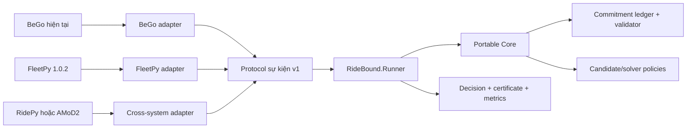

# RideBound — bản đồ tài liệu

> Trạng thái: đặc tả v1 + WP0 hoàn thành + WP1 đang thực hiện
> Cập nhật: 2026-07-29
> Nguồn sự thật về tiến độ: [18-status-and-decision-log.md](18-status-and-decision-log.md)

## 1. Mục đích của bộ tài liệu

RideBound là một hệ thống độc lập để nghiên cứu **ridepooling trực tuyến có giới hạn thay đổi lời hứa**. Hệ thống vẫn có thể gắn vào BeGo, nhưng phần lõi phải chạy được trong BeGo, FleetPy và ít nhất một simulator độc lập khác mà không viết lại thuật toán.

Bộ tài liệu này trả lời năm câu hỏi:

1. BeGo hiện tại có gì và thiếu gì?
2. Câu hỏi nghiên cứu nào còn bảo vệ được sau khi đối chiếu paper, patent và sản phẩm?
3. Mô hình toán, thuật toán, dữ liệu và tiêu chí đánh giá là gì?
4. Cần xây những project, adapter, API, bảng dữ liệu và test nào?
5. Agent hoặc thành viên tiếp theo phải đọc gì, làm gì và cập nhật ở đâu?

Đây là **kế hoạch thực thi**, không phải tuyên bố rằng các hạng mục đã được cài đặt.

## 2. Câu hỏi nghiên cứu một câu

> Trong ridepooling trực tuyến, liệu có thể nhận và chèn thêm yêu cầu vào các xe đang hoạt động, đồng thời giới hạn có chứng nhận tổng số lần và tổng mức độ thay đổi các lời hứa đã phát cho từng hành khách, mà không làm giảm đáng kể tỷ lệ phục vụ và hiệu quả vận hành?

“Lời hứa” gồm ETA đón/trả, xe được gán, điểm đón/trả và thứ tự phục vụ. “Có chứng nhận” nghĩa là mỗi quyết định phải kèm bằng chứng máy kiểm tra được về ngân sách còn lại hoặc chỉ ra chính xác vi phạm.

## 3. Phạm vi được khóa

### Trong phạm vi

- Yêu cầu đến theo thời gian và xe đang di chuyển.
- Chèn yêu cầu mới vào phần route chưa chạy.
- Lưu toàn bộ chuỗi lời hứa sau khi yêu cầu được chấp nhận.
- Ngân sách thay đổi nhiều chiều theo từng hành khách.
- Ràng buộc capacity, time window, maximum ride time và prefix đã thực thi.
- So sánh cùng codebase, trong FleetPy và trong ít nhất một simulator độc lập.
- Đánh giá ổn định vận hành; không tự suy diễn mức hài lòng của người dùng.

### Ngoài phạm vi v1

- Chứng minh fairness theo nhóm nhạy cảm khi không có nhãn thật.
- Học “mức chịu thay đổi” của người dùng từ dữ liệu giả.
- Pricing, incentive, strategic behavior hoặc market equilibrium.
- Multi-hop transfer giữa nhiều xe.
- Dự báo nhu cầu bằng deep learning như đóng góp chính.
- Thay thế toàn bộ chức năng chọn địa điểm đi chơi hiện tại của BeGo.

## 4. Thứ tự đọc bắt buộc

### Thành viên hoặc agent mới

1. Tài liệu này.
2. [01-research-charter.md](01-research-charter.md).
3. [02-current-system-audit.md](02-current-system-audit.md).
4. [18-status-and-decision-log.md](18-status-and-decision-log.md).
5. Work package hiện hành trong [16-roadmap-and-work-packages.md](16-roadmap-and-work-packages.md).
6. Tài liệu chuyên môn liên quan đến phần sẽ sửa.

### Người làm thuật toán

- [04-problem-model-and-notation.md](04-problem-model-and-notation.md)
- [07-commitment-ledger-and-certificates.md](07-commitment-ledger-and-certificates.md)
- [08-algorithms-baselines-and-solver.md](08-algorithms-baselines-and-solver.md)
- [11-metrics-statistics-and-preregistration.md](11-metrics-statistics-and-preregistration.md)

### Người làm hệ thống

- [05-portable-core-architecture.md](05-portable-core-architecture.md)
- [06-event-contract-and-determinism.md](06-event-contract-and-determinism.md)
- [14-bego-integration-api-persistence-ux.md](14-bego-integration-api-persistence-ux.md)
- [15-testing-reproducibility-and-quality-gates.md](15-testing-reproducibility-and-quality-gates.md)

### Người làm benchmark

- [09-three-layer-evaluation.md](09-three-layer-evaluation.md)
- [10-data-scenarios-and-demand-replay.md](10-data-scenarios-and-demand-replay.md)
- [11-metrics-statistics-and-preregistration.md](11-metrics-statistics-and-preregistration.md)
- [12-fleetpy-adapter.md](12-fleetpy-adapter.md)
- [13-cross-system-adapters.md](13-cross-system-adapters.md)

## 5. Danh mục tài liệu

| Tệp | Nội dung chính |
|---|---|
| [01-research-charter.md](01-research-charter.md) | Bối cảnh, giả thuyết, đóng góp và ranh giới claim |
| [02-current-system-audit.md](02-current-system-audit.md) | Hiện trạng BeGo, khoảng cách tới bài toán online |
| [03-related-work-and-claim-boundary.md](03-related-work-and-claim-boundary.md) | Paper trực tiếp, phần đã cũ, phần còn mới |
| [04-problem-model-and-notation.md](04-problem-model-and-notation.md) | Đầu vào, đầu ra, mô hình toán và bất biến |
| [05-portable-core-architecture.md](05-portable-core-architecture.md) | Cấu trúc project, dependency và portable core |
| [06-event-contract-and-determinism.md](06-event-contract-and-determinism.md) | Protocol NDJSON, event, replay và hash |
| [07-commitment-ledger-and-certificates.md](07-commitment-ledger-and-certificates.md) | Ledger, ngân sách, phân rã revision, certificate |
| [08-algorithms-baselines-and-solver.md](08-algorithms-baselines-and-solver.md) | Baseline, RideBound, candidate pool, OR-Tools |
| [09-three-layer-evaluation.md](09-three-layer-evaluation.md) | Ba lớp bằng chứng và quy tắc so sánh công bằng |
| [10-data-scenarios-and-demand-replay.md](10-data-scenarios-and-demand-replay.md) | Dữ liệu thật/công khai/tổng hợp và giới hạn suy luận |
| [11-metrics-statistics-and-preregistration.md](11-metrics-statistics-and-preregistration.md) | Metric, CI, kiểm định, non-inferiority |
| [12-fleetpy-adapter.md](12-fleetpy-adapter.md) | Adapter FleetPy 1.0.2 |
| [13-cross-system-adapters.md](13-cross-system-adapters.md) | RidePy, AMoD2, AMoDeus, OpenRidepoolSimulator |
| [14-bego-integration-api-persistence-ux.md](14-bego-integration-api-persistence-ux.md) | API, database, SignalR và UI |
| [15-testing-reproducibility-and-quality-gates.md](15-testing-reproducibility-and-quality-gates.md) | Test pyramid và artifact tái lập |
| [16-roadmap-and-work-packages.md](16-roadmap-and-work-packages.md) | Lộ trình và điều kiện hoàn thành từng gói |
| [17-agent-operating-manual.md](17-agent-operating-manual.md) | Cách agent tiếp tục công việc an toàn |
| [18-status-and-decision-log.md](18-status-and-decision-log.md) | Tiến độ sống, quyết định, blocker |
| [19-requirement-traceability.md](19-requirement-traceability.md) | Truy vết yêu cầu → thiết kế → test → bằng chứng |
| [20-risks-and-scope-control.md](20-risks-and-scope-control.md) | Risk register và cơ chế dừng |
| [21-paper-to-design-evidence.md](21-paper-to-design-evidence.md) | Paper nào ảnh hưởng quyết định nào |
| [22-glossary.md](22-glossary.md) | Giải thích thuật ngữ bằng tiếng Việt |
| [23-delivery-backlog-and-ticket-policy.md](tasks/23-delivery-backlog-and-ticket-policy.md) | Quy tắc topic/ticket, DoR/DoD và cách chọn việc tiếp theo |
| [24-wp1-contracts-ticket-plan.md](tasks/24-wp1-contracts-ticket-plan.md) | 15 ticket WP1 có scope, rules, BDD và acceptance criteria |
| [research/README.md](research/README.md) | Archive báo cáo, audit và evidence matrix nền |

## 6. Kiến trúc bằng một hình

Điểm quan trọng: ba môi trường phải gọi **cùng artifact** `RideBound.Runner`;
không chép lại thuật toán RideBound bằng Python hoặc C++.

## 7. Quy tắc nguồn sự thật

- Tiến độ và việc tiếp theo: `18-status-and-decision-log.md`.
- Claim học thuật: `01` và `03`.
- Công thức chuẩn: `04` và `07`.
- Protocol chuẩn: `06`.
- Baseline chuẩn: `08`.
- Tiêu chí đánh giá chuẩn: `09`–`11`.
- Nếu hai tài liệu mâu thuẫn, ghi một ADR/decision mới vào `18` trước khi sửa code.

## 8. Mốc hiện tại

- Repository độc lập: `https://github.com/tsunflowerr/RideBound`.
- WP0 hoàn thành với `RideBound.slnx`; repository hiện có 7 source project và
  4 test project sau khi WP1 thêm Contracts/Runner boundary tests.
- Baseline WP1 hiện có 95 Contracts, 11 Runner boundary và 7 architecture tests
  pass; full-suite result nằm trong tài liệu `18`.
- BeGo độc lập vẫn đạt 25/25 backend và 7/7 frontend test.
- Đã có test harness, protocol envelope/primitives, canonical JSON,
  schema/version compatibility, hello negotiation và initialize identity; chưa
  có event reducer, NDJSON session, online baseline, ledger hoặc adapter.
- WP1 đang thực hiện: `RB-WP1-001..007` đã hoàn thành.
- Bước thực thi tiếp theo: `RB-WP1-008` trong
  [24-wp1-contracts-ticket-plan.md](tasks/24-wp1-contracts-ticket-plan.md).
