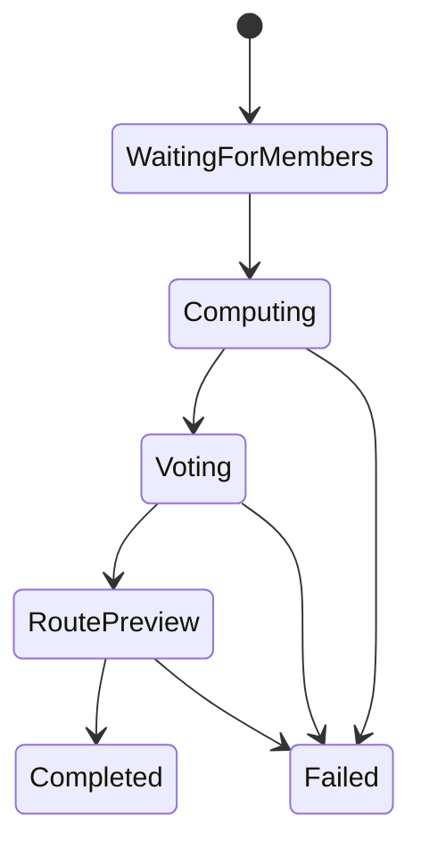

# Kiểm toán hệ thống BeGo hiện tại

## 1. Snapshot kỹ thuật ngày 2026-07-27

| Thành phần | Hiện trạng đã kiểm tra |
|---|---|
| Backend | .NET SDK 10.0.301, các project target `net10.0` |
| Kiến trúc | Domain, Application, Infrastructure, API, Tests |
| Solver | Google OR-Tools 9.15.6755 |
| Database | PostgreSQL/PostGIS qua EF Core/Npgsql |
| Cache | Redis 7 |
| Frontend | Next.js 16.2.2, React 19.2.4, SignalR 10 |
| Backend test | 25/25 pass |
| Frontend test | 7/7 pass |

Frontend test có warning vì `package.json` chưa khai báo `"type": "module"`, nhưng không làm test fail. Đây là việc bảo trì riêng, không phải blocker của RideBound.

## 2. Luồng nghiệp vụ hiện tại

`Session` hiện phục vụ một nhóm đã được hình thành trước:

1. Thành viên tham gia và khai báo vị trí/phương tiện.
2. Gán hành khách cho tài xế khi còn ở `WaitingForMembers`.
3. Tìm địa điểm và tính route.
4. Bỏ phiếu.
5. Xem route cuối và khóa giờ khởi hành.

`SetMemberDriver`, `CreateOrGetPickupRequest`, `AcceptPickupRequest` và `ReleasePickupRequest` đều từ chối thay đổi sau khi computation bắt đầu. Vì vậy hệ thống hiện tại là **snapshot planning**, chưa phải online ridepooling.

## 3. Mô hình dữ liệu hiện tại

### `Session`

Có:

- thành viên, vote, venue được đề cử;
- pickup request;
- JSON snapshot tối ưu gần nhất và route cuối;
- thời điểm khóa khởi hành.

Thiếu:

- simulation/operation clock;
- event sequence;
- vehicle live state;
- route prefix đã chạy và suffix còn lại;
- promise version;
- revision history;
- incident và certificate;
- optimistic concurrency theo epoch.

### `PickupRequest`

Có ba trạng thái nghiệp vụ: pending, accepted, cancelled; lưu tài xế được gán.

Thiếu:

- thời điểm yêu cầu xuất hiện theo simulation;
- pickup/drop-off time window;
- max ride time;
- trạng thái onboard/completed;
- lời hứa đã phát;
- accepted-to-rejected invariant;
- lịch sử reassignment và nguyên nhân.

### Routing input/output

`DriverOptimizationInput` chỉ chứa:

- một tài xế;
- danh sách hành khách;
- một venue;
- một traffic snapshot.

Nó không chứa phần route đã thực thi, request mới đến, lời hứa cũ hoặc budget còn lại.

`DriverOptimizationResult` trả route, passenger route và cost breakdown. Nó không trả decision epoch, delta với plan trước hoặc certificate.

## 4. Thuật toán hiện tại

`HybridOutingRoutePlanner` điều phối lựa chọn venue và route. `SharedDestinationRouteOptimizer` tạo/chọn điểm đón, xây route tới cùng destination và chấm generalized cost/fairness.

Một số constant quan trọng:

- `MaxWalkDistanceMeters = 500`;
- `SharedClusterRadiusMeters = 500`;
- tốc độ đi bộ mặc định `1.25 m/s`;
- shared-stop target walk là 5 phút;
- route candidate pool tối đa 50 ứng viên mỗi tài xế.

Các constant này phù hợp với hệ thống hiện tại nhưng **không được tái sử dụng ngầm làm commitment budget**. Walking constraint và promise revision là hai khái niệm khác nhau.

## 5. Benchmark hiện tại

Endpoint `/api/benchmarks/outing` chạy:

- synthetic;
- DARP with meeting points;
- Li & Lim PDPTW;
- public-all.

Report hiện có cost, burden, Gini, regret, detour, walking, shared-stop rate và runtime. Report không có event stream hoặc metric revision.

### Hạn chế phải công khai

- Public benchmark hiện ánh xạ tọa độ Euclidean vào local geographic frame.
- Li & Lim time windows **chưa được enforce như hard constraints**.
- Các slice hiện tại là snapshot; không chứng minh hành vi rolling insertion.
- Dữ liệu không có lịch sử lời hứa do hệ thống phát.

Do đó benchmark hiện tại chỉ dùng cho:

- regression của BeGo cũ;
- exact-small/candidate sanity sau khi importer được sửa;
- phân tích meeting point bổ sung.

Nó không được dùng làm bằng chứng chính cho RideBound v1.

## 6. Khoảng cách tới RideBound

| Nhu cầu RideBound | BeGo hiện tại | Quyết định |
|---|---|---|
| Request stream | Không có | Thêm event model độc lập |
| Xe đang hoạt động | Không có live suffix | Thêm `VehicleSnapshot` |
| Lịch sử lời hứa | Chỉ JSON snapshot cuối | Append-only promise ledger |
| Budget nhiều epoch | Không có | Core state mới |
| Online baseline | Không có | Xây rolling baseline cùng core |
| Certificate | Không có | Validator + witness |
| Cross-simulator | Planner phụ thuộc domain BeGo | Contracts trung lập + runner |
| Replay xác định | Seed có ở benchmark nhưng chưa có event hash | Manifest + canonical serialization |

## 7. Những gì được tái sử dụng

- .NET 10 solution và CI/test conventions.
- OR-Tools sau một solver port.
- Postgres/PostGIS, Redis, SignalR.
- Route cost/traffic provider qua adapter.
- Coordinate, venue và member mapping ở biên BeGo.
- Một phần candidate meeting-point như plugin tùy chọn.
- Hạ tầng benchmark runner và cách xuất JSON, sau khi tách khỏi DTO cũ.

## 8. Những gì không được ghép trực tiếp

- Không nhồi event/ledger vào `Session.LatestOptimizationSnapshotJson`.
- Không mở khóa `Session.AcceptPickupRequest` sau computation rồi coi là online support.
- Không sửa `HybridOutingRoutePlanner` thành một “god class” chứa rolling engine.
- Không để portable core tham chiếu `OptiGo.Domain.Entities.Member`, EF Core, ASP.NET, Mapbox hoặc SignalR.
- Không lấy benchmark DTO cũ làm protocol simulator.

## 9. Chiến lược migration an toàn

### Giai đoạn 1 — song song

Xây `RideBound.*` độc lập. BeGo cũ không đổi hành vi.

### Giai đoạn 2 — bootstrap adapter

Sau khi venue/driver đã được khóa, BeGo adapter biến route hiện tại thành `CommitRun` ban đầu.

### Giai đoạn 3 — online operation

Yêu cầu mới đi qua API RideBound, không qua mutation cũ của `Session`.

### Giai đoạn 4 — product integration

UI hiển thị decision/revision timeline và trạng thái xe. Chỉ sau khi core/replay/benchmark pass mới cân nhắc hợp nhất trải nghiệm người dùng.

## 10. Mốc regression bắt buộc

Mọi work package liên quan BeGo phải giữ:

- backend test không thấp hơn 25 pass hiện có;
- frontend test không thấp hơn 7 pass hiện có;
- endpoint outing cũ không đổi response contract nếu chưa có migration version;
- RideBound có endpoint/namespace riêng;
- mọi thay đổi schema có migration và rollback note.
