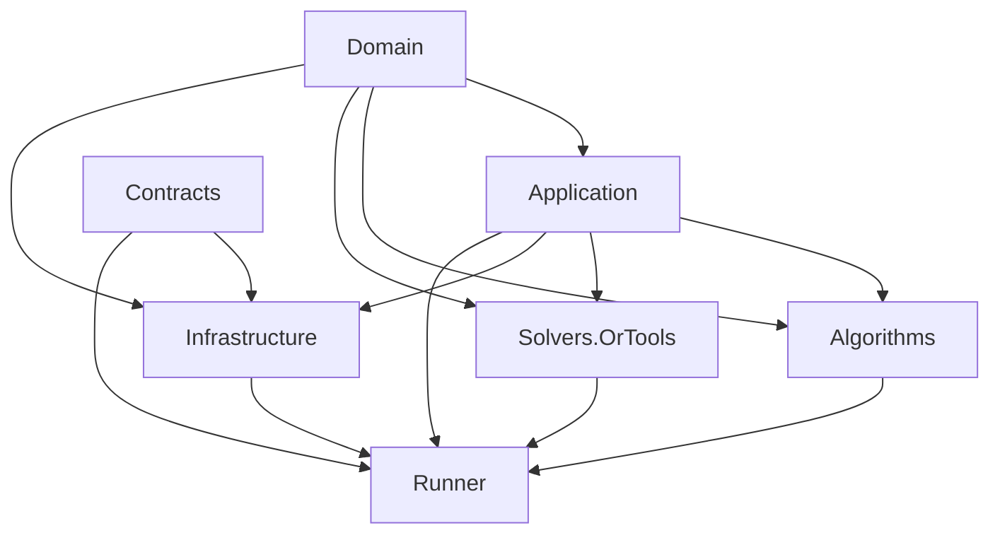

# Kiến trúc portable core

## 1. Nguyên tắc

“Portable” không có nghĩa viết ba bản thuật toán giống nhau. Nó nghĩa BeGo, FleetPy và framework thứ ba gọi đúng cùng một artifact, dùng cùng schema và policy configuration.

Portable core không được biết:

- EF Core/PostgreSQL;
- ASP.NET/SignalR;
- `OptiGo.Domain`;
- Mapbox/Google;
- FleetPy/RidePy/AMoD2;
- wall clock hoặc filesystem tùy tiện.

## 2. Cấu trúc project mục tiêu

```text
src/
  RideBound.Domain/            # DDD model và invariant thuần
  RideBound.Application/       # use case và ports
  RideBound.Contracts/         # protocol/DTO versioned
  RideBound.Algorithms/        # policy implementation
  RideBound.Solvers.OrTools/   # solver adapter
  RideBound.Infrastructure/    # implementation các ports bên ngoài
  RideBound.Runner/            # composition root + NDJSON

tests/
  RideBound.Domain.Tests/
  RideBound.ArchitectureTests/
  # Thêm contract/application/integration tests khi có behavior

simulators/
  fleetpy-ridebound/
  ridepy-ridebound/
  amod2-ridebound/          # optional, sau preflight

benchmarks/
  schemas/
  scenarios/
  manifests/
  results/                    # raw result không commit nếu quá lớn

docs/
scripts/
artifacts/
```

BeGo/OptiGo tiếp tục ở repository riêng `E:\Code\BeGo` và remote do repository
đó cấu hình; không copy cây `BeGo/src` vào RideBound. Adapter BeGo chỉ được tạo
khi WP5 có behavior thật, tránh scaffold project rỗng.

## 3. Trách nhiệm từng project

### `RideBound.Contracts`

- DTO/schema versioned.
- Enum và identifier trung lập.
- Canonical JSON options.
- Không tham chiếu project khác.
- Không chứa business logic.

### `RideBound.Domain`

- State machine của run/request/vehicle.
- Commitment ledger.
- Promise, budget, certificate model và invariant.
- Value object, aggregate, domain event và domain service thuần.
- Không tham chiếu project hoặc package bên ngoài.

### `RideBound.Application`

- Điều phối use case và deterministic decision pipeline.
- Khai báo ports cho clock, travel time, candidate, solver và policy.
- Chỉ tham chiếu `RideBound.Domain`.
- Không biết EF Core, ASP.NET, BeGo hoặc simulator.

### `RideBound.Algorithms`

- Rolling insertion baseline.
- Penalty-only, freeze horizon, no-reassignment.
- RideBound hard/soft policies.
- Candidate plan construction và scoring.
- Không gọi database/network.
- Tham chiếu `Application` và `Domain`.

### `RideBound.Solvers.OrTools`

- CP-SAT/MIP adapter.
- Mapping candidate selection model.
- Time/gap limit và solver diagnostics.
- OR-Tools dependency nằm ở đây, không rò vào Domain/Application.

### `RideBound.Infrastructure`

- Cài đặt ports liên quan filesystem, process, persistence hoặc external service.
- Chuyển Contracts ở boundary nhưng không đưa DTO vào Domain.
- WP5 có thể tách `RideBound.Persistence` và `RideBound.Adapters.BeGo` thành
  project riêng nếu behavior đủ lớn.
- Không chứa thuật toán hoặc invariant RideBound.

### `RideBound.Runner`

- Long-lived NDJSON stdin/stdout là interface chuẩn.
- Có thể thêm HTTP/gRPC cho product, nhưng NDJSON vẫn là oracle cho simulator/replay.
- Log kỹ thuật ra `stderr`; `stdout` chỉ chứa protocol messages.
- Handshake, capability negotiation, health và graceful shutdown.

### `tests/*`

- Unit/property/golden/replay/integration/performance tests.
- Architecture tests đọc project graph và chặn dependency hướng sai.
- Exact-small oracle.
- Contract fixtures dùng chung cho Python adapter.

## 3.1. File/class skeleton cho WP0–WP4

Đây là target map để agent không tự tạo cấu trúc khác nhau. Tên cuối được khóa bằng ADR ở WP0.

```text
RideBound.Contracts/
  Protocol/
    ProtocolEnvelope.cs
    ProtocolMessageType.cs
    HelloMessages.cs
    EventBatchMessage.cs
    DecisionMessage.cs
    ErrorMessage.cs
  Events/
    CommitEvent.cs
    RequestEvents.cs
    VehicleEvents.cs
    TravelAndIncidentEvents.cs
  Models/
    RequestContract.cs
    VehicleSnapshotContract.cs
    RoutePlanContract.cs
    PromiseContract.cs
    CommitmentPolicyContract.cs
    CertificateContract.cs
  Serialization/
    CanonicalJson.cs
    ContractVersion.cs

RideBound.Domain/
  Time/
    SimTime.cs
  Runs/
    RideBoundRun.cs
  Requests/
    RequestState.cs
  Vehicles/
    VehicleState.cs
  Routes/
    RouteState.cs
  Promises/
    ServicePromise.cs
    PromiseDelta.cs
  Ledger/
    CommitmentLedger.cs
    BudgetVector.cs
    LedgerReducer.cs
  Validation/
    PhysicalPlanValidator.cs
    CommitmentValidator.cs
    DecisionCertificateBuilder.cs

RideBound.Application/
  Abstractions/
    IDeterministicClock.cs
    ITravelTimeOracle.cs
    ICandidatePlanGenerator.cs
    IAssignmentSolver.cs
    IDispatchPolicy.cs
  State/
    EventReducer.cs
  Determinism/
    StableOrdering.cs
    SeedDerivation.cs
    DecisionHashChain.cs
  Decisions/
    RideBoundDecisionEngine.cs
    DecisionContext.cs

RideBound.Algorithms/
  Candidates/
    InsertionCandidateGenerator.cs
    CandidateScheduleEvaluator.cs
  Policies/
    RollingCostPolicy.cs
    RollingPenaltyPolicy.cs
    FixedFreezeHorizonPolicy.cs
    NoReassignmentPolicy.cs
    CommitHardVectorPolicy.cs
  Objectives/
    LexicographicObjective.cs
  Fallback/
    SafeFallbackPolicy.cs

RideBound.Solvers.OrTools/
  OrToolsAssignmentSolver.cs
  CandidateSelectionModelBuilder.cs
  SolverDiagnosticsMapper.cs

RideBound.Runner/
  Program.cs
  Protocol/
    NdjsonReader.cs
    NdjsonWriter.cs
    RunnerSession.cs
  Hosting/
    PolicyFactory.cs
    RunnerHealth.cs

tests/
  RideBound.Domain.Tests/
    State/
    Ledger/
    Validation/
  RideBound.ArchitectureTests/
  RideBound.Contracts.Tests/       # WP1
  RideBound.Application.Tests/     # WP1–WP2
  RideBound.IntegrationTests/      # khi có external boundary
```

Không tạo tất cả file rỗng trong một commit. WP0 chỉ scaffold project,
`AssemblyReference` và architecture tests; WP1–WP4 thêm file khi có
test/behavior tương ứng.

## 4. Dependency rule



Mũi tên biểu diễn “project ở đích có thể tham chiếu project ở nguồn”.
Domain và Contracts là hai lá độc lập. Nếu cần đảo chiều, khai báo port trong
Application thay vì cho lớp trong tham chiếu Infrastructure.

## 5. Ports cốt lõi

```csharp
public interface ITravelTimeOracle
{
    TravelEstimate Estimate(NodeId from, NodeId to, SimTime at);
}

public interface ICandidatePlanGenerator
{
    IReadOnlyList<CandidatePlan> Generate(DecisionContext context);
}

public interface IAssignmentSolver
{
    SolveResult Solve(CandidateSelectionProblem problem, SolveBudget budget);
}

public interface IDispatchPolicy
{
    Decision Evaluate(DecisionContext context);
}

public interface ICommitmentValidator
{
    CommitmentCertificate Validate(
        DecisionContext before,
        ProposedDecision proposed);
}
```

Đây là minh họa contract, chưa phải chữ ký code đã khóa. Chữ ký chính thức được quyết định ở WP1 và ghi ADR.

## 6. Engine pipeline


Validator phải độc lập với code tạo candidate ở mức hợp lý. Không cho cùng một function vừa tính vừa tự tuyên bố hợp lệ mà không có kiểm tra chéo.

## 7. Boundary với travel time

Domain/Application chỉ nhận node/edge identifier và travel estimate. Adapter chịu trách nhiệm:

- map WGS84 sang graph node;
- truy vấn Mapbox/OSRM/FleetPy transport space;
- làm tròn về đơn vị canonical;
- version/hash travel-time snapshot.

Để phân rã exogenous revision, oracle phải đánh giá được:

- plan cũ dưới snapshot cũ;
- plan cũ dưới snapshot mới;
- plan mới dưới snapshot mới.

Nếu framework không hỗ trợ lịch sử matrix, adapter phải snapshot/cache đủ cho một epoch; nếu không, capability matrix phải đánh dấu metric này là không hỗ trợ.

## 8. In-process và out-of-process

### BeGo

Product có thể dùng in-process reference để giảm latency, nhưng phải pass contract tests giống runner. Riêng Layer 1 nghiên cứu dùng published runner artifact giống Layer 2 để kiểm chứng đúng cùng binary; sau đó có differential test runner vs in-process.

### Python/C++ simulator

Dùng long-lived `RideBound.Runner`:

- khởi động một lần mỗi run;
- handshake;
- gửi NDJSON qua pipe;
- không spawn process mỗi epoch;
- watchdog và timeout rõ ràng;
- persist protocol transcript.

Sau này có thể thêm gRPC, nhưng không được làm semantic contract khác.

## 9. Versioning

- `schemaVersion`: semantic version của protocol.
- `policyVersion`: version thuật toán/config.
- `coreCommitSha`: Git commit của core.
- `binarySha256`: hash artifact.
- `adapterVersion`: version adapter.
- `simulatorVersion` và upstream commit.

Breaking schema tạo major mới. Field optional tương thích tạo minor. Sửa bug không đổi semantics tạo patch.

## 10. Quyết định build/container

- .NET SDK pin qua root `global.json`.
- Runner publish self-contained hoặc container multi-arch theo experiment environment.
- Python simulator dùng lockfile/Conda environment.
- Full experiment pin image digest, không chỉ tag.
- Commercial solver không là dependency bắt buộc của core.

## 11. Anti-corruption layer với BeGo cũ

Adapter không để mô hình hiện tại làm méo bài toán:

- `Session` chỉ là nguồn bootstrap/product context.
- `CommitRun` có lifecycle riêng.
- `Member.Id` được map sang `RiderId`; core không nhận entity.
- Snapshot JSON cũ không dùng làm ledger.
- Existing route planner có thể cung cấp initial plan nhưng không được tiếp tục quyết định sau khi RideBound run bắt đầu.

## 12. Definition of portable

Chỉ được ghi “portable core hoàn thành” khi:

- cùng runner binary hash được dùng trong BeGo replay và FleetPy;
- ít nhất một framework độc lập khác dùng cùng binary;
- golden protocol tests pass ở cả adapter;
- không có reimplementation RideBound trong adapter;
- report chứa simulator capability matrix và semantic deviations;
- cùng một canonical scenario nhỏ tạo quyết định tương đương khi travel/event semantics được đồng nhất.

## 13. Technology choices

| Phần | Lựa chọn v1 | Ghi chú |
|---|---|---|
| Domain/Application/runner | .NET 10, C# 14 | Pin bằng `global.json` |
| Serialization | `System.Text.Json` + versioned JSON Schema | Canonical options nằm trong Contracts |
| Cross-language IPC | Long-lived NDJSON qua stdin/stdout | HTTP/gRPC là interface phụ |
| Optimization | OR-Tools 9.15 qua solver project | Không để package rò vào Domain/Application |
| Product API | ASP.NET Core 10 | Namespace/endpoint riêng |
| Persistence | EF Core 10 + PostgreSQL 16/PostGIS | Ledger/event append-only |
| Ephemeral cache | Redis 7 | Không là nguồn sự thật |
| Live updates | SignalR 10 | Product only |
| Layer 2 | Python environment của FleetPy 1.0.2 | Pin lock/container |
| Layer 3 | RidePy v2.10.1 hoặc AMoD2 commit pin | Preflight quyết định |
| Analysis | Python environment khóa riêng | Paired bootstrap, plots, bundle checks |
| Packaging | Docker/OCI image + SHA-256 | Pin digest cho experiment |
| Observability | OpenTelemetry-compatible metrics/traces | Không đưa wall clock vào decision |

Không thêm thư viện chỉ vì “có thể cần”. Mỗi dependency mới phải thuộc một work package, có license/version và test.
