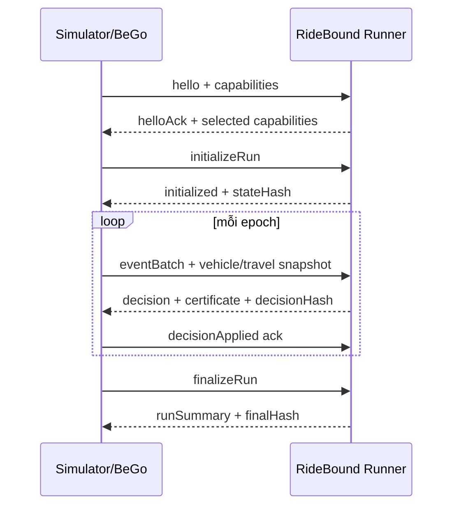

# Event contract và replay xác định

## 1. Vì sao event contract là trung tâm

BeGo dùng C#, FleetPy/RidePy dùng Python và AMoD2 dùng C++. Nếu mỗi adapter truyền một state khác nhau, kết quả cross-system không còn kiểm chứng tính portable. Vì vậy protocol là ranh giới chuẩn giữa simulator/product và core.

Protocol v1 dùng **NDJSON**: mỗi dòng là một JSON object hoàn chỉnh. Runner sống suốt một run.

## 2. Envelope bắt buộc

Mọi message có:

```json
{
  "schemaVersion": "1.0",
  "messageType": "eventBatch",
  "runId": "run-001",
  "scenarioId": "manhattan-20260727-a",
  "epochId": 42,
  "eventSeq": 178,
  "simTimeMs": 28830000,
  "payload": {}
}
```

Quy tắc:

- `runId` và `scenarioId` bất biến trong run.
- `epochId` tăng đúng một cho mỗi decision.
- `eventSeq` tăng đơn điệu cho từng event đầu vào.
- `simTimeMs` là thời gian từ simulation origin, không phải wall clock.
- Identifier là string opaque; không dựa vào thứ tự GUID ngẫu nhiên.

## 3. Đơn vị canonical

| Đại lượng | Đơn vị protocol | Lý do |
|---|---|---|
| Thời gian | integer millisecond | Cross-language, tránh float drift |
| Khoảng cách | integer millimeter hoặc meter đã làm tròn theo manifest | Xác định, không phụ thuộc locale |
| Tọa độ WGS84 | integer `1e-7` degree khi cần | Không dùng double làm khóa |
| Capacity/party | integer | Tự nhiên |
| Cost | integer micro-cost hoặc structured components | Tránh so sánh float không ổn định |

Adapter phải ghi rounding rule trong manifest. Không được một adapter làm tròn giây còn adapter khác giữ float mà vẫn gọi là cùng scenario semantics.

## 4. Vòng đời protocol



Runner không được tự đoán một decision đã được simulator áp dụng. Chỉ sau `decisionApplied` mới chuyển promise từ proposed sang published.

## 5. Message types v1

### Control

- `hello`
- `helloAck`
- `initializeRun`
- `initialized`
- `checkpoint`
- `restore`
- `finalizeRun`
- `runSummary`
- `shutdown`
- `error`

### Input events

- `requestArrived`
- `bookingConfirmed`
- `offerDeclined`
- `requestCancelledBeforeAcceptance`
- `requestCancelledAfterAcceptance`
- `vehicleAdvanced`
- `vehicleReachedStop`
- `passengerBoarded`
- `passengerAlighted`
- `travelTimesUpdated`
- `timerTick`
- `incidentOpened`
- `incidentResolved`

### Decisions

- `offerProposed`
- `requestAccepted`
- `requestRejected`
- `requestDeferred`
- `vehiclePlanUpdated`
- `promisePublished`
- `commitmentBreachDeclared`

Một `eventBatch` có thể chứa nhiều event cùng simulation time. Batch order được xác định bởi `eventSeq`.

Framework không có hai bước offer/confirm có thể phát `requestArrived` và áp `requestAccepted` trong cùng epoch. Framework có booking hai bước như FleetPy dùng `offerProposed`, rồi chỉ mở ledger khi nhận `bookingConfirmed`.

## 6. Request contract tối thiểu

```json
{
  "requestId": "r-1042",
  "arrivalTimeMs": 28800000,
  "originNodeId": "n-11",
  "destinationNodeId": "n-92",
  "earliestPickupMs": 28800000,
  "latestPickupMs": 29100000,
  "maxRideTimeMs": 1800000,
  "partySize": 1,
  "serviceClass": "standard",
  "commitmentPolicyId": "uniform-v1"
}
```

`serviceClass` chỉ là policy label đã công bố. Không biến thuộc tính giả thành nhóm người thật.

## 7. Vehicle snapshot tối thiểu

```json
{
  "vehicleId": "v-07",
  "capacity": 4,
  "occupiedSeats": 2,
  "position": {
    "edgeId": "e-100-101",
    "progressPermille": 630
  },
  "onboardRequestIds": ["r-1001", "r-1010"],
  "acceptedRequestIds": ["r-1001", "r-1010", "r-1033"],
  "executedStopCount": 8,
  "planVersion": 15
}
```

Nếu simulator chỉ có node position, capability nêu `edgeProgress=false`; freeze rule phải dùng semantic phù hợp.

## 8. Decision contract tối thiểu

Decision gồm:

- accepted/rejected/deferred request;
- reason code, không chỉ free text;
- new route suffix từng vehicle;
- promise mới cho rider bị ảnh hưởng;
- ledger delta;
- certificate;
- solver diagnostics;
- state hash trước/sau;
- decision hash.

Reason code mẫu:

- `NO_FEASIBLE_INSERTION`
- `CAPACITY`
- `TIME_WINDOW`
- `MAX_RIDE_TIME`
- `FROZEN_PREFIX`
- `COMMITMENT_BUDGET`
- `SOLVER_TIMEOUT_SAFE_FALLBACK`
- `INCIDENT_OVERRIDE`

## 9. Handshake và capability negotiation

Simulator gửi:

- position model: node/edge;
- dynamic travel times;
- stop relocation;
- vehicle reassignment;
- cancellations;
- exact event ordering;
- ability to replay old plan under new travel times;
- native baseline hooks;
- maximum supported fleet/request scale.

Runner trả capability cần cho policy. Nếu thiếu capability bắt buộc:

- fail fast trước run; hoặc
- hạ xuống policy đã khai báo và đánh dấu experiment không so sánh trực tiếp.

Không âm thầm bỏ một promise dimension.

## 10. Canonical serialization và hash

Decision hash được tạo từ canonical representation:

- key order cố định;
- UTF-8;
- newline `\n`;
- integer units;
- list được sort chỉ khi semantics là set;
- route order không bao giờ sort;
- không chứa runtime, timestamp wall-clock hoặc log text;
- enum dùng exact string versioned.

Hash:

```text
SHA-256(
  previousDecisionHash
  || canonicalInputState
  || canonicalDecision
  || policyVersion
)
```

Nhờ chain hash, có thể phát hiện thiếu hoặc sửa event/decision giữa run.

## 11. Deterministic random

- Một master seed trong manifest.
- Sub-seed sinh bằng hash của `(masterSeed, component, scenarioId, epochId)`.
- Không dùng global shared RNG.
- Stable tie-break theo `candidateId`, `vehicleId`, `requestId`.
- Parallel enumeration phải thu kết quả rồi stable-sort trước solve.

Solver có nondeterminism phải được cấu hình single-thread/deterministic mode cho regression. Performance runs có thể đa luồng nhưng phải ghi rõ và không dùng cho bitwise equivalence claim.

## 12. Failure semantics

### Malformed message

Runner trả `error` với code và không mutate state.

### Duplicate event

Nếu cùng `(runId,eventSeq)` và cùng payload hash: idempotent ack. Nếu payload khác: fail run vì data corruption.

### Epoch gap

Fail fast; không tự điền event.

### Runner timeout

Adapter dùng safe fallback đã đăng ký, ghi `SOLVER_TIMEOUT_SAFE_FALLBACK`, và vẫn lưu transcript.

### Process crash

Restore từ checkpoint cuối + replay events sau checkpoint. Decision hash sau restore phải bằng run không crash.

## 13. Golden fixtures bắt buộc

Tối thiểu:

1. một xe, một request, accept;
2. capacity reject;
3. time-window reject;
4. request mới tạo ETA revision còn budget;
5. request mới bị loại vì budget;
6. vehicle switch hết quota;
7. traffic-only ETA shift;
8. incident override;
9. duplicate event idempotent;
10. checkpoint/restore equivalence.

JSON fixture được validate bởi .NET và từng adapter Python/C++.
