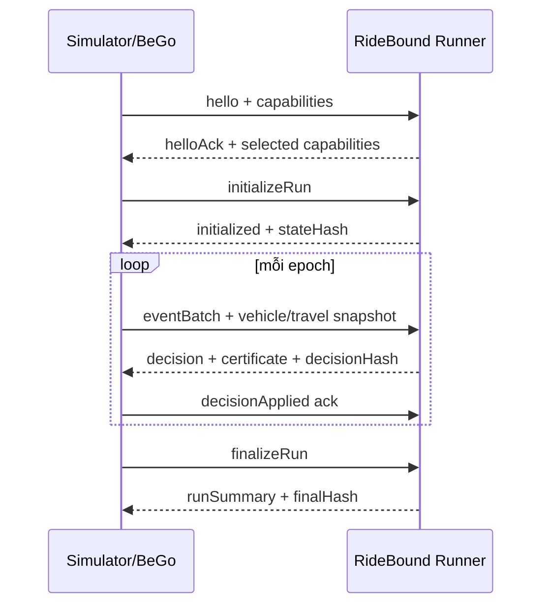

# Event contract và replay xác định

## 1. Vì sao event contract là trung tâm

BeGo dùng C#, FleetPy/RidePy dùng Python và AMoD2 dùng C++. Nếu mỗi adapter truyền một state khác nhau, kết quả cross-system không còn kiểm chứng tính portable. Vì vậy protocol là ranh giới chuẩn giữa simulator/product và core.

Protocol v1 dùng **NDJSON**: mỗi dòng là một JSON object hoàn chỉnh. Runner sống suốt một run.

## 2. Version và envelope v1

Protocol v1 dùng chính xác `schemaVersion = "1.0.0"`. Giá trị phải khớp
`^(0|[1-9][0-9]*)\.(0|[1-9][0-9]*)\.(0|[1-9][0-9]*)$`; không nhận `1`, `1.0`,
prefix `v`, metadata hoặc số có leading zero. Major đổi khi semantics unit,
ordering, lifecycle hoặc hash thay đổi. Minor chỉ thêm field optional có safe
behavior đã công bố; patch không đổi canonical semantics.

`1.0.0` là version được phát hành hiện tại. Receiver v1 chấp nhận cùng nhánh
patch `1.0.x` vì patch không được đổi schema/canonical semantics; nó từ chối
minor cao hơn nếu chưa có explicit safe-forward profile. Vì vậy việc parser nhận
`1.0.7` không có nghĩa `1.0.7` đã được phát hành.

Mọi message có hai field envelope bắt buộc `schemaVersion`, `messageType` và một
`payload` object bắt buộc (dùng `{}` khi message không có nội dung):

```json
{
  "schemaVersion": "1.0.0",
  "messageType": "eventBatch",
  "runId": "run-001",
  "scenarioId": "manhattan-20260727-a",
  "epochId": 42,
  "simTimeMs": 28830000,
  "payload": {
    "events": [
      {
        "eventSeq": 178,
        "eventType": "timerTick",
        "payload": {}
      }
    ]
  }
}
```

Field envelope bổ sung phụ thuộc message:

| Message | Field envelope ngoài `schemaVersion`, `messageType` |
|---|---|
| `hello`, `helloAck`, `shutdown` | không có |
| `initializeRun`, `initialized`, `finalizeRun`, `runSummary`, `checkpoint`, `restore` | `runId`, `scenarioId` |
| `eventBatch` | `runId`, `scenarioId`, `epochId`, `simTimeMs` |
| decision và `decisionApplied` | `runId`, `scenarioId`, `epochId`, `simTimeMs` |
| `error` | các field context đã đọc hợp lệ từ input; field chưa xác định bị bỏ, không phát `null` |

`eventSeq` thuộc từng event trong `payload.events`, không thuộc envelope batch.
Field optional vắng mặt thì bị omit; v1 không dùng `null`. Unknown field bị từ
chối cho `1.0.0`; compatibility với minor tương lai chỉ được mở theo matrix của
RB-WP1-005.

### 2.1. Compatibility matrix thực thi

Machine-readable matrix nằm tại
`benchmarks/schemas/v1/compatibility-matrix.json`:

| Sender so với receiver `1.0.0` | Behavior | Code/disposition |
|---|---|---|
| cùng major/minor, patch bất kỳ | nhận với cùng semantics | — |
| cùng major, minor cao hơn | mặc định từ chối message | `UNSUPPORTED_SCHEMA_MINOR` / `rejectMessage` |
| major khác | fail session trước khi diễn giải field mới | `UNSUPPORTED_SCHEMA_MAJOR` / `failSession` |
| field lạ trên nhánh `1.0.x` | từ chối message | `UNKNOWN_FIELD` / `rejectMessage` |

Một future-minor field chỉ được bỏ qua khi profile machine-readable ghi đủ
message type, exact field path, default/ignore behavior và việc field có tham gia
canonical/hash projection hay không. Danh sách profile hiện rỗng; không có minor
tương lai nào được tuyên bố hỗ trợ. Kiểm tra major diễn ra trước unknown-field
check để message major mới không bị phân loại nhầm thành lỗi field recoverable.

Quy tắc:

- `runId` và `scenarioId` là string opaque, dài 1–128 UTF-8 byte, bất biến sau
  `initializeRun`; không trim, case-fold hoặc dựa vào thứ tự GUID.
- `epochId` bắt đầu từ `1` ở `eventBatch` đầu tiên và tăng đúng một sau mỗi
  decision đã được `decisionApplied`; state vừa initialize có epoch `0`.
- `eventSeq` bắt đầu từ `1`, liên tiếp trên toàn run và tăng một cho từng input
  event, không reset theo batch/epoch.
- `simTimeMs` là thời gian từ simulation origin, không phải wall clock, và không
  được giảm giữa các epoch.

## 3. Đơn vị canonical và range

Mọi JSON number trong protocol v1 là integer và nằm trong vùng chính xác chung
`[-9007199254740991, 9007199254740991]` (`±(2^53-1)`). Không nhận exponent,
fraction, `NaN`, infinity, negative zero hoặc numeric string. Range hẹp hơn trong
bảng có ưu tiên:

| Đại lượng/field suffix | Đơn vị protocol | Range |
|---|---|---|
| thời gian `*TimeMs`, duration `*Ms` | integer millisecond | `0..9007199254740991` |
| khoảng cách `*DistanceMm` | integer millimeter | `0..9007199254740991` |
| WGS84 `latitudeE7` | integer `10^-7` degree | `-900000000..900000000` |
| WGS84 `longitudeE7` | integer `10^-7` degree | `-1800000000..1800000000` |
| capacity, party, count, sequence, epoch | integer count | `0..9007199254740991`, trừ minimum riêng của schema |
| edge progress `progressPermille` | integer phần nghìn chiều cạnh có hướng | `1..999` |
| cost `*CostMicros` | integer `10^-6` cost unit của manifest | `-9007199254740991..9007199254740991` |

Mỗi manifest khai báo `sourceUnitConversions` cho adapter, gồm source unit,
canonical unit và exact rule `roundTiesToEven`. Conversion phải kiểm range trước
và sau khi nhân scale; overflow hoặc giá trị ngoài range bị từ chối, không
saturate. Cùng scenario phải có cùng conversion table. FleetPy seconds được đổi
sang millisecond; distance được đổi duy nhất sang millimeter.

`costUnitId` trong manifest là opaque identifier của một cost basis đã versioned
(ví dụ `abstract-generalized-cost-v1`), không mặc định là tiền tệ. Các component
cost phải mang suffix `CostMicros`; không cộng các `costUnitId` khác nhau.

## 4. Vòng đời protocol



Runner không được tự đoán một decision đã được simulator áp dụng. Chỉ sau `decisionApplied` mới chuyển promise từ proposed sang published.

### 4.1. Ranh giới envelope, payload và manifest

- **Envelope** chỉ chứa routing/identity của message: version, type, run,
  scenario, epoch và simulation time theo bảng ở mục 2.
- **Payload** chứa nội dung thay đổi theo message: capabilities, event list,
  snapshot, decision, acknowledgement, certificate shell hoặc error detail.
  Payload không lặp lại field envelope.
- **Manifest** là payload bất biến của `initializeRun`: protocol/policy version,
  master seed, scenario/config identity, graph/travel snapshot identity,
  canonical unit/conversion table, negotiated capabilities, adapter/simulator
  version, core commit và binary hash. Dataset path, wall clock, hostname và log
  không thuộc canonical manifest.

`runId` và `scenarioId` có trong envelope `initializeRun`; manifest chứa
`scenarioContentHash` để chứng minh nội dung, không lặp hai ID. Thay manifest
sau initialize là lỗi fatal; run mới phải dùng `runId` mới.

### 4.2. Initialize manifest identity v1

`initializeRun.payload` có đúng một field `manifest`. Manifest v1 bắt buộc:

- `protocolVersion`, `masterSeed`, `policyId`, `policyVersion` và
  `policyConfigurationHash`;
- `scenarioContentHash`, `graphSnapshotHash`, `travelTimeSnapshotHash`;
- `costUnitId` và semantic set `sourceUnitConversions`, unique theo `quantity`,
  sort ordinal, với exact `roundingRule = "roundTiesToEven"`;
- exact `capabilitySelection` đã trả trong `helloAck`;
- `adapter` (`adapterId`, `adapterVersion`);
- `simulator` (`simulatorId`, `simulatorVersion`, `upstreamCommitSha`);
- `coreCommitSha` và `binarySha256`.

SHA-256 text là 64 lowercase hex; source commit là 40 hoặc 64 lowercase hex.
Manifest không chứa `runId`, `scenarioId`, wall clock, hostname, dataset path,
local path hoặc log. `runId`/`scenarioId` được đối chiếu từ envelope và
session/experiment context; scenario content được khóa bằng hash.

`initialized.payload` chứa `manifestHash` và `initialStateIdentity`. State ban
đầu có `epochId = 0`, `nextEventSeq = 1`, `simTimeMs >= 0` và `stateHash`.
WP1-007 chỉ khóa shape/identity do caller cung cấp; tính manifest/state hash nằm
ở RB-WP1-010. Re-initialize một session active là `INVALID_SESSION_STATE`;
version, adapter, capability, run hoặc scenario lệch là `IDENTITY_MISMATCH`.
Validation không được mutate identity đang tồn tại.

## 5. Message/event/decision types v1

### Envelope `messageType`

- `hello`
- `helloAck`
- `initializeRun`
- `initialized`
- `checkpoint`
- `restore`
- `finalizeRun`
- `runSummary`
- `eventBatch`
- `decision`
- `decisionApplied`
- `shutdown`
- `error`

### `eventType` trong `eventBatch.payload.events`

- `requestArrived`
- `bookingConfirmed`
- `offerDeclined`
- `requestCancelledBeforeAcceptance`
- `requestCancelledAfterAcceptance`
- `vehicleAdvanced`
- `vehicleReachedStop`
- `passengerBoarded`
- `passengerAlighted`
- `travelTimesUpdated`
- `timerTick`
- `incidentOpened`
- `incidentResolved`

### `decisionType` trong `decision.payload.actions`

- `offerProposed`
- `requestAccepted`
- `requestRejected`
- `requestDeferred`
- `vehiclePlanUpdated`
- `promisePublished`
- `commitmentBreachDeclared`

Một `eventBatch` có thể chứa nhiều event cùng simulation time. Batch order được
xác định bởi `eventSeq`; một `decision` có thể chứa nhiều action có thứ tự.

Framework không có hai bước offer/confirm có thể phát `requestArrived` và áp `requestAccepted` trong cùng epoch. Framework có booking hai bước như FleetPy dùng `offerProposed`, rồi chỉ mở ledger khi nhận `bookingConfirmed`.

## 6. Request contract tối thiểu

`requestArrived.payload` bọc object dưới field `request`; object bên trong có
shape:

```json
{
  "requestId": "r-1042",
  "arrivalTimeMs": 28800000,
  "originNodeId": "n-11",
  "destinationNodeId": "n-92",
  "earliestPickupMs": 28800000,
  "latestPickupMs": 29100000,
  "maxRideTimeMs": 1800000,
  "partySize": 1,
  "serviceClass": "standard",
  "commitmentPolicyId": "uniform-v1"
}
```

`serviceClass` chỉ là policy label đã công bố. Không biến thuộc tính giả thành nhóm người thật.

Các event request-reference (`bookingConfirmed`, `offerDeclined` và hai
cancellation) dùng đúng `{ "requestId": "..." }`. Runtime codec và schema v1
từ chối unknown/duplicate/null/fraction/out-of-range field.

## 7. Vehicle snapshot tối thiểu

```json
{
  "vehicleId": "v-07",
  "capacity": 4,
  "occupiedSeats": 2,
  "position": {
    "kind": "edgeProgress",
    "fromNodeId": "n-100",
    "toNodeId": "n-101",
    "edgeId": "e-100-101",
    "progressPermille": 630
  },
  "onboardRequestIds": ["r-1001", "r-1010"],
  "acceptedRequestIds": ["r-1001", "r-1010", "r-1033"],
  "route": {
    "planVersion": 15,
    "executedStopCount": 1,
    "frozenPrefix": [
      {
        "stopId": "s-08",
        "nodeId": "n-100",
        "kind": "waypoint",
        "serviceDurationMs": 0
      }
    ],
    "mutableSuffix": [
      {
        "stopId": "s-drop-r-1033",
        "nodeId": "n-120",
        "kind": "dropOff",
        "requestId": "r-1033",
        "serviceDurationMs": 0
      }
    ]
  }
}
```

Position là tagged union:

```json
{ "kind": "node", "nodeId": "n-100" }
```

hoặc object `edgeProgress` như ví dụ trên. Edge có hướng; `fromNodeId`,
`toNodeId` và `edgeId` đều bắt buộc để không nhập nhằng parallel edge.
`progressPermille` chỉ nhận `1..999`; đúng endpoint phải normalize thành
`kind = "node"`. Không suy diễn edge từ hai node, tọa độ hoặc route gần nhất.

Capability `positionModel` nhận:

- `nodeOnly`: chỉ phát `node`;
- `directedEdgeProgress`: phát được cả `node` tại stop và `edgeProgress` khi xe
  đang ở giữa cạnh.

Nếu policy cần freeze leg đang chạy mà adapter chỉ có `nodeOnly`, manifest phải
chọn policy downgrade đã đặt tên hoặc handshake fail. Không tự đặt progress bằng
0/1000. Quyết định này đóng phần contract của O-006; khả năng FleetPy trích xuất
đúng progress vẫn là preflight adapter ở WP7.

### 7.1. Typed online payload WP2

Từ `RB-WP2-002`, `protocol-event.schema.json` dispatch payload theo exact
`eventType`; không còn `fixtureIntent` hoặc catch-all object cho field đã khóa:

| Event | Payload v1 |
|---|---|
| `requestArrived` | `{ request: RequestContract }` |
| booking/offer/two cancellation | `{ requestId }` |
| `vehicleAdvanced` | `{ vehicle: VehicleSnapshotContract }` |
| `vehicleReachedStop` | `{ vehicleId, stopId, planVersion, position(node) }` |
| boarding/alighting | `{ vehicleId, requestId, planVersion }` |
| `travelTimesUpdated` | `{ snapshot: { version, snapshotHash, arcs[] } }` |
| `timerTick` | `{}` |
| incident open/resolve | typed identity/reason payload; reducer WP2 vẫn từ chối vì behavior thuộc WP3 |

Route gồm exact ordered `frozenPrefix`/`mutableSuffix`; stop pickup/drop bắt
buộc có `requestId`, waypoint phải omit. Directed travel arcs là semantic set,
normalize ordinal theo `(fromNodeId,toNodeId)` và mang integer
`travelTimeMs`. Snapshot đầu phải có hash đúng manifest; các bản sau tăng version
đúng một.

## 8. Decision contract tối thiểu

Decision gồm:

- accepted/rejected/deferred request;
- reason code, không chỉ free text;
- new route suffix từng vehicle;
- promise mới cho rider bị ảnh hưởng;
- ledger delta;
- certificate;
- solver diagnostics;
- state hash trước/sau;
- decision hash.

Reason code mẫu:

- `NO_FEASIBLE_INSERTION`
- `CAPACITY`
- `TIME_WINDOW`
- `MAX_RIDE_TIME`
- `FROZEN_PREFIX`
- `COMMITMENT_BUDGET`
- `SOLVER_TIMEOUT_SAFE_FALLBACK`
- `INCIDENT_OVERRIDE`

### 8.1. Decision shell ở Q1

Runner WP1 chưa có reducer, solver hoặc commitment validator. Khi một
`eventBatch` hợp lệ về cấu trúc, nó phát `decision` với:

- `status = "notProduced"` và `reasonCode = "WP1_STRUCTURAL_ONLY"`;
- `actions = []`;
- certificate `status = "notProduced"` với reason
  `COMMITMENT_VALIDATOR_NOT_AVAILABLE`;
- solver `status = "notRun"`;
- state/hash linkage đầy đủ.

Đây là protocol acknowledgement có hash, không phải quyết định accept/reject,
route hoặc certificate hợp lệ. Schema cấm shell `notProduced` mang action,
certificate `produced` hoặc solver result. WP2 phải thay shell bằng behavior thật
qua cùng message shape, không đổi ordering/lifecycle v1.

### 8.2. Produced online action ở WP2

Runner mặc định `online` phát strict typed payload:

```text
requestAccepted  -> requestId + vehicleId + candidateId
requestRejected  -> requestId + reasonCode
requestDeferred  -> requestId + reasonCode
vehiclePlanUpdated -> vehicleId + candidateId + full versioned route
```

Runtime codec và JSON Schema cùng từ chối unknown/null/missing field cho bốn
action này. Request action sort theo request ID; route action sort theo vehicle
ID; route giữ exact prefix/suffix order. Full committed online state, canonical
event batch và produced action đều ảnh hưởng state/decision hash. Proposed
request/route state chỉ commit sau matching `decisionApplied`.

Q1 shell được giữ để regression bằng `--mode conformance`; mode này không phải
online policy. Certificate trong WP2 online vẫn explicit `notProduced` vì hard
commitment validator thuộc WP3.

## 9. Handshake và capability negotiation

`hello.payload` gửi:

- `adapterId`, `adapterVersion`;
- semantic set `supportedSchemaVersions`;
- single-valued `positionModel`;
- semantic set `capabilities`;
- `maxFleetSize`, `maxRequestCount`.

Vocabulary capability v1:

- `dynamicTravelTimes`;
- `stopRelocation`;
- `vehicleReassignment`;
- `cancellations`;
- `exactEventOrdering`;
- `oldPlanProjection`;
- `nativeBaselineHooks`.

`helloAck.payload` chứa `selectedSchemaVersion` và `capabilitySelection`.
Selection bắt buộc công bố `status` (`accepted`/`downgraded`), position model,
semantic set capability cùng hai giới hạn scale. `downgraded` bắt buộc có
`downgradePolicyId`; `accepted` không được mang field này.

Các set capability được canonicalize theo string ordinal. `positionModel` là
single-valued enum, không phải boolean `edgeProgress`. Runner trả capability cần
cho policy. Nếu thiếu capability bắt buộc:

- fail fast trước run; hoặc
- hạ xuống `downgradePolicyId` đã khai báo trong `helloAck`, đưa selection vào
  canonical manifest và đánh dấu experiment không so sánh trực tiếp.

Không âm thầm bỏ một promise dimension.

Negotiation là pure selection: không phụ thuộc thứ tự input set và chưa
initialize state. Required/optional capability và minimum scale phải được policy
khai báo explicit. Unknown required capability hoặc required capability thiếu
trả `CAPABILITY_REQUIRED_MISSING`; unknown optional/config lỗi trả
`SCHEMA_VALIDATION_FAILED`. Selection không được công bố position, capability
hoặc scale mà client chưa offer. Exact selection được lặp trong manifest để
initialize validation có thể phát hiện drift.

## 10. Canonical serialization và hash

### 10.1. Canonical JSON v1

Canonical JSON là subset integer-only của RFC 8785:

- UTF-8 không BOM, không whitespace ngoài string;
- object property sort tăng dần theo UTF-16 code units như RFC 8785;
- property trùng tên, surrogate lỗi và Unicode không hợp lệ bị từ chối;
- string escaping theo RFC 8785, hex escape chữ thường;
- number chỉ là integer decimal tối giản trong range mục 3;
- required field luôn có; optional field vắng thì omit; v1 không serialize `null`;
- array giữ nguyên thứ tự;
- field có semantic set phải được schema đánh dấu và normalize trước serialization
  bằng exact sort key/comparer đã công bố; route/stop/event list không bao giờ sort;
- enum là exact lower-camel string versioned.

Canonical bytes không có newline. NDJSON writer nối đúng một byte LF `0x0A` sau
JSON để framing; LF đó không nằm trong canonical/hash input. Runtime, wall clock,
hostname, local path, log text và nondeterministic solver timing bị loại khỏi
canonical projections.

### 10.2. Length framing

Không nối text trực tiếp. Một frame được mã hóa:

```text
Frame(tag, value) =
  UInt16BE(byteLength(UTF8(tag)))
  || UTF8(tag)
  || UInt64BE(byteLength(value))
  || value
```

Tag trong v1 là ASCII, unique và case-sensitive. Domain prefix kết thúc bằng NUL
để không trùng với một frame:

```text
manifestDomain = UTF8("RideBound.ManifestHash.v1\0")
decisionDomain = UTF8("RideBound.DecisionHash.v1\0")
```

### 10.3. Manifest và decision hash

```text
manifestHash = SHA-256(
  manifestDomain
  || Frame("canonicalManifest", canonicalManifestBytes)
)

decisionHash = SHA-256(
  decisionDomain
  || Frame("previousDecisionHash", previousDecisionHashRaw32)
  || Frame("manifestHash", manifestHashRaw32)
  || Frame("policyVersion", UTF8(policyVersion))
  || Frame("canonicalInputState", canonicalInputStateBytes)
  || Frame("canonicalDecision", canonicalDecisionBytes)
)
```

Epoch đầu dùng 32 zero byte làm `previousDecisionHashRaw32`; các epoch sau bắt
buộc dùng raw 32 byte của decision đã được apply trước đó. Text representation
của SHA-256 là đúng 64 lowercase hex character.

`canonicalInputState` chứa event batch đã validate, vehicle/travel snapshot và
state identity trước decision. `canonicalDecision` chứa toàn bộ outcome
deterministic, state hash, certificate shell/status và solver status; nó loại
`previousDecisionHash`, `decisionHash`, runtime duration, log và free-text
diagnostic để tránh circular/nondeterministic input. Schema của RB-WP1-009 phải
đánh dấu từng field include/exclude; field không được phân loại thì fixture/hash
test phải fail.

Nhờ domain separation, length framing và chain hash, có thể phát hiện thiếu, đổi
thứ tự hoặc sửa event/decision mà không có ambiguity do nối chuỗi.

### 10.4. State identity hash của runner WP1

State identity structural không phải domain state. Nó dùng projection:

```json
{"epochId":0,"nextEventSeq":1,"simTimeMs":0}
```

và công thức:

```text
stateIdentityHash = SHA-256(
  UTF8("RideBound.StateIdentityHash.v1\0")
  || Frame("canonicalStateIdentity", canonicalStateIdentityBytes)
)
```

Projection không có wall clock, path, log hoặc `stateHash` của chính nó. Sau
`eventBatch`, runner tính identity kế tiếp nhưng chỉ commit epoch, sequence,
simulation time và previous decision hash khi nhận `decisionApplied`.

## 11. Deterministic random

- Một master seed trong manifest.
- Sub-seed sinh bằng hash của `(masterSeed, component, scenarioId, epochId)`.
- Không dùng global shared RNG.
- Stable tie-break theo `candidateId`, `vehicleId`, `requestId`.
- Parallel enumeration phải thu kết quả rồi stable-sort trước solve.

Solver có nondeterminism phải được cấu hình single-thread/deterministic mode cho regression. Performance runs có thể đa luồng nhưng phải ghi rõ và không dùng cho bitwise equivalence claim.

## 12. Ordering, idempotency và failure semantics

### 12.1. Event batch

- Một `eventBatch` không rỗng và chỉ chứa events tại đúng `simTimeMs` của envelope.
- Event giữ input order và có `eventSeq` liên tiếp; event đầu phải bằng sequence
  kế tiếp của run.
- Batch mới phải có `epochId = previousAppliedEpoch + 1`. Runner không nhận batch
  tiếp theo trước `decisionApplied`.
- `eventSeq` gap/reorder và `epochId` gap/reorder làm session failed; không tự
  điền, buffer hoặc sort.
- Gửi lại toàn batch đã xử lý với cùng run/epoch, sequence range và hash của
  **toàn canonical `eventBatch` envelope + payload** trả lại response đã cache,
  không advance state/hash. `simTimeMs` là một phần identity này.
- Trùng key nhưng bất kỳ canonical context/payload nào khác, kể cả đổi
  `simTimeMs`, là `DUPLICATE_PAYLOAD_CONFLICT` fatal. Duplicate event riêng lẻ
  hoặc batch overlap một phần cũng fatal; client phải retry nguyên batch.
- Runner WP1 giữ đúng một batch/response gần nhất. Cache một phần tử đủ cho retry
  nguyên batch quanh `decisionApplied`, có lifecycle bounded và không biến thành
  kho transcript; transcript bền vững thuộc adapter/experiment harness.

### 12.2. Error contract

Error payload có `code`, `disposition` và `message`. `message` là mô tả sanitized,
không tham gia logic/hash và không chứa stack trace, path hoặc secret.

| Code | Disposition | Ý nghĩa |
|---|---|---|
| `MALFORMED_UTF8`, `MALFORMED_JSON`, `MESSAGE_TOO_LARGE` | `rejectMessage` | bỏ line, không mutate |
| `INVALID_SCHEMA_VERSION`, `UNKNOWN_MESSAGE_TYPE`, `SCHEMA_VALIDATION_FAILED`, `UNKNOWN_FIELD` | `rejectMessage` | message không thuộc schema đã chọn |
| `UNSUPPORTED_SCHEMA_MAJOR` | `failSession` | không thể diễn giải session an toàn |
| `UNSUPPORTED_SCHEMA_MINOR` | `rejectMessage` | chỉ có thể retry bằng version được hỗ trợ |
| `INVALID_SESSION_STATE`, `IDENTITY_MISMATCH`, `CAPABILITY_REQUIRED_MISSING` | `rejectMessage` | giữ nguyên state trước message |
| `EVENT_SEQUENCE_GAP`, `EVENT_SEQUENCE_OVERLAP`, `EPOCH_GAP` | `failSession` | transcript không còn liên tục |
| `DUPLICATE_PAYLOAD_CONFLICT`, `HASH_MISMATCH`, `MANIFEST_MUTATION` | `failSession` | corruption hoặc identity bị sửa |
| `INTERNAL_ERROR` | `failSession` | invariant/runtime lỗi; diagnostic chi tiết chỉ ở `stderr` |
| `INCOMPLETE_FRAME_EOF` | `terminateProcess` | không thể trả response tin cậy sau EOF giữa frame |

`rejectMessage` là recoverable: state/hash không đổi và client có thể gửi message
hợp lệ tiếp theo. `failSession` là fatal cho run/session: runner phát một error,
chuyển sang `failed`, sau đó chỉ nhận `shutdown`; không tái initialize cùng
process. `terminateProcess` đóng process với exit code khác zero khi có thể.

Business rejection như `CAPACITY`, `TIME_WINDOW` hoặc
`SOLVER_TIMEOUT_SAFE_FALLBACK` là decision reason code, không phải protocol
error. Timeout dùng safe fallback đã đăng ký và vẫn lưu transcript.

### 12.3. Process crash

Restore từ checkpoint cuối + replay events sau checkpoint. Decision hash sau
restore phải bằng run không crash. Behavior này thuộc WP3; fixture WP1 chỉ được
gắn `future-behavior`.

## 13. Golden fixtures bắt buộc

Tối thiểu:

1. một xe, một request, accept;
2. capacity reject;
3. time-window reject;
4. request mới tạo ETA revision còn budget;
5. request mới bị loại vì budget;
6. vehicle switch hết quota;
7. traffic-only ETA shift;
8. incident override;
9. duplicate event idempotent;
10. checkpoint/restore equivalence.

JSON fixture được validate bởi .NET và từng adapter Python/C++.

Mỗi fixture có metadata:

```json
{
  "fixtureId": "duplicate-event-idempotent",
  "supportLevel": "runner-executable",
  "expectedValidator": "runner-session",
  "minimumWorkPackage": "WP1",
  "expectedOutcome": "pass"
}
```

`supportLevel` chỉ nhận:

- `schema-only`: kiểm shape valid/invalid, không tuyên bố runner thực thi behavior;
- `runner-executable`: runner của work package hiện tại phải chạy và so exact
  response/hash;
- `future-behavior`: contract mô tả behavior WP2/WP3 trở đi; chỉ schema validation
  được tính ở Q1.

`expectedValidator` và `minimumWorkPackage` bắt buộc. `expectedOutcome` nhận
`pass` hoặc exact error code. Expected canonical bytes/hash là source-controlled,
không tự regenerate khi test chạy. Trong 10 fixture bắt buộc, fixture 9 có thể là
`runner-executable` ở WP1; fixture 1–8 và checkpoint restore giữ
`future-behavior` cho tới work package cài semantics tương ứng. WP1 có thêm
transcript hello/init/structural-event/error riêng để chứng minh runner lifecycle.

## 14. Decision checklist RB-WP1-001

| Hạng mục | Quyết định v1 | Lý do/hệ quả |
|---|---|---|
| Schema version | SemVer ba phần, bắt đầu `1.0.0` | Không còn hai cách hiểu `1.0`/`1.0.0`; đổi semantics là major |
| Integer/range | Integer-only, common safe range `±(2^53-1)` | Cross-language và schema tooling không mất chính xác |
| Distance/coordinate/cost | mm, WGS84 E7, micro-cost có `costUnitId` | Một unit duy nhất; conversion/rounding nằm trong manifest |
| Position | tagged union `node`/`edgeProgress`; capability `nodeOnly`/`directedEdgeProgress` | Bao phủ RidePy và FleetPy mà không bịa progress |
| Event order | sequence toàn run liên tiếp; epoch sau applied decision; gap/overlap fatal | Replay không tự sửa input |
| Boundary | envelope định tuyến, payload nội dung, manifest config bất biến | Không lặp identity hoặc đưa local runtime vào hash |
| Error | stable code + `rejectMessage`/`failSession`/`terminateProcess` | Client biết retry hay dừng, không parse free text |
| Canonical JSON | RFC 8785 subset integer-only; LF chỉ là NDJSON framing | Exact bytes độc lập locale/OS |
| Hash | SHA-256, domain prefix, tagged UInt16/UInt64 BE frames | Không ambiguity do nối chuỗi; có vector cross-language |
| Fixture | `schema-only`/`runner-executable`/`future-behavior` | Không biến contract tương lai thành implementation claim |

Decision chưa khóa trong ticket này:

- vehicle reassignment tiếp tục là O-001, khóa ở WP2;
- khả năng trích xuất `edgeProgress` chính xác từ FleetPy là WP7 preflight; nếu
  không đạt thì adapter công bố `nodeOnly` và fail/downgrade theo policy;
- exact minor-version compatibility matrix được hiện thực và kiểm ở RB-WP1-005,
  nhưng không được đổi các semantic đã khóa ở bảng trên.
