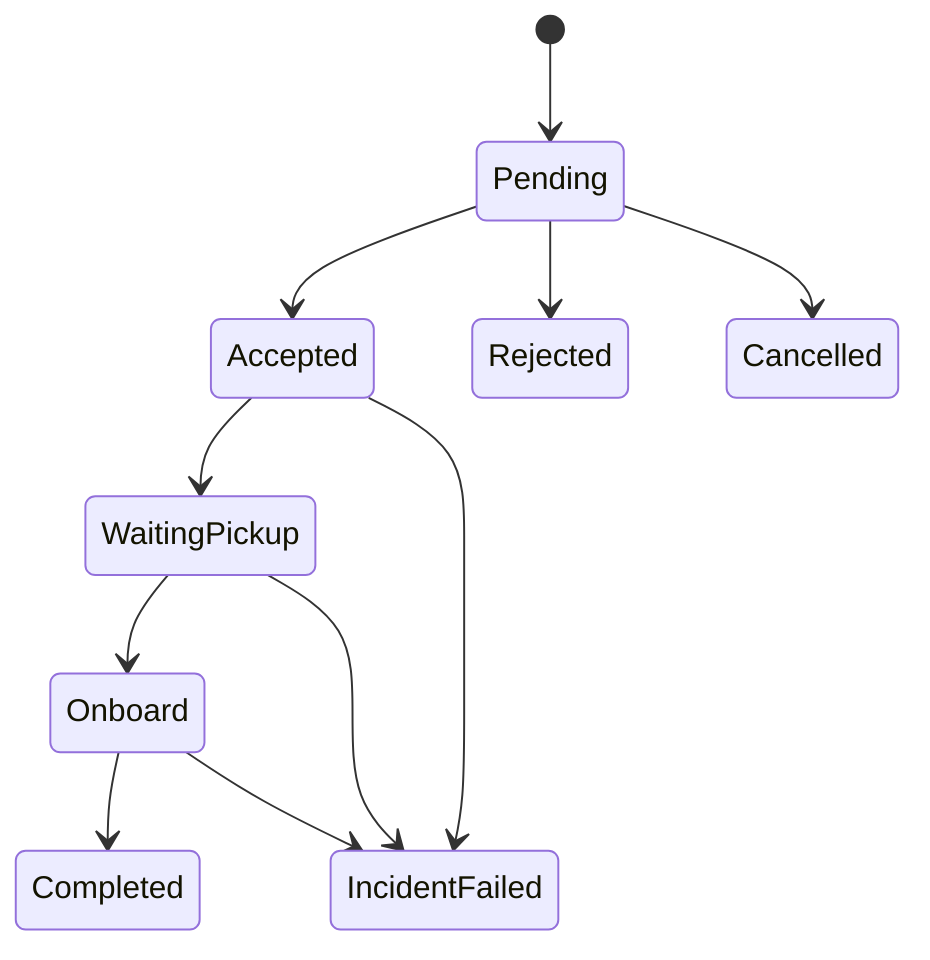

# Commitment ledger và certificate

## 1. Ledger là gì?

Ledger là sổ cái append-only ghi mọi lời hứa đã **phát ra ngoài hệ thống** sau khi request được accept. Candidate nội bộ chưa publish không tiêu budget.

Một ledger record gồm:

```text
run/epoch/request
previous promise version
new promise version
exogenous projection
raw/material deltas
budget before/after
reason/source event
publication id
certificate reference
```

Initial accepted promise tạo ledger mở đầu nhưng không tính là revision.

`publication id` là identity ổn định của promise publication trong proposed
state. Không nhúng `decisionHash` hiện tại vào chính state đang được hash vì sẽ
tạo vòng tự tham chiếu. Khi certificate/Runner được triển khai ở
`RB-WP3-010..011`, decision envelope chứa publication ID và bind toàn certificate/
state bằng decision hash bên ngoài ledger record.

## 2. Vòng đời request



Không có transition bình thường `Accepted -> Rejected`. Hủy bởi người dùng và failure do incident là trạng thái riêng, không được dùng để làm đẹp acceptance metric.

### 2.1 Promise mở lúc nào — `initialPromiseTrigger`

Ledger cần biết **chính xác** thời điểm lời hứa đầu tiên ra đời, vì mọi revision sau đó
được đo từ đó. Config khai báo một trong hai trigger, khóa bởi ADR-039:

| Giá trị | Promise mở tại | Reason code | Dùng cho |
|---|---|---|---|
| `initial-acceptance` (mặc định) | chuyển `Pending → Accepted` | `INITIAL_ACCEPTANCE` | WP1–WP6; assignment là cam kết ngay |
| `booking-confirmation` | chuyển `Accepted → WaitingPickup/Onboard` | `INITIAL_BOOKING_CONFIRMATION` | Layer 2 thật, nơi assignment chỉ là **offer provisional** |

Ở chế độ `booking-confirmation`, một request đang `Accepted` đã được kiểm tra vật lý
đầy đủ nhưng **cố ý chưa có promise nào**: nó là một offer, và rider chưa được hứa gì.
Vì vậy validator bỏ qua nó khi tính hard vector và warning excess, và một
`OfferDeclined` trên request đó là `CancelAfterAcceptance` — từ chối một offer đã cấp
không được ghi thành chưa từng được phục vụ.

Config thiếu field phải parse thành `initial-acceptance` để content hash của
config WP1–WP6 không đổi. Trigger nằm trong hash cấu hình chính sách, nên hai arm
không thể vô tình so sánh với hai định nghĩa promise khác nhau.

## 3. Budget policy

Budget là vector:

```text
pickup_eta_total_ms
drop_eta_total_ms
material_eta_revision_count
vehicle_switch_count
pickup_stop_relocation_mm
pickup_stop_switch_count
drop_stop_relocation_mm
drop_stop_switch_count
incumbent_order_inversion_count
pre_pickup_inserted_stop_count
```

Mỗi field có:

- hard limit;
- soft warning level tùy chọn;
- phase applicability;
- exemption rule cho incident;
- source: service policy hoặc user-provided.

Không tự sinh “user preference” và gắn nhãn thật cho nó.

## 4. Phase lock

Ngoài budget tích lũy, một số promise bị khóa theo phase:

- xe đã vượt decision point → next stop immutable;
- rider onboard → pickup stop/ETA immutable;
- còn dưới `freezeHorizonMs` tới pickup → vehicle/stop có thể bị khóa;
- route prefix đã execute → tuyệt đối immutable;
- sau khi publish “final pickup confirmation” → policy khóa theo contract.

Hard lock và cumulative budget bổ sung nhau:

- budget kiểm soát tổng thay đổi suốt lịch sử;
- lock ngăn thay đổi nguy hiểm khi gần thực thi.

## 5. Áp dụng delta

```text
Project previous plan under current travel state
Compute candidate promise
Compute exogenous, decision and visible deltas
Load ledger balance
Apply hard-lock rules
Apply dimension budgets
Return allowed/rejected + witness
```

Không mutate ledger trong lúc thử candidate. Chỉ candidate thắng và đã publish mới commit delta.

Từ ADR-021, service-order evidence dùng token ổn định
`(requestId, stopKind, stopId)`. `incumbent_order_inversion_count` đếm các cặp
token incumbent chung bị đảo thứ tự; `pre_pickup_inserted_stop_count` đếm stop ID
mới xuất hiện trước pickup của rider. Đổi node pickup/drop cần distance lookup
canonical theo millimeter; không được suy khoảng cách từ travel time.

## 6. Normalized utilization

Để so sánh các dimension:

\[
u_{i,k}^e =
\begin{cases}
TV_{i,k}^e / B_{i,k}, & B_{i,k}>0\\
0, & TV=0,\ B=0\\
\infty, & TV>0,\ B=0
\end{cases}
\]

Các aggregate:

- `max_k u_{i,k}`: dimension căng nhất của rider;
- `max_i max_k u_{i,k}`: worst rider;
- distribution của utilization.

Utilization chỉ dùng để xếp hạng/report; feasibility vẫn kiểm từng dimension.

## 7. Certificate

Mỗi decision có một certificate versioned:

```json
{
  "certificateVersion": "1.0",
  "decisionId": "d-42",
  "normalOperation": true,
  "physicalFeasible": true,
  "acceptedNeverRejected": true,
  "frozenPrefixPreserved": true,
  "commitmentBudgetsSatisfied": true,
  "checkedRequestCount": 38,
  "checkedVehicleCount": 12,
  "witnesses": [],
  "validatorVersion": "1.0.0",
  "inputStateHash": "...",
  "decisionHash": "..."
}
```

Certificate không chỉ là boolean. Khi một candidate bị loại hoặc incident breach:

```json
{
  "requestId": "r-1042",
  "dimension": "pickup_eta_total_ms",
  "limit": 600000,
  "before": 540000,
  "delta": 120000,
  "after": 660000,
  "causedByEventSeq": 178,
  "candidateId": "v07-r1042-p3d8"
}
```

Đây là **witness**: bằng chứng nhỏ chỉ ra chỗ hỏng.

Certificate body không tự chứa current decision hash trong phần dùng để tính
chính hash đó. Body bind input/state/publication; decision envelope cuối cùng bind
toàn body bằng `decisionHash`. Quy tắc này tránh fixed-point hash nhưng vẫn giữ
tamper evidence.

## 8. Validator độc lập

Validator nhận full before-state và proposed decision, rồi tự:

- diễn lại route schedule;
- kiểm capacity/time windows/ride time;
- kiểm prefix;
- dựng promise;
- tính delta;
- kiểm ledger;
- kiểm lifecycle.

Validator không tin cost/delta do solver gửi. Solver diagnostics chỉ là thông tin bổ sung.

## 9. Incident và breach

Ví dụ incident:

- road closure làm route cũ không thể thực thi;
- vehicle breakdown;
- safety evacuation;
- simulator báo state không nhất quán.

Quy tắc:

1. Mở incident bằng event rõ ràng.
2. Chọn phương án ưu tiên safety/physical feasibility.
3. Ghi dimension bị breach, nguyên nhân và affected riders.
4. Không trừ ngược hoặc reset lịch sử.
5. Report normal-operation và incident metrics riêng.

Một run có breach không tự động bị loại. Nhưng không được tính breach là “budget satisfied”.

## 10. Traffic decomposition trong ledger

Mỗi promise update lưu:

- promise trước;
- exogenous projection;
- promise mới;
- decision-induced delta;
- visible delta.

Budget v1 nên có hai cấu hình:

- `decision-only`: hard budget áp vào phần do thuật toán kiểm soát;
- `customer-visible`: hard/soft budget áp vào tổng thay đổi nhìn thấy.

`decision-only` là cấu hình nghiên cứu chính vì công bằng hơn khi so thuật toán dưới cùng traffic shock. `customer-visible` là secondary vì gần trải nghiệm sản phẩm nhưng có thể bất khả thi khi traffic thay đổi lớn.

Cùng lý do đó, **phase lock được đánh giá trên trục exogenous → candidate**, không phải
trên trục published promise → candidate (ADR-039). Xe chạy thật làm ETA trôi vài mili
giây; drift đó được ghi vào ledger như exogenous delta nhưng không phải vi phạm lock,
vì thuật toán không gây ra nó. Promise đã công bố trước đó vẫn là thứ xác định horizon
nào đang bị khóa. Nếu so candidate trực tiếp với promise cũ thì mọi traffic shock đều
trở thành vi phạm lock và phép so B1/C1 mất ý nghĩa.

## 11. Concurrent update và idempotency

- Ledger append dùng expected `planVersion`/`ledgerVersion`.
- Unique key `(runId, requestId, promiseVersion)`.
- Một decision publish trong một transaction logic.
- Retry cùng decision hash là idempotent.
- Decision khác trên cùng expected version bị conflict, phải reload/replay.

## 12. Các định lý/bất biến mục tiêu

### Ledger monotonicity

Mỗi cumulative counter không giảm.

### Budget soundness

Nếu certificate normal-operation hợp lệ, không field nào vượt hard limit.

### No hidden reset

Vehicle/stop đổi về giá trị cũ vẫn tiêu switch/total variation; không hoàn lại budget.

### Publish atomicity

Không tồn tại state trong đó route mới đã áp dụng nhưng promise/ledger chưa ghi, hoặc ngược lại.

### Explainability completeness

Mọi reject do commitment phải trỏ tới ít nhất một witness dimension.

## 13. Ví dụ ngắn

Rider A được accept với pickup ETA 18:30 và budget ETA tổng 10 phút.

- Epoch 2: ETA 18:34 → tiêu 4 phút.
- Epoch 3: ETA 18:31 → tiêu thêm 3 phút, tổng 7 phút.
- Epoch 4: candidate mới đưa ETA 18:36 → delta 5 phút, tổng 12 phút.

Dù 18:36 chỉ cách lời hứa đầu 6 phút, candidate epoch 4 vẫn vi phạm vì lịch sử đã dao động. Một constraint chỉ so với initial promise sẽ bỏ sót điều này.

## 14. Biên executable đã đóng ở WP3

- Normal operation chạy independent validator theo thứ tự state → physical →
  projection → lock → budget → ledger; candidate không được tự khai delta/cost.
- Initial/revision publication, route mới, ledger mới và certificate nằm trong cùng
  pending transaction; sai ACK không commit, checkpoint bị cấm khi còn pending.
- Certificate body phải có state hashes trùng containing decision và
  `publicationIds` khớp đúng tập action `promisePublished`; decision hash bind cả
  event input lẫn body/action.
- Incident/breach là ledger riêng: breach chỉ gắn incident đang mở, rider/vehicle
  bị ảnh hưởng, budget attempted bằng `before + chargedDelta`; resolve không xóa
  incident, breach hoặc commitment history.
- Checkpoint lưu full run/travel/commitment/incident/hash-chain state và restore chỉ
  nhận exact canonical reachable state. Genesis-vs-restore suffix replay phải cho
  decision bytes/hash giống nhau.

Giới hạn: WP3 định nghĩa và kiểm tra breach record/action nhưng không triển khai
solver incident-recovery policy; safe fallback optimization thuộc WP4. Vì vậy
certificate do Runner WP3 phát trong normal operation luôn `normalOperation=true`.
