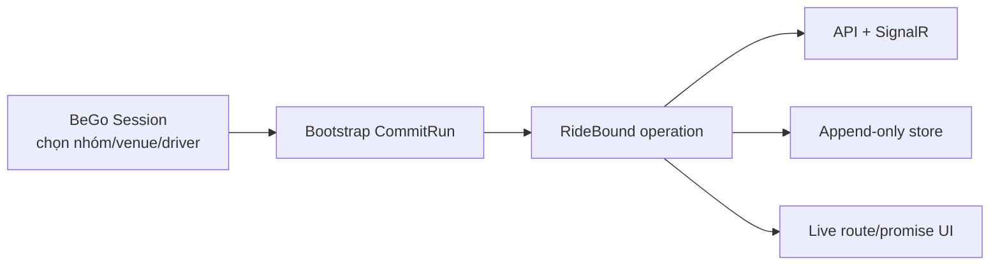

# Tích hợp BeGo: API, persistence, observability và UX

## 1. Nguyên tắc migration

RideBound chạy cạnh hệ thống outing hiện tại trước. Không biến `Session` thành aggregate online khổng lồ.



## 2. Aggregate mới

Tên đề xuất:

- `CommitRun`;
- `CommitVehicle`;
- `CommitRequest`;
- `PublishedPromise`;
- `CommitmentLedgerEntry`;
- `CommitDecision`;
- `CommitCertificate`;
- `CommitIncident`;
- `ExperimentManifest`.

Không tái dùng `PickupRequest` làm online request v1. Adapter có thể map bootstrap ID.

## 3. Database tables

### `commit_runs`

- run/scenario/session linkage;
- status;
- schema/policy/core versions;
- simulation origin;
- manifest/hash;
- current epoch/event/plan versions.

### `commit_events`

- append-only ordered input;
- `(run_id,event_seq)` unique;
- event type, sim time, payload JSONB, payload hash.

### `commit_requests`

- canonical request fields;
- lifecycle;
- accepted/completed timestamps;
- current vehicle;
- source IDs.

### `commit_vehicle_snapshots`

- epoch/vehicle;
- position/capacity/onboard;
- executed prefix and plan version;
- snapshot hash.

### `commit_promises`

- request/promise version;
- vehicle/stop/ETA/order;
- published epoch;
- exogenous projection;
- previous promise reference.

### `commit_ledger_entries`

- dimension;
- raw/material/exogenous/decision/visible deltas;
- cumulative value;
- limit/remaining;
- cause event/decision.

### `commit_decisions`

- input/output hashes;
- policy;
- accept/reject reasons;
- route plans;
- runtime/solver status;
- applied acknowledgement.

### `commit_certificates`

- decision ID;
- validator version;
- invariant flags;
- witnesses JSONB;
- certificate hash.

### `commit_incidents`

- type, opened/resolved;
- external evidence;
- affected riders;
- breach dimensions.

### `experiment_manifests`

- immutable config;
- source checksums;
- binary/container versions.

## 4. Persistence rules

- Event/promise/ledger/decision là append-only.
- Mutable projection tables có thể dùng cho query nhanh nhưng rebuild được từ log.
- Unique/idempotency keys.
- Optimistic concurrency theo epoch/plan version.
- Transaction logic: decision + promises + ledger + certificate + outbox.
- JSONB có schema version; các field tìm kiếm chính có column/index riêng.
- Dữ liệu experiment và product có namespace/retention khác.

## 5. API v1

### Run lifecycle

```text
POST   /api/commit/runs
GET    /api/commit/runs/{runId}
POST   /api/commit/runs/{runId}/events
GET    /api/commit/runs/{runId}/decisions/{epochId}
GET    /api/commit/runs/{runId}/requests/{requestId}/ledger
POST   /api/commit/runs/{runId}/incidents
POST   /api/commit/runs/{runId}/finalize
```

### Replay/benchmark

```text
POST   /api/commit/replays
GET    /api/commit/replays/{id}
GET    /api/commit/replays/{id}/artifacts
```

Production API không cần expose raw solver knobs cho client.

## 6. Idempotency và auth

- Event POST yêu cầu idempotency key/eventSeq.
- Host/operator quyền mở run; simulator service dùng service credential.
- Member chỉ xem promise của session/run mình.
- Incident override là privileged action và audit.
- Rate limiting riêng cho expensive replay/decision endpoints.
- Không cho client sửa ledger/certificate trực tiếp.

## 7. SignalR events

- `CommitRequestAccepted`
- `CommitRequestRejected`
- `VehiclePlanUpdated`
- `PromiseRevised`
- `CommitmentWarning`
- `CommitmentBreach`
- `PassengerBoarded`
- `PassengerCompleted`
- `CommitRunFinalized`

Payload cho UI chứa user-safe explanation; raw witness chi tiết có endpoint audit riêng.

## 8. UX tối thiểu

### Rider

- ETA hiện tại và thời điểm cập nhật.
- Xe/điểm đón hiện tại.
- Timeline ngắn của material revisions.
- Cảnh báo sự cố rõ ràng.
- Không hiển thị công thức ledger khó hiểu mặc định.

### Operator/research

- budget meter theo dimension;
- route before/after;
- event/decision timeline;
- reject witness;
- certificate status;
- normal vs incident mode;
- export transcript.

### Ngôn ngữ

Không ghi “AI đã tối ưu công bằng”. Dùng:

- “Giới hạn thay đổi kế hoạch đã thông báo”.
- “ETA thay đổi do tình hình giao thông”.
- “Yêu cầu mới không được ghép vì sẽ vượt giới hạn thay đổi của khách đã nhận”.

## 9. BeGo bootstrap

Khi outing đã chọn venue/driver và muốn chuyển sang operation:

1. Tạo `CommitRun` link `SessionId`.
2. Map thành viên/xe/route.
3. Publish initial promises.
4. Bắt đầu simulation/product clock.
5. Các request đến sau đi qua RideBound API.

Nếu bootstrap route không đủ dữ liệu time window/max ride:

- dùng policy default được hiển thị và lưu;
- không giả vờ dữ liệu đến từ user;
- report provenance từng field.

## 10. Những thay đổi không làm ở WP đầu

- Không sửa `Session.ChangeStatus`.
- Không xóa endpoint `/api/benchmarks/outing`.
- Không migrate snapshot cũ thành fake ledger.
- Không đưa UI RideBound vào flow mặc định.
- Không thêm protected-attribute collection.

## 11. Observability

Metrics:

- decision latency;
- queue depth;
- event lag;
- certificate failure;
- fallback;
- ledger utilization;
- incident/breach;
- replay divergence.

Tracing:

`runId -> epochId -> eventSeq -> decisionId -> certificateId`

Log không chứa secret/API key hoặc vị trí chính xác nếu environment production có privacy requirement.

## 12. Privacy và retention

- Tách research pseudonymous ID khỏi account ID.
- Giảm độ chính xác vị trí trong export khi không cần.
- Raw route/event retention có thời hạn.
- Consent/notice nếu dùng product logs cho nghiên cứu.
- Data deletion workflow không được phá experiment artifact đã anonymize ngoài chính sách; cần governance rõ trước pilot thật.

## 13. Migration/rollback

Mỗi migration:

- forward SQL/EF migration;
- index impact;
- backfill rule;
- rollback/disable feature flag;
- compatibility với deployment đang chạy.

RideBound feature flag off phải giữ BeGo cũ hoạt động.
