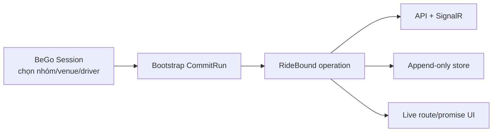

# Tích hợp BeGo: API, persistence, observability và UX

## 1. Nguyên tắc migration

RideBound chạy cạnh hệ thống outing hiện tại trước. Không biến `Session` thành aggregate online khổng lồ.



## 2. Aggregate mới

Tên đề xuất:

- `CommitRun`;
- `CommitVehicle`;
- `CommitRequest`;
- `PublishedPromise`;
- `CommitmentLedgerEntry`;
- `CommitDecision`;
- `CommitCertificate`;
- `CommitIncident`;
- `ExperimentManifest`.

Không tái dùng `PickupRequest` làm online request v1. Adapter có thể map bootstrap ID.

## 3. Database tables

### `commit_runs`

- run/scenario/session linkage;
- status;
- schema/policy/core versions;
- simulation origin;
- manifest/hash;
- current epoch/event/plan versions.

### `commit_events`

- append-only ordered input;
- `(run_id,event_seq)` unique;
- event type, sim time, payload JSONB, payload hash.

### `commit_requests`

- canonical request fields;
- lifecycle;
- accepted/completed timestamps;
- current vehicle;
- source IDs.

### `commit_vehicle_snapshots`

- epoch/vehicle;
- position/capacity/onboard;
- executed prefix and plan version;
- snapshot hash.

### `commit_promises`

- request/promise version;
- vehicle/stop/ETA/order;
- published epoch;
- exogenous projection;
- previous promise reference.

### `commit_ledger_entries`

- dimension;
- raw/material/exogenous/decision/visible deltas;
- cumulative value;
- limit/remaining;
- cause event/decision.

### `commit_decisions`

- input/output hashes;
- policy;
- accept/reject reasons;
- route plans;
- runtime/solver status;
- applied acknowledgement.

### `commit_certificates`

- decision ID;
- validator version;
- invariant flags;
- witnesses JSONB;
- certificate hash.

### `commit_incidents`

- type, opened/resolved;
- external evidence;
- affected riders;
- breach dimensions.

### `experiment_manifests`

- immutable config;
- source checksums;
- binary/container versions.

## 4. Persistence rules

- Event/promise/ledger/decision là append-only.
- Mutable projection tables có thể dùng cho query nhanh nhưng rebuild được từ log.
- Unique/idempotency keys.
- Optimistic concurrency theo epoch/plan version.
- Transaction logic: decision + promises + ledger + certificate + outbox.
- JSONB có schema version; các field tìm kiếm chính có column/index riêng.
- Dữ liệu experiment và product có namespace/retention khác.

## 5. API v1

### Run lifecycle

```text
POST   /api/commit/runs
GET    /api/commit/runs/{runId}
POST   /api/commit/runs/{runId}/events
GET    /api/commit/runs/{runId}/decisions/{epochId}
GET    /api/commit/runs/{runId}/requests/{requestId}/ledger
POST   /api/commit/runs/{runId}/incidents
POST   /api/commit/runs/{runId}/finalize
```

### Replay/benchmark

```text
POST   /api/commit/replays
GET    /api/commit/replays/{id}
GET    /api/commit/replays/{id}/artifacts
```

Production API không cần expose raw solver knobs cho client.

## 6. Idempotency và auth

- Event POST yêu cầu idempotency key/eventSeq.
- Host/operator quyền mở run; simulator service dùng service credential.
- Member chỉ xem promise của session/run mình.
- Incident override là privileged action và audit.
- Rate limiting riêng cho expensive replay/decision endpoints.
- Không cho client sửa ledger/certificate trực tiếp.

## 7. SignalR events

- `CommitRequestAccepted`
- `CommitRequestRejected`
- `VehiclePlanUpdated`
- `PromiseRevised`
- `CommitmentWarning`
- `CommitmentBreach`
- `PassengerBoarded`
- `PassengerCompleted`
- `CommitRunFinalized`

Payload cho UI chứa user-safe explanation; raw witness chi tiết có endpoint audit riêng.

## 8. UX tối thiểu

### Rider

- ETA hiện tại và thời điểm cập nhật.
- Xe/điểm đón hiện tại.
- Timeline ngắn của material revisions.
- Cảnh báo sự cố rõ ràng.
- Không hiển thị công thức ledger khó hiểu mặc định.

### Operator/research

- budget meter theo dimension;
- route before/after;
- event/decision timeline;
- reject witness;
- certificate status;
- normal vs incident mode;
- export transcript.

### Ngôn ngữ

Không ghi “AI đã tối ưu công bằng”. Dùng:

- “Giới hạn thay đổi kế hoạch đã thông báo”.
- “ETA thay đổi do tình hình giao thông”.
- “Yêu cầu mới không được ghép vì sẽ vượt giới hạn thay đổi của khách đã nhận”.

## 9. BeGo bootstrap

Khi outing đã chọn venue/driver và muốn chuyển sang operation:

1. Tạo `CommitRun` link `SessionId`.
2. Map thành viên/xe/route.
3. Publish initial promises.
4. Bắt đầu simulation/product clock.
5. Các request đến sau đi qua RideBound API.

Nếu bootstrap route không đủ dữ liệu time window/max ride:

- dùng policy default được hiển thị và lưu;
- không giả vờ dữ liệu đến từ user;
- report provenance từng field.

## 10. Những thay đổi không làm ở WP đầu

- Không sửa `Session.ChangeStatus`.
- Không xóa endpoint `/api/benchmarks/outing`.
- Không migrate snapshot cũ thành fake ledger.
- Không đưa UI RideBound vào flow mặc định.
- Không thêm protected-attribute collection.

## 11. Observability

Metrics:

- decision latency;
- queue depth;
- event lag;
- certificate failure;
- fallback;
- ledger utilization;
- incident/breach;
- replay divergence.

Tracing:

`runId -> epochId -> eventSeq -> decisionId -> certificateId`

Log không chứa secret/API key hoặc vị trí chính xác nếu environment production có privacy requirement.

## 12. Privacy và retention

- Tách research pseudonymous ID khỏi account ID.
- Giảm độ chính xác vị trí trong export khi không cần.
- Raw route/event retention có thời hạn.
- Consent/notice nếu dùng product logs cho nghiên cứu.
- Data deletion workflow không được phá experiment artifact đã anonymize ngoài chính sách; cần governance rõ trước pilot thật.

## 13. Migration/rollback

Mỗi migration:

- forward SQL/EF migration;
- index impact;
- backfill rule;
- rollback/disable feature flag;
- compatibility với deployment đang chạy.

RideBound feature flag off phải giữ BeGo cũ hoạt động.

## 14. Boundary khóa bởi ADR-025 cho WP5

Refinement ngày 2026-08-05 thay tên aggregate đề xuất bằng schema/flow thực thi
trong [tasks/32](tasks/32-wp5-bego-integration-ticket-plan.md):

- adapter/API/EF/SignalR nằm trong repository BeGo; không project-reference hoặc
  copy RideBound core;
- BeGo chỉ gọi exact hashed/versioned long-lived NDJSON Runner artifact;
- `CommitRun` serialize một pending operation/decision; PostgreSQL lease cho phép
  nhiều worker xử lý nhiều run nhưng không xử lý song song cùng run;
- transaction tách T1 event/work, T2 decision/certificate/projection/outbox và T3
  ACK/checkpoint; Runner/SignalR I/O luôn ngoài transaction;
- delivery là at-least-once + idempotent effect, không claim exactly-once;
- ACK uncertain phải reconstruct Runner từ checkpoint + suffix replay và compare
  exact decision hash; không đoán success;
- bootstrap dùng run-pseudonymous ID, E7/ms ties-to-even, explicit provenance và
  fail khi time window/max ride không có override hoặc named stored profile;
- feature flag default off; rollback không xóa append-only evidence;
- paired B1/C1 là Layer-1 mechanical/descriptive signal, chưa phải effectiveness.

O-007 đóng cho WP5 bằng child process. HTTP/gRPC chỉ xét lại nếu có yêu cầu
cross-host thật và ADR mới. Paper/official systems evidence nằm ở
[WP5 distributed integration evidence](research/wp5-distributed-integration-evidence-2026-08-05.md).

## 15. Trạng thái thực thi sau RB-WP5-009

BeGo hiện có T1/T2/T3 thật trên PostgreSQL, không còn là sơ đồ đề xuất:

- T1 append event/work và advance server-owned cursor dưới run row lock;
- Runner I/O ở ngoài transaction dưới bounded lease;
- T2 revalidate exact decision/certificate rồi ghi decision, certificate,
  user-safe projection, timeline và outbox atomically;
- matching ACK + checkpoint xảy ra ngoài DB, sau đó T3 xác minh độc lập toàn
  envelope/hash/state binding mới đánh dấu operation `Applied`;
- mọi uncertain process outcome dùng fresh Runner reconstruction; revision + owner
  + database time là fence, không dựa vào caller clock hay EF snapshot cũ;
- outbox relay chỉ claim exact unpublished head của từng run bằng
  `DISTINCT ON` + ordered `FOR UPDATE SKIP LOCKED`; run chậm không giữ row lock
  qua SignalR và không chặn head của run khác;
- `attempt_count` tăng dưới PostgreSQL DB-time lease là completion fence. Chỉ mark
  `published` sau `SendAsync`; lỗi gửi reschedule exponential bounded, crash sau
  send tạo duplicate cùng message ID/payload/hash thay vì effect mới;
- relay tái kiểm exact allowlist user-safe envelope và canonical Session group;
  route/node/certificate witness/budget/raw identity không được broadcast;
- wire thêm stable `aggregateSequence` và payload hash ngoài exact nested payload.
  Frontend giữ bounded per-run monotonic cursor + recent message IDs để bỏ
  duplicate/stale completion do sender cũ hết lease hoàn tất muộn;
- `SendAsync` chỉ chứng minh server-side SignalR invocation/enqueue, không chứng
  minh client đã nhận bền vững. Client mất kết nối phải catch-up qua audit timeline
  của `RB-WP5-010`; không có claim exactly-once end-user delivery;
- relay service/store đã đăng ký nhưng hosted polling worker vẫn chưa bật;
  default-off worker lifecycle thuộc `RB-WP5-011`.

Test thực dùng tám failpoint trước/sau Runner/T2/ACK/T3, PostgreSQL 17 và published
Runner; no-crash/recovered artifacts phải byte/hash-equal. Promise service order
được kiểm semantic như Domain, thay vì chỉ kiểm field/type.

Outbox gate bổ sung real PostgreSQL crash-after-send/reclaim/stale-fence,
cross-run non-blocking, retry backoff, per-run head ordering, T2 rollback atomicity
và Session retarget mutation. Full BeGo Debug/Release đạt 131/131 không skip;
frontend 9/9, lint, TypeScript, production build và vulnerability audits sạch.

## 16. Trạng thái thực thi sau RB-WP5-010

Audit timeline giờ là durable catch-up/query boundary thật, tách khỏi outbox
worker queue:

- cursor là exact `(sequence,id)` với codec canonical, bounded page và PostgreSQL
  row-value keyset; audit read không dùng `SKIP LOCKED`;
- member scope được server suy ra từ toàn bộ pickup request thật của chính member,
  rồi map qua restricted subject link sang pseudonymous run/request. Truy vấn
  request của member khác trả access denied, không giả thành danh sách rỗng;
- member chỉ thấy canonical user-safe projection/timeline. Operator policy riêng
  mới được đọc exact raw decision/certificate evidence, chạy rebuild hoặc export;
- JSONB đọc ra được canonicalize lại rồi kiểm hash/allowlist, tránh trả PostgreSQL
  rendered JSON kèm hash của byte canonical khác;
- rebuild chạy trong repeatable-read snapshot từ append-only decision/certificate/
  operation source, kiểm epoch/hash/state chain và materializer rồi so hash với live
  projection/timeline. Drift làm export fail closed;
- pseudonymous export có recursive forbidden-field guard; log/metric không chứa
  subject, token, tọa độ, route, witness hoặc raw evidence;
- hai composite index `(run,sequence,id)` và `(run,request,sequence,id)` được kiểm
  bằng `EXPLAIN` trên 12.000 dòng đại diện; migration downgrade guard chạy trước
  mọi thao tác drop để không để schema ở trạng thái hạ cấp dở dang.

Full BeGo Debug và Release `/warnaserror` trên hai fresh PostgreSQL + published
Runner đạt 138/138, 0 skip. Frontend 9/9, lint, TypeScript, production build;
NuGet/npm audit sạch và required RideBound đạt 557/557. Đây là correctness,
rebuildability và privacy evidence; không phải throughput/SLA, effectiveness hoặc
exactly-once delivery claim. Hosted worker/rollout lifecycle vẫn thuộc `011`.

## 17. Trạng thái thực thi sau RB-WP5-011

Rollout không chỉ là một nhánh `if` quanh publisher:

- config mặc định `Disabled`; mode này không đăng ký decision/outbox hosted service,
  member COMMIT API fail closed trước khi resolve Runner, còn old Session/health
  contract và operator evidence path không đổi;
- `Shadow` chỉ đăng ký decision worker; `Live` mới đăng ký thêm outbox relay. Mọi
  worker phải qua cached exact Runner artifact SHA-256 preflight trước claim;
- namespace `Shadow`/`Live` được persist bất biến trên `commit_runs`; decision claim
  lọc namespace, outbox store hard-code chỉ claim `Live`. Vì vậy outbox shadow không
  thể bị publish khi restart hoặc đổi config sang live;
- migration backfill mọi run cũ thành `Shadow`, bỏ DB default sau backfill và đổi
  active uniqueness thành `(session,policy,namespace)`. Trigger cấm retarget mode;
  guarded `Down` chạy trước drop và giữ schema/evidence nguyên khi có dữ liệu;
- stop/cancel không claim vòng mới; lease đang giữ được để hết hạn rồi exact
  owner/revision fence cho worker cùng namespace reclaim. Shadow chỉ ghi `commit_*`
  và không sửa latest/final route snapshot của Session cũ;
- `/api/health/commit` trả stable Disabled/Ready/hash/config status, không lộ path,
  token hay payload. Hash sai làm health 503 và worker/API không claim/resolve.

Real PostgreSQL kiểm same-Session dual namespace, immutable mode, live/shadow claim
separation, restart lease reclaim, shadow outbox `attempt_count=0`, old route snapshot
unchanged và migration rollback integrity. Full BeGo Debug/Release `/warnaserror`
đạt 147/147, 0 skip; frontend 9/9 + lint/TypeScript/build; dependency audits sạch;
required RideBound đạt 557/557. Rollout vẫn default off; chưa có paired effectiveness.

## 18. Paired Layer-1 boundary sau RB-WP5-012

BeGo có project tool `OptiGo.PairedReplay` và fixture
`benchmarks/ridebound/layer1-paired-v1`. Hai arm đều chạy Runner commitment mode,
nên B1 không được bỏ qua validator/certificate path trong khi C1 đi qua path đó.
Pair manifest bind exact Runner DLL/core commit, raw/canonical workload, explicit
pseudonymous provenance, common commitment policy và từng config.

Fairness boundary được thực thi thay vì chỉ ghi trong tài liệu:

- candidate generation, OR-Tools adapter, seed và mọi deterministic work limit
  phải exact sau khi bỏ đúng `/policyId`;
- effective policy hash bind common policy catalog + arm config và Runner kiểm lại
  ở initialize;
- config bytes được stage một lần rồi kiểm hash trước/sau mỗi process, tránh
  preflight một file nhưng Runner đọc file khác do TOCTOU;
- actual protocol input được normalize chỉ ở policy fields và output-derived
  `decisionApplied.decisionHash`; mọi khác biệt khác fail pair;
- mỗi arm chạy hai process sạch, decision/certificate qua exact BeGo materializer,
  checkpoint được tính lại từ manifest/state/decision/event cursor;
- bundle enumerate toàn bộ file, reject thiếu/thừa/tamper và bind source + assembly
  của harness, không giả working tree chưa commit thành clean-commit evidence.

Bundle final có manifest SHA-256
`b843bd20cbe9bf887d00998d4eaad54258848eb41d87ae49fd18a2142a0cb807`;
BeGo Debug/Release đạt 152/152, 0 skip. Nó chứng minh Layer-1 mechanical pairing,
determinism/certificate/checkpoint và artifact integrity, không chứng minh policy
C1 tốt hơn B1.

## 19. Independent systems evidence sau RB-WP5-013

Evidence không gọi exception injection trong cùng test process là “process crash”.
Executable `OptiGo.CommitFaultHarness` chạy riêng và `Environment.FailFast` ngay tại
đủ 8 `CommitWorkerFailpoint` cùng 4 `CommitOutboxRelayFailpoint`, nên không có
`finally`/DI shutdown che lỗi. Test cha dùng database lease làm recovery authority,
khởi tạo fresh exact Runner và kiểm decision/certificate/checkpoint hash, effect/
timeline count, stale fence và outbox delivery semantics. Sau mỗi crash, mọi process
`dotnet` mới phải biến mất; `RunnerProcessClient.ActiveSessionCount` và PostgreSQL
connection count đều trở về baseline.

Oracle transition là bảng test-owned, không gọi production transition table. Nó chạy
256 seed × 64 bước; claim oracle so exact expected/observed operation set dưới 2, 3
và 4 worker. Năm mutant bắt buộc bỏ active-run unique index, ACK/checkpoint gate,
T2 outbox atomicity, fingerprint hoặc canonical hash đều tạo invariant violation và
bị gate giết; đây là explicit mutation evidence, không phải mutation-score giả.

Curve queue `8/32/64 × 1/2/4 worker` có một warm-up, năm repetition, raw samples,
machine/PostgreSQL config, deterministic randomized scenario order và row-count
trước/sau. Nó chỉ đo intake và claim-drain local: queue nhỏ cho thấy overhead worker,
queue 32/64 cho thấy bốn worker giảm median drain trong lần audit. Không dùng curve
này làm end-to-end throughput, production SLA hoặc effectiveness claim. Artifact
manifest SHA-256 là
`e21fb0877fbc6d61bf6f1e24adcda24e09a29fea95a9f44d1b61bf4fc1061ca2`.

## 20. Closure boundary sau RB-WP5-014

Source-level audit không chỉ đọc test count. Nó phát hiện ba khoảng trống có thể
làm sai ý nghĩa durable/publication và đã sửa trước khi đóng WP5:

1. `commit_subject_links` là dữ liệu quyết định member authorization nhưng trước
   đó còn mutable. Migration `20260809180000_HardenCommitPublicationBoundary`
   gắn append-only trigger cho cả `UPDATE`/`DELETE`; rollback fail closed khi còn
   subject/outbox data và chỉ chạy khi operator bật explicit schema-rollback guard.
2. T2 ghi outbox trước T3 nên một row `DecisionPersisted` không được publish.
   `commit_outbox.operation_id` nay non-null, FK cùng run vẫn được giữ. Query chọn
   absolute earliest unpublished head mỗi run trước, rồi chỉ cho candidate nếu exact
   same-run operation của head có `state = 'Applied'`; row sau không vượt head chưa
   T3. Real PostgreSQL test chứng minh pre-T3 claim rỗng/không tăng attempt dù có row
   `Applied` phía sau, post-T3 mới claim tuần tự.
3. Claim đã per-run-head nhưng một cycle trước đây publish tuần tự trong cùng scope.
   Batch processor nay tạo async DI scope/DbContext riêng cho từng run và chờ bằng
   `Task.WhenAll`; test có publisher chậm chứng minh run nhanh hoàn tất trước khi
   run chậm được thả, đồng thời vẫn giữ fence/lease ở store.

Full BeGo Debug và Release `/p:TreatWarningsAsErrors=true` trên hai fresh PostgreSQL
database + published Runner đạt 154/154, 0 skip. Frontend đạt 9/9, lint, TypeScript,
production build; full format và vulnerability audits sạch. Đây là GO cho
refinement WP6, không phải production readiness, end-user exactly-once, SLA hoặc
evidence C1 hiệu quả hơn B1. Review nguồn và hướng dẫn file/code nằm ở
[reviews/wp1-wp5-final/README.md](reviews/wp1-wp5-final/README.md).
