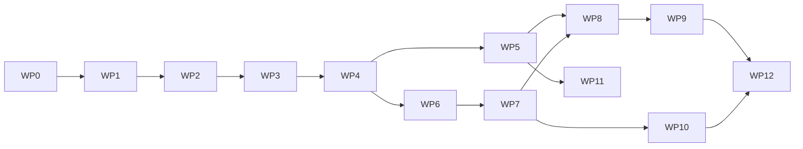

# Roadmap và work packages

## 1. Cách dùng

Mỗi work package có:

- mục tiêu;
- deliverable;
- dependency;
- exit gate;
- việc không làm.

Chỉ một package chính ở trạng thái `IN_PROGRESS` trong [18-status-and-decision-log.md](18-status-and-decision-log.md). Có thể làm task nhỏ song song nếu không thay đổi contract chưa khóa.

Roadmap này quản lý outcome và exit gate. Quy tắc ticket nằm trong
[23-delivery-backlog-and-ticket-policy.md](23-delivery-backlog-and-ticket-policy.md).
Chỉ topic hiện hành được refinement chi tiết; WP1 hiện có execution plan tại
[24-wp1-contracts-ticket-plan.md](24-wp1-contracts-ticket-plan.md).

## WP0 — Freeze baseline và scaffold

### Mục tiêu

Tạo repository và skeleton độc lập mà không copy hoặc đổi behavior BeGo.

### Deliverable

- `global.json` nếu cần pin SDK;
- repository Git riêng và remote chính thức;
- các project Domain/Application/Contracts/Algorithms/Solver/Infrastructure/Runner tối thiểu;
- solution references;
- namespace conventions;
- architecture tests và CI tối thiểu;
- tài liệu/AGENTS là nguồn sự thật trong repository mới;
- baseline test record.

### Exit gate

- restore/build/test toàn solution RideBound;
- existing 25 backend + 7 frontend test pass;
- dependency rules có architecture test;
- không endpoint/schema production mới ngoài scaffold.

### Không làm

- chưa implement solver;
- chưa sửa `Session`.
- chưa thêm package OR-Tools, EF Core, ASP.NET hoặc simulator.

## WP1 — Contracts và canonical replay

### Deliverable

- protocol schema v1;
- canonical units/JSON/hash;
- 10 golden fixtures;
- runner hello/init/event/error;
- manifest schema;
- decision transcript tool.

### Exit gate

- .NET golden tests pass;
- duplicate/idempotency/version tests;
- same transcript replay same hash.

## WP2 — Online state và rolling baseline

### Deliverable

- request/vehicle/run state machine;
- event reducer;
- route prefix/suffix;
- B1 rolling insertion;
- physical validator;
- tiny CLI demo.

### Exit gate

- lifecycle/route property tests;
- exact-small baseline oracle;
- accepted-never-rejected;
- no commitment constraint yet.

## WP3 — Ledger và certificate

### Deliverable

- promise model;
- exogenous/decision/visible delta;
- vector budget;
- hard locks;
- independent validator;
- certificate/witness;
- checkpoint.

### Exit gate

- mutation/property tests;
- incident separation;
- checkpoint replay equivalence;
- P1/P2/P3 test evidence.

## WP4 — RideBound policies và OR-Tools

### Deliverable

- B2/B3/B4;
- C1/C2;
- lexicographic solver;
- safe fallback;
- solver diagnostics;
- exact-small differential report.

### Exit gate

- infinite-budget equivalence B1;
- common candidate/compute rules;
- no invalid published decision;
- small Pareto examples.

## WP5 — BeGo adapter và persistence

### Deliverable

- BeGo bootstrap adapter;
- EF migrations/tables;
- event/decision endpoints;
- outbox/SignalR;
- feature flag;
- replay harness.

### Exit gate

- migration/integration tests;
- existing endpoints unchanged;
- paired B1/C1 BeGo replay;
- audit timeline query.

## WP6 — Common benchmark harness

### Deliverable

- dataset normalizers;
- scenario manifests;
- paired runner;
- metric computation;
- failure/exclusion log;
- result bundle.

### Exit gate

- tiny/medium reproducibility;
- raw-to-metric deterministic;
- public benchmark caveats enforced;
- no confirmatory run yet.

## WP7 — FleetPy Layer 2

### Deliverable

- pinned environment;
- FleetControl adapter;
- offer/booking semantics;
- event/plan mapping;
- FleetPy output reconciliation.

### Exit gate

- 10 adapter preflight tests;
- medium B1/C1 runs;
- same runner hash;
- capability matrix filled.

## WP8 — Pilot và preregistration

### Deliverable

- pilot results;
- variance/runtime analysis;
- chosen primary outcome/margins;
- frozen scenario/seed list;
- preregistration/config hashes.

### Exit gate

- no unresolved certificate/adapter errors;
- sample-size rationale;
- confirmatory set untouched;
- sign-off trong decision log.

## WP9 — Main experiments

### Deliverable

- Layer 1/2 full paired runs;
- statistical report;
- required plots/tables;
- raw artifacts;
- robustness/ablation.

### Exit gate

- success criteria được đánh giá, dù kết quả dương hay âm;
- exclusions theo prereg;
- rerun policy tuân thủ;
- reproducibility bundle kiểm tra độc lập.

## WP10 — Cross-system Layer 3

### Deliverable

- RidePy hoặc AMoD2 adapter;
- capability matrix;
- representative paired subset;
- heterogeneity analysis.

### Exit gate

- same runner binary;
- canonical scenario pass;
- cross-system results/report;
- không reimplement RideBound.

## WP11 — Product UX

### Deliverable

- rider promise UI;
- operator audit UI;
- SignalR live updates;
- incident explanation;
- privacy/retention settings.

### Exit gate

- accessibility/security test;
- user-safe language;
- feature flag rollback;
- không claim satisfaction nếu chưa study.

## WP12 — Thesis/paper/release

### Deliverable

- methods/result manuscript;
- claim audit mới;
- artifact DOI/release;
- limitations;
- demo.

### Exit gate

- mọi claim trỏ tới result/table/test;
- citations/version exact;
- artifact reproducible;
- negative results không bị giấu.

## 2. Critical path

## 3. Thứ tự ưu tiên khi thiếu thời gian

Không cắt:

- ledger/certificate;
- online B1;
- BeGo + FleetPy main layers;
- paired design/prereg;
- same runner.

Cắt trước:

- AMoDeus;
- OpenRidepoolSimulator;
- nhiều native baselines;
- production UI nâng cao;
- advanced forecasting/rebalancing;
- mọi ablation ở Layer 3.

## 4. Bước tiếp theo cụ thể

WP0 được thực hiện trực tiếp trong repository RideBound mới theo yêu cầu của
người dùng. Sau khi WP0 qua exit gate:

1. Thực hiện `RB-WP1-001` để khóa protocol boundary và open decisions.
2. Tiếp tục đúng ordered queue `RB-WP1-002` đến `RB-WP1-015`.
3. Chỉ thêm Contracts/Application files khi có golden test tương ứng.
4. Không bắt đầu online algorithm trước khi canonical replay của WP1 ổn định.
5. Không ticket hóa WP2 cho tới khi Q1 có evidence và WP1 được đóng đúng gate.
