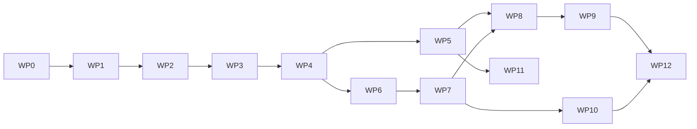

# Roadmap và work packages

## 1. Cách dùng

Mỗi work package có:

- mục tiêu;
- deliverable;
- dependency;
- exit gate;
- việc không làm.

Chỉ một package chính ở trạng thái `IN_PROGRESS` trong [18-status-and-decision-log.md](18-status-and-decision-log.md). Có thể làm task nhỏ song song nếu không thay đổi contract chưa khóa.

Roadmap này quản lý outcome và exit gate. Quy tắc ticket nằm trong
[23-delivery-backlog-and-ticket-policy.md](tasks/23-delivery-backlog-and-ticket-policy.md).
Chỉ topic hiện hành được refinement chi tiết. WP1 đã đóng theo execution plan
[24-wp1-contracts-ticket-plan.md](tasks/24-wp1-contracts-ticket-plan.md); WP2 bắt
đầu bằng ticket refinement
[25-wp2-online-state-refinement.md](tasks/25-wp2-online-state-refinement.md) và
hiện có ordered queue trong
[26-wp2-online-baseline-ticket-plan.md](tasks/26-wp2-online-baseline-ticket-plan.md).
WP2 đã đóng; WP3 refinement trong
[27-wp3-ledger-certificate-refinement.md](tasks/27-wp3-ledger-certificate-refinement.md)
đã tạo ordered queue
[28-wp3-ledger-certificate-ticket-plan.md](tasks/28-wp3-ledger-certificate-ticket-plan.md).
WP3 đã đóng; WP4 refinement
[29-wp4-algorithms-solver-refinement.md](tasks/29-wp4-algorithms-solver-refinement.md),
đã Done và tạo ordered queue
[30-wp4-algorithms-solver-ticket-plan.md](tasks/30-wp4-algorithms-solver-ticket-plan.md).
WP4 đã đóng bằng ADR-024; WP5 đã refinement và hoàn thành theo
[31-wp5-bego-integration-refinement.md](tasks/31-wp5-bego-integration-refinement.md),
[32-wp5-bego-integration-ticket-plan.md](tasks/32-wp5-bego-integration-ticket-plan.md).
WP6 refinement đã hoàn thành trong
[33-wp6-common-benchmark-harness-refinement.md](tasks/33-wp6-common-benchmark-harness-refinement.md);
ordered implementation queue nằm tại
[34-wp6-common-benchmark-harness-ticket-plan.md](tasks/34-wp6-common-benchmark-harness-ticket-plan.md),
`RB-WP6-001..014` đã Done; WP6 đã đóng bằng ADR-036. WP7 refinement
`RB-WP7-001..014` đã Done trong
[35-wp7-fleetpy-layer2-refinement.md](tasks/35-wp7-fleetpy-layer2-refinement.md);
ordered queue ở [tasks/36](tasks/36-wp7-fleetpy-layer2-ticket-plan.md) đã đóng bằng
ADR-038 và evidence current-state.

## WP0 — Freeze baseline và scaffold

### Mục tiêu

Tạo repository và skeleton độc lập mà không copy hoặc đổi behavior BeGo.

### Deliverable

- `global.json` nếu cần pin SDK;
- repository Git riêng và remote chính thức;
- các project Domain/Application/Contracts/Algorithms/Solver/Infrastructure/Runner tối thiểu;
- solution references;
- namespace conventions;
- architecture tests và CI tối thiểu;
- tài liệu/AGENTS là nguồn sự thật trong repository mới;
- baseline test record.

### Exit gate

- restore/build/test toàn solution RideBound;
- existing 25 backend + 7 frontend test pass;
- dependency rules có architecture test;
- không endpoint/schema production mới ngoài scaffold.

### Không làm

- chưa implement solver;
- chưa sửa `Session`.
- chưa thêm package OR-Tools, EF Core, ASP.NET hoặc simulator.

## WP1 — Contracts và canonical replay

**Trạng thái:** Complete, Q1 Release verified ngày 2026-07-29.

### Deliverable

- protocol schema v1;
- canonical units/JSON/hash;
- 10 golden fixtures;
- runner hello/init/event/error;
- manifest schema;
- decision transcript tool.

### Exit gate

- .NET golden tests pass;
- duplicate/idempotency/version tests;
- same transcript replay same hash.

WP1 closure/revalidation evidence nằm trong `18` và `19`: 115 Contracts,
38 Runner, 7 Architecture và 1 Domain pass — Release 161/161. Debug từng pass
123 non-Runner test rồi
Windows enterprise policy chặn fresh Runner DLL trước discovery; environment
exception và Release correctness evidence được giữ riêng, không nhập nhằng.

## WP2 — Online state và rolling baseline

**Trạng thái:** Complete cho physical/B1 ngày 2026-07-30; không gồm commitment.

Logical test inventory sau WP2 là 333; required Debug solution pass 333/333 và
Release build/format pass. Release xUnit bị Windows Application Control chặn
fresh unsigned DLL ở Application/Algorithms/Runner; đúng Release artifacts đó
pass qua policy-safe bundles/process checks. Exception nằm trong `18`, không
được tính là Release full-solution pass.

### Deliverable

- request/vehicle/run state machine;
- event reducer;
- route prefix/suffix;
- B1 rolling insertion;
- physical validator;
- tiny CLI demo.

### Exit gate

- lifecycle/route property tests;
- exact-small baseline oracle;
- accepted-never-rejected;
- no commitment constraint yet.

## WP3 — Ledger và certificate

**Trạng thái:** Complete ngày 2026-08-02; `RB-WP3-001..014` DONE. Promise,
three-way delta, immutable ledger, vector budget/locks, incident breach,
independent validator, certificate, atomic Runner publication và canonical
checkpoint/restore đều nằm trên cùng state/hash/ACK boundary.

### Deliverable

- promise model;
- exogenous/decision/visible delta;
- vector budget;
- hard locks;
- independent validator;
- certificate/witness;
- checkpoint.

### Exit gate

- mutation/property tests;
- incident separation;
- checkpoint replay equivalence;
- P1/P2/P3 test evidence.

## WP4 — RideBound policies và OR-Tools

**Trạng thái:** Complete ngày 2026-08-03; `RB-WP4-001..014` Done, ADR-023/024
Accepted. Required suite 557/557; independent exact-small/solver evidence và
synthetic microbenchmark đã ghi, chưa nâng effectiveness/scale claim.

Refinement hiện hành:
[29-wp4-algorithms-solver-refinement.md](tasks/29-wp4-algorithms-solver-refinement.md).
Execution plan hiện hành:
[30-wp4-algorithms-solver-ticket-plan.md](tasks/30-wp4-algorithms-solver-ticket-plan.md).

### Deliverable

- B2/B3/B4;
- C1/C2;
- lexicographic solver;
- safe fallback;
- solver diagnostics;
- exact-small differential report.

### Exit gate

- infinite-budget equivalence B1;
- common candidate/compute rules;
- no invalid published decision;
- small Pareto examples.

## WP5 — BeGo adapter và persistence

**Trạng thái:** Complete 2026-08-09; `RB-WP5-001..014` Done. Xem
[31-wp5-bego-integration-refinement.md](tasks/31-wp5-bego-integration-refinement.md)
và [32-wp5-bego-integration-ticket-plan.md](tasks/32-wp5-bego-integration-ticket-plan.md).

### Deliverable

- BeGo bootstrap adapter;
- EF migrations/tables;
- event/decision endpoints;
- outbox/SignalR;
- feature flag;
- replay harness.

### Exit gate

- migration/integration tests;
- existing endpoints unchanged;
- paired B1/C1 BeGo replay;
- audit timeline query.

## WP6 — Common benchmark harness

**Trạng thái:** `RB-WP6-001..014` DONE; WP6 COMPLETE. Strict contract,
verified derivatives, plan/seed/pairing compiler, exact external Runner supervisor,
append-only terminal store và production/independent metric equality đã có;
strict BagIt bundle/clean-process verifier và source-locked claim checker đã có;
tiny paired gate đã đóng bằng ADR-033; medium public-data mechanical gate đã đóng bằng
ADR-034 medium gate và ADR-035/contract `1.0.6` adversarial determinism/failure/
resource closure; ADR-036 đã đóng source/claim audit toàn WP1–WP6 bằng fresh tiny,
medium H/I trên exact source cuối, external verifier, full gates và review tiếng Việt. Xem
[33-wp6-common-benchmark-harness-refinement.md](tasks/33-wp6-common-benchmark-harness-refinement.md),
[34-wp6-common-benchmark-harness-ticket-plan.md](tasks/34-wp6-common-benchmark-harness-ticket-plan.md)
và [WP6 contract v1](benchmarking/wp6-contract-v1.md).

### Deliverable

- dataset normalizers;
- scenario manifests;
- paired runner;
- metric computation;
- failure/exclusion log;
- result bundle.

### Exit gate

- tiny/medium reproducibility;
- raw-to-metric deterministic;
- public benchmark caveats enforced;
- no confirmatory run yet.

## WP7 — FleetPy Layer 2

**Trạng thái hiện tại:** `RB-WP7-001..014 DONE` — Candidate portfolio opt-in,
FleetPy 1.0.2 external adapter, một Runner artifact cố định mỗi source state và actual
B1/C1 closed-loop đã qua gate cơ học. Xem ADR-038 và `docs/benchmarking/wp7-014-...`.
ADR-039 bổ sung: khóa các ngữ nghĩa còn thiếu quyết định, thêm work-profile gate cho
Candidate core, và chạy lại toàn bộ actual gate trên Runner v8 —
`docs/benchmarking/wp7-015-...`.

### Deliverable

- pinned environment;
- FleetControl adapter;
- offer/booking semantics;
- event/plan mapping;
- FleetPy output reconciliation.

### Exit gate

- 10 adapter preflight tests;
- medium B1/C1 runs;
- same runner hash;
- capability matrix filled.

## WP8 — Pilot và preregistration

**Trạng thái hiện tại:** **Complete**, `RB-WP8-001..014 Done`. Pilot/frontier 25/25,
burden oracle/verifier, exact 20-cell fixed panel và preregistration đã đóng. Holdout
dùng `2018-11-14`→`2018-11-18`, 4 demand realization/ngày, uniform 108 requests/cell.
Ba amendment pre-outcome sửa node cap, analysis/source binding và stale Runner pin;
freeze hiện hành là `H4=2f7e6bf3…a32dd`, bind cả publish tree. Chưa có confirmatory
outcome tại thời điểm cập nhật freeze.

### Deliverable

- pilot results;
- variance/runtime analysis;
- chosen primary outcome/margins;
- frozen scenario/seed list;
- preregistration/config hashes.

### Exit gate

- no unresolved certificate/adapter errors;
- sample-size rationale;
- confirmatory set untouched;
- sign-off trong decision log.

## WP9 — Main experiments

**Trạng thái hiện tại:** In progress; `RB-WP9-001/003 Done`, `RB-WP9-002a Ready`.
Ordered queue và exact closure gate ở `docs/tasks/39-wp9-main-experiment-ticket-plan.md`.

### Deliverable

- Layer 1/2 full paired runs;
- statistical report;
- required plots/tables;
- raw artifacts;
- robustness/ablation.

### Exit gate

- success criteria được đánh giá, dù kết quả dương hay âm;
- exclusions theo prereg;
- rerun policy tuân thủ;
- reproducibility bundle kiểm tra độc lập.

## WP10 — Cross-system Layer 3

### Deliverable

- RidePy hoặc AMoD2 adapter;
- capability matrix;
- representative paired subset;
- heterogeneity analysis.

### Exit gate

- same runner binary;
- canonical scenario pass;
- cross-system results/report;
- không reimplement RideBound.

## WP11 — Product UX

### Deliverable

- rider promise UI;
- operator audit UI;
- SignalR live updates;
- incident explanation;
- privacy/retention settings.

### Exit gate

- accessibility/security test;
- user-safe language;
- feature flag rollback;
- không claim satisfaction nếu chưa study.

## WP12 — Thesis/paper/release

### Deliverable

- methods/result manuscript;
- claim audit mới;
- artifact DOI/release;
- limitations;
- demo.

### Exit gate

- mọi claim trỏ tới result/table/test;
- citations/version exact;
- artifact reproducible;
- negative results không bị giấu.

## 2. Critical path

## 3. Thứ tự ưu tiên khi thiếu thời gian

Không cắt:

- ledger/certificate;
- online B1;
- BeGo + FleetPy main layers;
- paired design/prereg;
- same runner.

Cắt trước:

- AMoDeus;
- OpenRidepoolSimulator;
- nhiều native baselines;
- production UI nâng cao;
- advanced forecasting/rebalancing;
- mọi ablation ở Layer 3.

## 4. Bước tiếp theo cụ thể

WP0 được thực hiện trực tiếp trong repository RideBound mới theo yêu cầu của
người dùng. Sau khi WP0 qua exit gate:

1. WP0, WP1/Q1 và ordered queue `RB-WP2-001..012` đã hoàn thành.
2. WP2 đã cung cấp typed online state, immutable route/reducer, independent
   physical validator, deterministic B1, exact-small oracle và tiny replay.
3. WP3 đã hoàn thành `RB-WP3-001..014`, đóng correctness boundary bằng ADR-022
   và handoff review chi tiết WP1–WP3.
4. ADR-023/024 và `RB-WP4-001..014` đã đóng schedule, candidate fairness/loss,
   multiple-plan, lexicographic objective, OR-Tools, fallback, Runner integration,
   independent evidence và final review WP1–WP4.
5. Tín hiệu WP4 hiện chỉ là exact-small agreement/gap 0 và synthetic runtime
   curve; paired demand/effectiveness thuộc WP5–WP9.
6. `RB-WP5-001..014` đã đóng WP5 bằng actual child-process crash, PostgreSQL
   oracle, self-verifying artifact và source-level closure audit. Audit sửa thêm
   authorization-evidence immutability, pre-T3 publication và cross-run relay
   isolation; review/verdict ở [reviews/wp1-wp5-final/README.md](reviews/wp1-wp5-final/README.md).
7. `RB-WP6-014` đã đóng source/constraint/algorithm/claim audit WP1–WP6. `RB-WP7-001..014`
   đã tiếp tục bằng Candidate oracle/dominance, external FleetPy capability/adapter,
   actual tiny/medium B1/C1 loops và verifier. Không diễn giải WP6 instant-drain hay
   WP7 mechanical closure thành FleetPy effectiveness; O-001/O-002/O-003/O-004 vẫn đóng.
