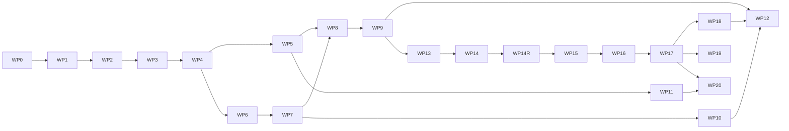

# Roadmap và work packages

## 1. Cách dùng

Mỗi work package có:

- mục tiêu;
- deliverable;
- dependency;
- exit gate;
- việc không làm.

Chỉ một package chính ở trạng thái `IN_PROGRESS` trong [18-status-and-decision-log.md](18-status-and-decision-log.md). Có thể làm task nhỏ song song nếu không thay đổi contract chưa khóa.

Roadmap này quản lý outcome và exit gate. Quy tắc ticket nằm trong
[23-delivery-backlog-and-ticket-policy.md](tasks/23-delivery-backlog-and-ticket-policy.md).
Chỉ topic hiện hành được refinement chi tiết. WP1 đã đóng theo execution plan
[24-wp1-contracts-ticket-plan.md](tasks/24-wp1-contracts-ticket-plan.md); WP2 bắt
đầu bằng ticket refinement
[25-wp2-online-state-refinement.md](tasks/25-wp2-online-state-refinement.md) và
hiện có ordered queue trong
[26-wp2-online-baseline-ticket-plan.md](tasks/26-wp2-online-baseline-ticket-plan.md).
WP2 đã đóng; WP3 refinement trong
[27-wp3-ledger-certificate-refinement.md](tasks/27-wp3-ledger-certificate-refinement.md)
đã tạo ordered queue
[28-wp3-ledger-certificate-ticket-plan.md](tasks/28-wp3-ledger-certificate-ticket-plan.md).
WP3 đã đóng; WP4 refinement
[29-wp4-algorithms-solver-refinement.md](tasks/29-wp4-algorithms-solver-refinement.md),
đã Done và tạo ordered queue
[30-wp4-algorithms-solver-ticket-plan.md](tasks/30-wp4-algorithms-solver-ticket-plan.md).
WP4 đã đóng bằng ADR-024; WP5 đã refinement và hoàn thành theo
[31-wp5-bego-integration-refinement.md](tasks/31-wp5-bego-integration-refinement.md),
[32-wp5-bego-integration-ticket-plan.md](tasks/32-wp5-bego-integration-ticket-plan.md).
WP6 refinement đã hoàn thành trong
[33-wp6-common-benchmark-harness-refinement.md](tasks/33-wp6-common-benchmark-harness-refinement.md);
ordered implementation queue nằm tại
[34-wp6-common-benchmark-harness-ticket-plan.md](tasks/34-wp6-common-benchmark-harness-ticket-plan.md),
`RB-WP6-001..014` đã Done; WP6 đã đóng bằng ADR-036. WP7 refinement
`RB-WP7-001..014` đã Done trong
[35-wp7-fleetpy-layer2-refinement.md](tasks/35-wp7-fleetpy-layer2-refinement.md);
ordered queue ở [tasks/36](tasks/36-wp7-fleetpy-layer2-ticket-plan.md) đã đóng bằng
ADR-038 và evidence current-state.

## WP0 — Freeze baseline và scaffold

### Mục tiêu

Tạo repository và skeleton độc lập mà không copy hoặc đổi behavior BeGo.

### Deliverable

- `global.json` nếu cần pin SDK;
- repository Git riêng và remote chính thức;
- các project Domain/Application/Contracts/Algorithms/Solver/Infrastructure/Runner tối thiểu;
- solution references;
- namespace conventions;
- architecture tests và CI tối thiểu;
- tài liệu/AGENTS là nguồn sự thật trong repository mới;
- baseline test record.

### Exit gate

- restore/build/test toàn solution RideBound;
- existing 25 backend + 7 frontend test pass;
- dependency rules có architecture test;
- không endpoint/schema production mới ngoài scaffold.

### Không làm

- chưa implement solver;
- chưa sửa `Session`.
- chưa thêm package OR-Tools, EF Core, ASP.NET hoặc simulator.

## WP1 — Contracts và canonical replay

**Trạng thái:** Complete, Q1 Release verified ngày 2026-07-29.

### Deliverable

- protocol schema v1;
- canonical units/JSON/hash;
- 10 golden fixtures;
- runner hello/init/event/error;
- manifest schema;
- decision transcript tool.

### Exit gate

- .NET golden tests pass;
- duplicate/idempotency/version tests;
- same transcript replay same hash.

WP1 closure/revalidation evidence nằm trong `18` và `19`: 115 Contracts,
38 Runner, 7 Architecture và 1 Domain pass — Release 161/161. Debug từng pass
123 non-Runner test rồi
Windows enterprise policy chặn fresh Runner DLL trước discovery; environment
exception và Release correctness evidence được giữ riêng, không nhập nhằng.

## WP2 — Online state và rolling baseline

**Trạng thái:** Complete cho physical/B1 ngày 2026-07-30; không gồm commitment.

Logical test inventory sau WP2 là 333; required Debug solution pass 333/333 và
Release build/format pass. Release xUnit bị Windows Application Control chặn
fresh unsigned DLL ở Application/Algorithms/Runner; đúng Release artifacts đó
pass qua policy-safe bundles/process checks. Exception nằm trong `18`, không
được tính là Release full-solution pass.

### Deliverable

- request/vehicle/run state machine;
- event reducer;
- route prefix/suffix;
- B1 rolling insertion;
- physical validator;
- tiny CLI demo.

### Exit gate

- lifecycle/route property tests;
- exact-small baseline oracle;
- accepted-never-rejected;
- no commitment constraint yet.

## WP3 — Ledger và certificate

**Trạng thái:** Complete ngày 2026-08-02; `RB-WP3-001..014` DONE. Promise,
three-way delta, immutable ledger, vector budget/locks, incident breach,
independent validator, certificate, atomic Runner publication và canonical
checkpoint/restore đều nằm trên cùng state/hash/ACK boundary.

### Deliverable

- promise model;
- exogenous/decision/visible delta;
- vector budget;
- hard locks;
- independent validator;
- certificate/witness;
- checkpoint.

### Exit gate

- mutation/property tests;
- incident separation;
- checkpoint replay equivalence;
- P1/P2/P3 test evidence.

## WP4 — RideBound policies và OR-Tools

**Trạng thái:** Complete ngày 2026-08-03; `RB-WP4-001..014` Done, ADR-023/024
Accepted. Required suite 557/557; independent exact-small/solver evidence và
synthetic microbenchmark đã ghi, chưa nâng effectiveness/scale claim.

Refinement hiện hành:
[29-wp4-algorithms-solver-refinement.md](tasks/29-wp4-algorithms-solver-refinement.md).
Execution plan hiện hành:
[30-wp4-algorithms-solver-ticket-plan.md](tasks/30-wp4-algorithms-solver-ticket-plan.md).

### Deliverable

- B2/B3/B4;
- C1/C2;
- lexicographic solver;
- safe fallback;
- solver diagnostics;
- exact-small differential report.

### Exit gate

- infinite-budget equivalence B1;
- common candidate/compute rules;
- no invalid published decision;
- small Pareto examples.

## WP5 — BeGo adapter và persistence

**Trạng thái:** Complete 2026-08-09; `RB-WP5-001..014` Done. Xem
[31-wp5-bego-integration-refinement.md](tasks/31-wp5-bego-integration-refinement.md)
và [32-wp5-bego-integration-ticket-plan.md](tasks/32-wp5-bego-integration-ticket-plan.md).

### Deliverable

- BeGo bootstrap adapter;
- EF migrations/tables;
- event/decision endpoints;
- outbox/SignalR;
- feature flag;
- replay harness.

### Exit gate

- migration/integration tests;
- existing endpoints unchanged;
- paired B1/C1 BeGo replay;
- audit timeline query.

## WP6 — Common benchmark harness

**Trạng thái:** `RB-WP6-001..014` DONE; WP6 COMPLETE. Strict contract,
verified derivatives, plan/seed/pairing compiler, exact external Runner supervisor,
append-only terminal store và production/independent metric equality đã có;
strict BagIt bundle/clean-process verifier và source-locked claim checker đã có;
tiny paired gate đã đóng bằng ADR-033; medium public-data mechanical gate đã đóng bằng
ADR-034 medium gate và ADR-035/contract `1.0.6` adversarial determinism/failure/
resource closure; ADR-036 đã đóng source/claim audit toàn WP1–WP6 bằng fresh tiny,
medium H/I trên exact source cuối, external verifier, full gates và review tiếng Việt. Xem
[33-wp6-common-benchmark-harness-refinement.md](tasks/33-wp6-common-benchmark-harness-refinement.md),
[34-wp6-common-benchmark-harness-ticket-plan.md](tasks/34-wp6-common-benchmark-harness-ticket-plan.md)
và [WP6 contract v1](benchmarking/wp6-contract-v1.md).

### Deliverable

- dataset normalizers;
- scenario manifests;
- paired runner;
- metric computation;
- failure/exclusion log;
- result bundle.

### Exit gate

- tiny/medium reproducibility;
- raw-to-metric deterministic;
- public benchmark caveats enforced;
- no confirmatory run yet.

## WP7 — FleetPy Layer 2

**Trạng thái hiện tại:** `RB-WP7-001..014 DONE` — Candidate portfolio opt-in,
FleetPy 1.0.2 external adapter, một Runner artifact cố định mỗi source state và actual
B1/C1 closed-loop đã qua gate cơ học. Xem ADR-038 và `docs/benchmarking/wp7-014-...`.
ADR-039 bổ sung: khóa các ngữ nghĩa còn thiếu quyết định, thêm work-profile gate cho
Candidate core, và chạy lại toàn bộ actual gate trên Runner v8 —
`docs/benchmarking/wp7-015-...`.

### Deliverable

- pinned environment;
- FleetControl adapter;
- offer/booking semantics;
- event/plan mapping;
- FleetPy output reconciliation.

### Exit gate

- 10 adapter preflight tests;
- medium B1/C1 runs;
- same runner hash;
- capability matrix filled.

## WP8 — Pilot và preregistration

**Trạng thái hiện tại:** **Complete**, `RB-WP8-001..014 Done`. Pilot/frontier 25/25,
burden oracle/verifier, exact 20-cell fixed panel và preregistration đã đóng. Holdout
dùng `2018-11-14`→`2018-11-18`, 4 demand realization/ngày, uniform 108 requests/cell.
Ba amendment pre-outcome sửa node cap, analysis/source binding và stale Runner pin;
freeze hiện hành là `H4=2f7e6bf3…a32dd`, bind cả publish tree. Chưa có confirmatory
outcome tại thời điểm cập nhật freeze.

### Deliverable

- pilot results;
- variance/runtime analysis;
- chosen primary outcome/margins;
- frozen scenario/seed list;
- preregistration/config hashes.

### Exit gate

- no unresolved certificate/adapter errors;
- sample-size rationale;
- confirmatory set untouched;
- sign-off trong decision log.

## WP9 — Main experiments

**Trạng thái hiện tại:** **Complete**, `RB-WP9-001..009 Done` dưới freeze H6.
Panel A 8 xe (`−7,13 pp`) và Panel B 4 xe (`−4,91 pp`) đều FAIL service gate;
burden gate PASS nhưng không cứu primary. 100/100 raw bundle đã qua verifier độc lập.
Ordered queue, kết quả âm và exact closure gate ở
`docs/tasks/39-wp9-main-experiment-ticket-plan.md` và
`docs/benchmarking/wp9-confirmatory-result-2026-08-23.md`.

### Deliverable

- Layer 1/2 full paired runs;
- statistical report;
- required plots/tables;
- raw artifacts;
- robustness/ablation.

### Exit gate

- success criteria được đánh giá, dù kết quả dương hay âm;
- exclusions theo prereg;
- rerun policy tuân thủ;
- reproducibility bundle kiểm tra độc lập.

## WP10 — Cross-system Layer 3

**Trạng thái hiện tại:** **Complete — negative capability result**;
`RB-WP10-001..010 Done`. RidePy `v2.10.1`/`bf1863e…9f14` đã chạy trong exact pinned
Linux container qua cùng versioned RideBound Runner, không tái hiện logic RideBound
trong Python. Canonical gate pass; representative subset fail closed vì `nodeOnly`
không biểu diễn concurrent mid-edge progress. Layer 3 claim chưa được thiết lập.
Ordered queue và outcome: `docs/tasks/40-wp10-ridepy-layer3-ticket-plan.md`.

### Deliverable

- RidePy hoặc AMoD2 adapter;
- capability matrix;
- representative paired subset;
- heterogeneity analysis.

### Exit gate

- same runner binary;
- canonical scenario pass;
- cross-system results/report;
- không reimplement RideBound.

Exit gate đã được đánh giá đầy đủ nhưng representative paired-subset gate không đạt.
WP10 được phép đóng bằng kết quả âm theo ADR-051; không báo thành Layer 3 success.

## WP11 — Product UX

### Deliverable

- rider promise UI;
- operator audit UI;
- SignalR live updates;
- incident explanation;
- privacy/retention settings.

### Exit gate

- accessibility/security test;
- user-safe language;
- feature flag rollback;
- không claim satisfaction nếu chưa study.

## WP12 — Thesis/paper/release

### Deliverable

- methods/result manuscript;
- claim audit mới;
- artifact DOI/release;
- limitations;
- demo.

### Exit gate

- mọi claim trỏ tới result/table/test;
- citations/version exact;
- artifact reproducible;
- negative results không bị giấu.

## WP13 — Post-H6 evidence sufficiency và mechanism diagnostics

**Trạng thái hiện tại:** **Complete**; `RB-WP13-001..013 Done`. Ordered queue:
`docs/tasks/42-wp13-post-h6-mechanism-diagnostics-ticket-plan.md`.

### Deliverable

- immutable H6 evidence inventory;
- policy-independent observed-input/decision projections;
- versioned first-divergence và minimal-relaxation records;
- opt-in Runner v1.2 retained/eligible/selected candidate evidence;
- independent verifier, mutation matrix và descriptive mechanism report.

### Exit gate

- không dùng policy-bearing state hash làm arm alignment;
- H6-supported và `notRecorded` fields được phân biệt bằng máy;
- immediate evidence tách khỏi downstream `trajectoryAssociated` outcome;
- không sửa H6 hoặc claim causal/population inference.

## WP14 — Exploratory ablation và Pareto frontier

**Trạng thái hiện tại:** **Freeze v1 stopped fail-closed**; `RB-WP14-001..005/008
Done`, `006/007 Deferred`, `009 Closed — FAIL`, `010..014 unauthorized`. Ordered queue:
`docs/tasks/44-wp14-exploratory-ablation-ticket-plan.md`. ADR-066 khoá sáu factor
F1–F6 và loại bốn factor bằng phép đo; quyết định owner sau `005` hoãn F3–F6 cho
tới frontier đầu tiên. ADR-069 đã freeze exact 16 cell × 10 arm = 160 job; ADR-070
đóng paired resource gate ở 1 valid B1/1 partial C1, giữ partial và cấm retry/
replacement. Full matrix/frontier chưa chạy.

**Ràng buộc bắt buộc:** development namespace/cells mới; H6 Panel A/B bị loại khỏi mọi
tuning/selection; freeze factor matrix, denominator, analyzer và resource envelope
trước outcome; không authorize H7 hoặc lifecycle policy v2.

**Exit gate:** không đạt dưới freeze v1. Bất kỳ successor nào cũng cần authorization
và protocol/ADR mới; không được thay thế failure receipt hoặc rescue H6.

## WP14R — Resilient execution successor

**Trạng thái hiện tại:** active theo ADR-071/072; `RB-WP14R-001..007 Done`,
`008 Ready` dưới exact freeze-v2 nhưng host preflight đang fail `POWER_SOURCE_NOT_AC`;
`009..012 unauthorized`. Refinement và ordered
queue: `docs/tasks/45-wp14r-resilient-execution-refinement.md` và
`docs/tasks/46-wp14r-resilient-execution-ticket-plan.md`.

**Mục tiêu:** xây immutable two-attempt ledger, supervised incremental evidence,
process-tree/host telemetry, fault-injection, resource dimensioning và independent
verifier trước khi owner cân nhắc freeze v2. Attempt không phải experimental unit;
recovery chỉ theo mechanical validity và cấm đọc scientific outcome.

**Ràng buộc bắt buộc:** WP14-v1 vẫn terminal FAIL CLOSED; không sửa 46 file freeze
bound, không retry/replace C1 partial, không chạm raw H6/E1, không tune factor/panel/
denominator và không mở WP15/H7. Scientific execution `008..012` chỉ được authorize
sau mechanics gates `002..006` và explicit protocol/freeze-v2 decision `007`.

**Exit gate:** fault matrix và independent ledger verifier đã pass; paired resource gate
dưới exact pre-outcome freeze v2 pass; development matrix/frontier được verify độc lập;
full source/logic/claim audit zero unresolved P0–P2. Failure ở bất kỳ gate nào dừng
fail-closed, không chọn best attempt.

## WP15 — Lifecycle-aware commitment v2

**Roadmap-level only; có refinement draft, chưa authorize execution.** Thiết kế
commitment graduation/freeze horizon theo lifecycle nếu WP14R chứng minh có Pareto
candidate; giữ accepted assignment, hard physical constraints, ledger/certificate và
same Runner. Refinement draft:
`docs/tasks/47-wp15-lifecycle-commitment-refinement.md`; evidence paper mới:
`docs/research/wp15-commitment-design-new-paper-evidence-2026-08-28.md`.

**Design space đã khoá trước (mỗi trục có điều kiện phủ định):** B — lời hứa là cửa sổ
với mức bảo đảm dẫn xuất từ tỷ số penalty thay vì `hardLimit` chọn tay; C — freeze
horizon phụ thuộc lifecycle state thay vì hằng số; D — giảm nguồn phương sai, đòi ADR
riêng vì đổi ngữ nghĩa hai stop-switch dimension. Anchor **giữ nguyên** là lời hứa đã
được khách chấp nhận, không chuyển sang outcome-anchored; mọi policy v2 phải bảo đảm
tập khả thi không rỗng theo cấu tạo.

**Exit gate:** formal contract, invariant/mutation/oracle tests và fallback; không
claim future value chỉ từ slack. Ticket `RB-WP15-xxx` chỉ được sinh sau khi WP14R đóng
`012` với frontier verified và có ADR authorize riêng.

## WP16 — Development data, sampling và pilot v2

**Roadmap-level only.** Mở data/scenario development mới, đo dynamism/urgency/capacity,
pilot policy v2 và derive budget/margin mà không chạm H6 panels.

**Exit gate:** provenance, unit/cluster definition, leakage audit và pilot-only claim.

## WP17 — H7 preregistration và confirmatory v2

**Roadmap-level only.** Chỉ mở khi WP15–WP16 đạt gate. Freeze estimand, panels,
failure treatment, Runner/artifact, analysis và stopping rules trước outcome.

**Exit gate:** independent freeze verification và terminal confirmatory report,
kể cả kết quả âm.

## WP18 — External validity và Layer 3 decision

**Roadmap-level only.** Đánh giá thêm dataset/simulator capability. RidePy chỉ được
mở lại nếu có representation trung thực cho concurrent mid-edge; AMoD2 hoặc alternate
adapter cần ADR, exact source/runtime và cùng Runner.

**Exit gate:** named capability result, no adapter-side policy reimplementation và
không pool heterogeneous layers thành một estimand giả.

## WP19 — Performance và SLA engineering

**Roadmap-level only.** Profile/optimize sau khi policy semantics khóa; giữ exact work
counters, correctness differential và machine-local benchmark provenance.

**Exit gate:** representative workload, allocation/time distributions, regression
budget; SLA chỉ khi có production-relevant measurement.

## WP20 — BeGo rollout v2

**Roadmap-level only.** Chỉ rollout policy v2 sau H7/product decision; feature flag,
audit, privacy, rollback và language không overclaim.

**Exit gate:** paired shadow/canary evidence, rollback drill và no-satisfaction claim
khi chưa có user study.

## 2. Critical path

## 3. Thứ tự ưu tiên khi thiếu thời gian

Không cắt:

- ledger/certificate;
- online B1;
- BeGo + FleetPy main layers;
- paired design/prereg;
- same runner.

Cắt trước:

- AMoDeus;
- OpenRidepoolSimulator;
- nhiều native baselines;
- production UI nâng cao;
- advanced forecasting/rebalancing;
- mọi ablation ở Layer 3.

## 4. Bước tiếp theo cụ thể

**Cập nhật 2026-08-24:** WP1–WP10 và final cross-WP review đã đóng. ADR-053 mở WP13
exploratory để định vị cơ chế của kết quả âm H6 nhưng giữ toàn bộ H6/WP10 immutable.
`RB-WP13-001` đã khóa refinement sau khi đọc 106/106 trang của ba full PDF;
`RB-WP13-002` đã inventory đủ raw evidence, khóa equal-observed-input alignment và
đóng required Debug gate 856/856. CPU profile của failure cũ dẫn tới exact no-allocation
number-marker check; medium public-drain pass 1/1 trong 1 phút 33 giây mà không đổi
ceiling, protocol bytes, Runner semantics hoặc H6 receipts. `RB-WP13-003` đã khóa
strict versioned first-divergence schema và 40/40 record bind exact report 002.
`RB-WP13-004` đã quét đủ 80 raw primary transcripts và khóa 40 paired action-level
comparisons: C1 nhận ít hơn ngay tại divergence ở 8/40 pair, accepted count bằng ở
32/40; kết quả chỉ descriptive/noncausal. `RB-WP13-005` đã link 41 B1 selected
candidates: 33 commitment-pruned, 7 absent/not-recorded, 1 selected-by-C1; 28 budget
và 5 lock clearances chỉ xóa recorded witness. `RB-WP13-006` đã cross-tab exact
evidence classes với immediate acceptance: cả 8 C1-lower pair có recorded witness
(7 budget, 1 lock), nhưng 25 equal pair cũng có witness; kết quả chỉ co-occurrence,
không causal attribution. `RB-WP13-007` đã chứng minh generation count/work evidence
exact-equal ở 40/40 pair và complete ở 80/80 arm-epoch, không cap/work/omission, nhưng
full retained identities/routes/objectives vẫn `notRecorded`; bảy unresolved links
không được tự gọi là ranking loss. `RB-WP13-008` đã khóa opt-in v1.2 retained-
portfolio evidence với exact generated/eligible/selected candidates, route/schedule và
solver-neutral objective inputs, đồng thời giữ default v1.1/H6 v1.0 compatibility.
`RB-WP13-009` đã freeze rồi execute E1 đủ 40 pair/80 arm ở namespace mới: 8.640
requests, 44.156/44.156 solver decisions có v1.2 portfolio, zero failure và cùng
source inventory hash. External inventory chỉ là execution/coverage receipt, chưa
phân tích candidate hoặc mechanism. `RB-WP13-010` đã dựng lại byte-exact 80 E1 bundle,
reject đúng typed code cho 31/31 mutant và xác nhận 80/80 same-arm behavioral projection
E1↔H6 bằng nhau. `RB-WP13-011` đã aggregate exact 40 pair: generated set equal 40/40, 33
C1-pruned, 7 C1-eligible-not-selected, 1 selected, zero absent; association rows
non-additive và noncausal. `RB-WP13-012` đã audit 80 source/schema/test/report files,
deep-verify 100 H6 bundle và 80 E1 arm, sửa một verifier-composition P2 bằng regression
và đóng với zero unresolved P0–P2. `RB-WP13-013` đã đóng WP13 bằng bảy exit gate pass,
resolution cho ba P3 limitation và verdict `openExploratoryAblationOnly`. Không
backfill/ghi H6, không CI/causal claim. WP14-v1 đã mở trên development namespace rồi
dừng fail-closed ở resource gate; WP14R đã khóa freeze-v2 với `001..007 Done`,
`008 Ready` nhưng chưa launch do AC precondition. WP15–WP20 vẫn roadmap-level.
WP11/WP12 deferred/stable và không được
dùng để diễn giải lại outcome.

WP0 được thực hiện trực tiếp trong repository RideBound mới theo yêu cầu của
người dùng. Sau khi WP0 qua exit gate:

1. WP0, WP1/Q1 và ordered queue `RB-WP2-001..012` đã hoàn thành.
2. WP2 đã cung cấp typed online state, immutable route/reducer, independent
   physical validator, deterministic B1, exact-small oracle và tiny replay.
3. WP3 đã hoàn thành `RB-WP3-001..014`, đóng correctness boundary bằng ADR-022
   và handoff review chi tiết WP1–WP3.
4. ADR-023/024 và `RB-WP4-001..014` đã đóng schedule, candidate fairness/loss,
   multiple-plan, lexicographic objective, OR-Tools, fallback, Runner integration,
   independent evidence và final review WP1–WP4.
5. Tín hiệu WP4 hiện chỉ là exact-small agreement/gap 0 và synthetic runtime
   curve; paired demand/effectiveness thuộc WP5–WP9.
6. `RB-WP5-001..014` đã đóng WP5 bằng actual child-process crash, PostgreSQL
   oracle, self-verifying artifact và source-level closure audit. Audit sửa thêm
   authorization-evidence immutability, pre-T3 publication và cross-run relay
   isolation; review/verdict ở [reviews/wp1-wp5-final/README.md](reviews/wp1-wp5-final/README.md).
7. `RB-WP6-014` đã đóng source/constraint/algorithm/claim audit WP1–WP6. `RB-WP7-001..014`
   đã tiếp tục bằng Candidate oracle/dominance, external FleetPy capability/adapter,
   actual tiny/medium B1/C1 loops và verifier. Không diễn giải WP6 instant-drain hay
   WP7 mechanical closure thành FleetPy effectiveness; O-001/O-002/O-003/O-004 vẫn đóng.
