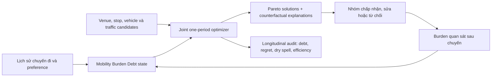

# Tổng quan 90 bài toàn văn và 8 hướng đề tài mở rộng cho OptiGo/BeGo

Ngày tổng hợp: 14/07/2026

Phạm vi hệ thống: backend .NET, frontend Next.js; chọn điểm đến cho nhóm, điểm đón chung, phân xe, tối ưu lộ trình và fairness.

## Kết luận điều hành

Đề tài nên chọn nhất là **BeGo-LTF: tối ưu chuyến đi nhóm lặp lại với fairness theo thời gian, Mobility Burden Debt và counterfactual regret**. Nó phù hợp nhất với nền tảng BeGo hiện có nhưng bổ sung một khoảng trống học thuật thật sự: các nghiên cứu ride-pooling chủ yếu đo fairness ở một lần phân công hoặc cho thu nhập tài xế; các nghiên cứu fairness dài hạn lại hầu như chỉ dừng ở mô hình học máy, phân bổ tài nguyên hoặc bỏ phiếu, chưa giải đồng thời điểm đến, điểm đón, xe và tuyến của một nhóm người qua nhiều lần đi.

Nếu muốn xây một công trình lớn, hướng tốt nhất không phải ghép tám đề tài lại, mà dùng đề tài 1 làm trục, đề tài 2 làm **bộ máy tối ưu một kỳ**, và lấy một phần nhỏ của đề tài 6 làm **lớp giải thích quyết định**. Cấu trúc này đủ để tạo ba đóng góp độc lập: mô hình fairness liên thời gian; thuật toán tối ưu; đánh giá với người dùng.

## 1. Tôi đã đọc và kiểm tra corpus như thế nào

- Corpus có đúng **90 PDF toàn văn**, **2.171 trang**, **1.218.943 từ trích xuất**; không có PDF lỗi hoặc tài liệu chỉ có tiêu đề/tóm tắt.
- 68 bài là bài journal/conference; 22 bản là preprint arXiv được giữ lại khi có đóng góp mới hoặc lý thuyết nền cần thiết. Có 53/90 bài từ 2022 trở đi và 75/90 bài từ 2020 trở đi.
- Tám cụm được cân bằng theo bài toán BeGo: accessibility/equity (14), group destination/consensus (12), meeting point/shared stop (10), operational fairness (16), privacy/incentive/stability (9), robust/dynamic planning (8), shared mobility core (13), temporal fairness (8).
- Mỗi PDF được tải về, kiểm tra trang đầu bằng render, trích xuất toàn bộ từng trang, quét theo các phần phương pháp–thực nghiệm–kết luận–hạn chế và đối chiếu số liệu quan trọng. Ma trận 90 bài nằm trong file đi kèm.
- Một bản 4 trang của bài số 29 đã được phát hiện là bản symposium summary và được thay bằng accepted manuscript đầy đủ 84 trang. Một tài liệu một trang khác cũng đã bị loại và thay bằng bài Transportation Science 27 trang. Việc này giúp tránh tình trạng “đủ số lượng nhưng không đủ nội dung”.

Corpus không được coi là 90 bằng chứng có trọng lượng ngang nhau. Các bài thực nghiệm quy mô lớn, bài journal mạnh và bài có chứng minh/benchmark được dùng làm trụ; các preprint nhỏ hoặc mô phỏng yếu được dùng chủ yếu để nhận diện khoảng trống và rủi ro.

## 2. BeGo hiện có và phần còn thiếu

BeGo đã có nền tảng tốt hơn một prototype chọn địa điểm thông thường:

- tìm tâm nhóm bằng weighted geometric median;
- sinh điểm đón theo corridor, hướng di chuyển và POI;
- ghép điểm đón, phân xe và tạo route pool;
- Held–Karp cho tuyến nhỏ, insertion và 2-opt cho tuyến lớn;
- chấm điểm theo tổng thời gian, gánh nặng cực đại, detour, walking, arrival spread, Gini và độ lệch chuẩn;
- trả về các phương án Pareto như nhanh nhất, công bằng và nhẹ cho tài xế.

Tuy nhiên, fairness hiện tại vẫn là **fairness một lần**. “Worst regret” hiện là chênh lệch giữa burden lớn nhất và median, chưa phải regret so với phương án phản thực tế tốt nhất của từng người. Các trọng số fairness là thiết kế của hệ thống, chưa có nền tảng chuẩn tắc, kiểm định người dùng hoặc bảo đảm toán học. BeGo cũng chưa ghi nhớ ai đã chịu thiệt trong các chuyến trước, chưa mô hình hóa khai báo chiến lược, độ bất định, privacy hay accessibility cá nhân hóa.

## 3. Những kết luận lớn rút ra từ 90 bài

### 3.1. Các mảnh của bài toán đang bị nghiên cứu tách rời

Group recommender nghiên cứu đồng thuận và đàm phán nhưng thường dùng nhóm tổng hợp, dữ liệu rating và nhóm nhỏ; nghiên cứu quan sát thực tế cho thấy lựa chọn sau tương tác nhóm khác đáng kể so với dự đoán sở thích cá nhân. Ngược lại, nghiên cứu ride-pooling tối ưu xe và route nhưng thường nhận origin/destination là đầu vào cố định. Bài về vehicle–customer coordination cho thấy cho phép người dùng đi bộ và tối ưu lại cả tuyến tạo ra phần lớn lợi ích vận hành, nhưng không chọn điểm đến theo đồng thuận nhóm và không xử lý fairness liên thời gian ([Management Science, 2023](https://doi.org/10.1287/mnsc.2023.4739)).

Trong corpus không có công trình nào giải đầy đủ chuỗi: **sở thích nhóm → chọn điểm đến → chọn các điểm đón → phân vai tài xế/hành khách → chia nhóm xe → route → giải thích và ghi nhận fairness cho lần sau**. Đây là khoảng trống trực tiếp nhất mà BeGo có lợi thế.

### 3.2. Không thể gọi một chỉ số duy nhất là “fairness”

Nghiên cứu workload-equity chỉ ra rằng cân bằng distance, load hoặc số stop tạo ra các nghiệm rất khác nhau; đổi Gini sang range, MAD, standard deviation hoặc lexicographic max-min cũng đổi Pareto frontier ([Computers & Operations Research, 2019](https://doi.org/10.1016/j.cor.2019.05.016)). Vì vậy, cộng nhiều penalty với trọng số tùy ý là hữu ích cho sản phẩm, nhưng chưa đủ làm đóng góp học thuật. Đề tài mới phải nêu rõ:

- **resource nào** được phân phối: thời gian đi bộ, chờ, ngồi xe, detour tài xế, chi phí, mức không hài lòng với điểm đến hay quyền ảnh hưởng;
- fairness **giữa ai**: thành viên, tài xế–hành khách, khu vực, nhóm dễ tổn thương;
- fairness **ở thời điểm nào**: mỗi chuyến, mỗi tháng, hoặc toàn lịch sử;
- bảo đảm nào là bắt buộc: individual rationality, max regret, envy cap, bounded dry spell, quota hay chỉ tối ưu mềm.

### 3.3. Fairness dài hạn là khoảng trống có nền tảng lý thuyết nhưng thiếu ứng dụng thực

Lý thuyết repeated allocation cho thấy một phân bổ từng vòng có thể không công bằng, trong khi chuỗi phân bổ vẫn proportional và Pareto-optimal ([AAAI 2024](https://doi.org/10.1609/aaai.v38i9.28837)). Perpetual voting cho phép thiểu số có ảnh hưởng tỷ lệ qua thời gian và đưa ra bounded dry spells ([AAAI 2020](https://doi.org/10.1609/aaai.v34i02.5584)). Non-Markovian fairness phân biệt long-term, anytime, periodic và bounded fairness, đồng thời khẳng định lịch sử là một phần của trạng thái quyết định ([arXiv 2023](https://doi.org/10.48550/arxiv.2312.04772)).

Ride-hailing mới chỉ có các thử nghiệm fairness dài hạn cho thu nhập tài xế hoặc thời gian chờ theo vùng; survey năm 2024 thừa nhận thiếu longitudinal datasets, benchmark thực và đánh giá ngoài mô phỏng ([survey](https://doi.org/10.48550/arxiv.2406.06736)). Đây chính là cơ sở để biến “Mobility Burden Debt” từ ý tưởng sản phẩm thành đề tài có định nghĩa, định lý, thuật toán và benchmark.

### 3.4. Điểm đón chung có lợi nhưng walking không thể được coi là đồng nhất

Adaptive stop pooling có thể giảm cả trung bình lẫn dao động travel time khi demand cao ([arXiv 2023](https://doi.org/10.48550/arxiv.2306.13356)); hyper-pooling ở Amsterdam ghép 225/2.000 hành khách vào 40 chuyến, đạt occupancy trung bình 5,8 cho các chuyến hyper-pool ([npj Sustainable Mobility and Transport, 2024](https://doi.org/10.1038/s44333-024-00006-4)). Nhưng các mô hình thường dùng cùng một walking radius hoặc cùng một multiplier.

Các nghiên cứu người khuyết tật nhấn mạnh cả hành trình, khả năng tiếp cận điểm đón, kênh đặt xe, đào tạo tài xế và phương án fallback; không một dịch vụ được khảo sát đáp ứng mọi nhu cầu. Do đó, “đi bộ thêm để tối ưu xe” có thể tăng hiệu quả nhưng tạo bất công hoặc loại trừ nếu không có mô hình barrier-aware và năng lực cá nhân.

### 3.5. Heterogeneity và uncertainty làm thay đổi kết luận hệ thống

Với dữ liệu NYC và bốn lớp hành vi, giả định người dùng đồng nhất gây 18,5% bất mãn và khoảng 36% hủy theo mô phỏng ([Transportation, 2024](https://doi.org/10.1007/s11116-024-10527-z)). Nghiên cứu prediction-risk cho DARP cho thấy không chỉ cần dự báo mà còn phải mô hình hóa lỗi dự báo và tương quan không gian ([Transportation Research Part C, 2024](https://doi.org/10.1016/j.trc.2024.104801)). Vì thế, một nghiệm “công bằng” theo ETA điểm có thể bất công sau khi traffic, no-show hoặc preference thực xảy ra.

### 3.6. Chia lợi ích quyết định mức chấp nhận, không chỉ route

Ba cách chia cost saving khác nhau tạo số chuyến được cả tài xế và hành khách chấp nhận khác nhau. Stable matching có thể hy sinh một phần social welfare để loại blocking pair. Mô hình game-theoretic trên hơn 360 triệu request còn phát hiện chuyển pha đột ngột từ mức chấp nhận thấp sang cao khi incentive vượt inconvenience ([Nature Communications, 2021](https://doi.org/10.1038/s41467-021-23287-6)). Tối ưu route mà không tối ưu cơ chế chia lợi ích có thể tạo phương án tốt trên giấy nhưng không ai muốn tham gia.

### 3.7. Multimodal có tiềm năng lớn nhưng group rendezvous gần như bỏ ngỏ

Các mô hình tích hợp transit–ridepool báo cáo giảm VMT tới 20% và tăng service rate tới 12% trên năm thành phố, nhưng người dùng vẫn là các request độc lập ([arXiv 2024](https://doi.org/10.48550/arxiv.2404.07691)). Chưa có mô hình đáng kể cho một nhóm dùng nhiều mode khác nhau, chọn chung địa điểm và đồng bộ arrival window.

## 4. Xếp hạng tám đề tài

Thang điểm 10 cho từng tiêu chí. “Khả thi” được chấm dựa trên khả năng kế thừa code BeGo, không phải độ dễ tuyệt đối.

| Hạng | Đề tài | Mới | Khớp BeGo | Khả thi | Chiều sâu học thuật | Tổng / 40 |
|---:|---|---:|---:|---:|---:|---:|
| 1 | BeGo-LTF: temporal fairness + Mobility Burden Debt | 9,5 | 10 | 8,5 | 10 | **38,0** |
| 2 | JOINT-Meet: tối ưu đồng thời destination–meeting point–vehicle–route | 9,0 | 10 | 8,0 | 9,5 | **36,5** |
| 3 | AbleMeet: điểm đón thích ứng, an toàn và accessibility-aware | 9,0 | 9,0 | 8,5 | 9,0 | **35,5** |
| 4 | RISK-Fair: fairness phân phối vững dưới bất định | 8,5 | 9,0 | 7,5 | 9,5 | **34,5** |
| 5 | StableShare: cơ chế chia lợi ích ổn định và chống khai báo chiến lược | 9,0 | 8,5 | 7,0 | 10 | **34,5** |
| 6 | FairTalk: giải thích, đàm phán và procedural fairness | 9,0 | 8,0 | 8,0 | 9,0 | **34,0** |
| 7 | PrivFair: tối ưu nhóm bảo vệ vị trí nhưng vẫn đo được fairness | 8,5 | 8,0 | 6,5 | 9,5 | **32,5** |
| 8 | TransitRendezvous: gặp nhóm đa phương thức, carbon-aware | 7,5 | 8,5 | 7,5 | 8,5 | **32,0** |

## 5. Mô tả đầy đủ tám đề tài

### Đề tài 1 — BeGo-LTF: Fair Group Mobility over Repeated Outings

**Mô tả ngắn:** hệ thống không cố làm mọi chuyến đều bằng nhau. Nó ghi nhớ ai đã phải đi xa, đi bộ, lái xe, chờ lâu hoặc nhường sở thích trong quá khứ, rồi chủ động “trả nợ fairness” ở các lần đi tiếp theo mà vẫn giữ hiệu quả toàn nhóm.

**Khoảng trống:** temporal-fairness hiện có chủ yếu cho phân loại, bandit, bỏ phiếu hoặc thu nhập tài xế. Group routing hiện có chủ yếu one-shot. Chưa có định nghĩa và thuật toán cho fairness của toàn bộ chuỗi quyết định đi chơi nhóm.

**Mô hình đề xuất:**

1. Định nghĩa burden cá nhân đã chuẩn hóa theo năng lực/ngưỡng cá nhân:

   `b_i^t = a_i·walk + b_i·wait + c_i·ride + d_i·driverDetour + e_i·cost + f_i·destinationDissatisfaction + risk`.

2. Định nghĩa **counterfactual regret** đúng nghĩa: burden của người `i` trong nghiệm nhóm trừ burden tốt nhất mà người đó có thể nhận trong một phương án khả thi tham chiếu. Không dùng “max trừ median” làm regret.
3. Cập nhật Mobility Burden Debt có decay và repayment:

   `D_i^(t+1) = rho·D_i^t + normalizedRegret_i^t - repayment_i^t`.

4. Tối ưu rolling horizon/MDP theo hiệu quả, max debt sau quyết định, Nash welfare hoặc generalized Gini; thêm ràng buộc individual rationality, envy cap, periodic fairness và bounded dry spell.
5. Xử lý thành viên mới, thành viên vắng mặt, nhóm tách/nhập và preference thay đổi.

**Thuật toán:** MILP hoặc CP-SAT chính xác cho nhóm nhỏ; logic-based Benders/column generation tách chọn destination–stop–route; ALNS hoặc large-neighborhood search cho nhóm lớn; rolling horizon có forecast cho chuỗi sự kiện. Có thể xây thêm policy học tăng cường sau khi solver chuẩn đã tạo benchmark, không cần bắt đầu bằng deep RL.

**Đánh giá:**

- benchmark one-shot hiện có của BeGo và một benchmark longitudinal mới, ví dụ 30–100 nhóm, 20–100 lần đi, membership và traffic biến đổi;
- baseline: static weighted sum, min-max mỗi kỳ, round-robin tài xế, perpetual quota, long-term variance và policy không nhớ lịch sử;
- metric: total generalized cost, worst debt, max counterfactual regret, debt recovery time, bounded dry spell violations, participation rate, stability khi thành viên thay đổi;
- ablation cho decay, repayment, các resource burden và độ dài look-ahead;
- user study theo chuỗi kịch bản để đo perceived fairness, willingness to reuse và mức hiểu lời giải thích.

**Đóng góp có thể công bố:** taxonomy burden cho group mobility; định nghĩa temporal mobility fairness; định lý về feasibility/bound debt trong các điều kiện cụ thể; thuật toán exact + scalable; longitudinal benchmark và user study. Đây là đề tài mạnh nhất vì đóng góp không phụ thuộc việc deep model có thắng vài phần trăm hay không.

**MVP không ngõ cụt:** chỉ cần thêm event history, debt state và solver rolling horizon quanh engine BeGo hiện có đã tạo được bài đầu. Phần causal/RL là mở rộng, không phải điều kiện sống còn.

### Đề tài 2 — JOINT-Meet: Joint Group Destination, Meeting-Point, Vehicle and Route Optimization

**Mô tả ngắn:** thay vì chọn địa điểm trước rồi mới tối ưu xe, hệ thống xem destination, điểm đón, ai lái, ai đi xe nào và route là một quyết định liên kết. Một địa điểm kém hơn chút về sở thích có thể tạo route tốt hơn rất nhiều và công bằng hơn cho cả nhóm.

**Câu hỏi nghiên cứu:** decomposition tuần tự hiện nay mất bao nhiêu chất lượng? Điều kiện nào cho phép tách bài toán mà không mất tối ưu? Có thể sinh Pareto frontier trong vài giây cho nhóm thực không?

**Mô hình:** multi-level mixed-integer model với preference utility, candidate venue, personalized walking network, stop opening, vehicle capacity, pickup precedence, time window, driver detour, arrival synchronization và fairness. So sánh ba kiến trúc: sequential pipeline; joint monolithic; decomposition có feedback.

**Thuật toán:** logic-based Benders với master chọn venue/stops/vehicles và subproblem route; branch-and-price nếu số route lớn; ALNS có destroy/repair xuyên tầng; cache ma trận OSRM và dominance pruning. Với nhóm nhỏ có thể chứng minh optimum, nhóm lớn báo cáo optimality gap.

**Đánh giá:** OSM ở nhiều loại đô thị, Li & Lim/DARP được mở rộng bằng venue candidates, dữ liệu check-in/POI và trace nhóm tổng hợp có kiểm soát. Metric gồm regret so với joint optimum, runtime, route cost, acceptance, max burden và Pareto coverage.

**Đóng góp:** formulation end-to-end; phân tích price of sequential decomposition; thuật toán hybrid; bộ benchmark mở. Rủi ro chính là combinatorial explosion, nhưng decomposition và solver exact nhỏ tạo lộ trình nghiên cứu rõ ràng.

### Đề tài 3 — AbleMeet: Personalized Accessible and Safe Meeting Points

**Mô tả ngắn:** điểm đón không còn là “tọa độ trong bán kính 500 m”. Mỗi người có một đồ thị tiếp cận khác nhau theo dốc, cầu thang, vỉa hè, chỗ qua đường, chiếu sáng, thời tiết, xe lăn, hành lý, trẻ nhỏ và mức an toàn ban đêm.

**Khoảng trống:** mô hình stop-pooling chứng minh lợi ích vận hành nhưng thường đồng nhất walking limit; nghiên cứu accessibility mô tả rào cản nhưng hiếm khi biến chúng thành constraint/algorithm của điểm đón và route.

**Mô hình và cách làm:**

- xây pedestrian impedance cá nhân hóa từ OSM, độ dốc, crossing, lighting, curb/ramp, weather và safety proxy;
- sinh candidate stop bằng multi-source shortest path thay vì vòng tròn Euclidean;
- ràng buộc wheelchair vehicle, caregiver, boarding time và door-to-door fallback;
- tối ưu lexicographic: không loại người → giới hạn worst accessible burden → hiệu quả xe;
- adaptive walking radius nhưng có fairness cap, không ép khu demand cao đi bộ nhiều một cách vô hình.

**Đánh giá:** accessibility audit cho nhiều persona; stress test khi thang máy hỏng/mưa/tối; so với 500 m cố định, adaptive stop pooling và door-to-door. Có thể làm participatory study với chuyên gia/người dùng thay vì chỉ mô phỏng.

**Đóng góp:** barrier-aware meeting-point graph, fairness definition cho accessible walking, robust candidate algorithm, benchmark accessibility. Đề tài này có impact xã hội rõ và scope dễ kiểm soát hơn đề tài 1–2.

### Đề tài 4 — RISK-Fair: Distributionally Robust and Intersectional Group Mobility

**Mô tả ngắn:** chọn phương án công bằng không chỉ với ETA dự đoán, mà công bằng cả khi dự báo sai, mưa, kẹt xe, no-show hoặc demand thay đổi.

**Khoảng trống:** robust DARP chủ yếu bảo vệ feasibility/cost; fairness ride-hailing thường dùng giá trị kỳ vọng. Ít bài đo xác suất một người hoặc một nhóm dễ tổn thương trở thành “người chịu rủi ro đuôi” của nghiệm.

**Mô hình:** scenario/Copula cho travel time và demand correlation; ambiguity set theo Wasserstein hoặc moment; CVaR của burden và regret; chance constraints cho pickup, arrival spread và accessibility; group-DRO để bảo vệ các giao điểm như người lớn tuổi + ở xa + không lái xe mà không cần tối ưu theo demographic thô.

**Thuật toán:** sample-average approximation + decomposition; robust column generation; risk-aware ALNS; online recalculation với prediction intervals. So sánh deterministic, stochastic expected-cost, worst-case robust và distributionally robust.

**Đánh giá:** calibration, out-of-sample violation, tail burden, worst-group regret, price of robustness và runtime. Bài vẫn có giá trị nếu DRO không thắng chi phí trung bình, miễn là chứng minh giảm tail risk có kiểm soát.

### Đề tài 5 — StableShare: Stable, Individually Rational and Strategy-Aware Benefit Sharing

**Mô tả ngắn:** hệ thống không chỉ hỏi “route nào rẻ nhất”, mà còn hỏi “chia chi phí/lợi ích thế nào để không ai muốn bỏ chuyến, đổi nhóm hoặc khai gian preference”.

**Khoảng trống:** proportional schemes dễ triển khai nhưng acceptance phụ thuộc threshold; stable matching và pricing thường tách khỏi destination/meeting-point routing; các bảo đảm strategyproof, budget balance, efficiency và fairness có thể xung đột.

**Mô hình:** transferable utility với walk/wait/detour/destination utility; cost saving và inconvenience allocation bằng Shapley/Owen value, nucleolus hoặc core-selecting transfer; individual rationality, budget balance, envy bound, no blocking coalition và approximate strategyproofness. Nếu không thể đồng thời thỏa các tính chất, một định lý bất khả thi cũng là đóng góp mạnh.

**Thuật toán:** joint assignment–transfer MILP; constraint generation để tìm blocking coalition; approximate core cho nhóm lớn; cơ chế online cho nhiều lần đi. Thực nghiệm mô phỏng misreport và một discrete-choice/user experiment để ước lượng acceptance threshold.

**Đánh giá:** social welfare, minimum utility, core violation, gain from manipulation, budget imbalance, participation và route efficiency. Đây là hướng có chiều sâu toán học cao nhất nhưng cần kiến thức mechanism design.

### Đề tài 6 — FairTalk: Explainable Negotiation and Procedural Fairness for Group Trips

**Mô tả ngắn:** hai nghiệm có burden giống nhau có thể được cảm nhận rất khác nếu một người không hiểu vì sao mình phải đi xa hoặc không có cơ hội phản hồi. FairTalk cho phép nhóm xem trade-off, phản đối, nhượng bộ, và nhận giải thích phản thực tế trước khi chốt.

**Khoảng trống:** group recommender cho thấy tương tác nhóm và conflict style ảnh hưởng satisfaction mạnh; ride-pooling optimization lại thường chỉ trả một nghiệm và một score. Transparency đơn thuần còn có thể không loại bỏ bias hành vi.

**Cách làm:**

- giao thức preference elicitation từng bước, cho phép hard veto, soft preference và privacy level;
- counterfactual explanation: “nếu đổi sang B, bạn giảm 6 phút nhưng hai người tăng tổng 19 phút”;
- negotiation operator: least misery, Nash bargaining, concession budget, minority protection;
- đo procedural fairness riêng với outcome fairness;
- selective disclosure để không lộ địa chỉ/sensitive preference của thành viên.

**Đánh giá:** thí nghiệm nhóm 3–6 người, so sánh static recommendation, full profile display, shared-summary negotiation và FairTalk; đo consensus time, task completion, perceived voice, trust, satisfaction, reuse intention và chênh lệch burden. Hướng này phù hợp bài HCI/recommender và có thể gắn trực tiếp vào frontend Next.js.

### Đề tài 7 — PrivFair: Privacy-Preserving Fair Group Mobility Optimization

**Mô tả ngắn:** hệ thống chọn điểm gặp và route mà server không cần thấy chính xác nhà, lịch sử đi lại hoặc disability profile; đồng thời vẫn chứng minh fairness không bị phá bởi noise bảo mật.

**Khoảng trống:** công trình privacy ride matching thường bảo vệ nearest-neighbor/location query; công trình fairness lại giả định có đầy đủ dữ liệu cá nhân. Differential privacy có thể làm sai ranking và gây thiệt có hệ thống cho người ở ngoại vi.

**Cách làm theo ba mức khả thi:**

1. threat model + geo-indistinguishability cho origin/history và privacy budget ledger;
2. secure aggregation/federated preference profile cho group destination;
3. MPC hoặc trusted execution chỉ cho bước nhạy cảm nếu hiệu năng cho phép.

Tối ưu ba chiều privacy–utility–fairness; tạo confidence interval cho debt/regret dưới noise; audit membership inference, reconstruction và collusion. Baseline gồm exact non-private, naive DP và privacy-aware robust optimization.

**Đóng góp:** fairness-aware privacy budget allocation; bound cho sai số burden/debt; protocol prototype và attack benchmark. Đây là đề tài tốt nhưng phải giới hạn threat model để không biến thành dự án mật mã quá lớn.

### Đề tài 8 — TransitRendezvous: Robust Multimodal Group Rendezvous

**Mô tả ngắn:** các thành viên có thể đi bộ, xe máy/ô tô, ride-pool, bus/metro khác nhau nhưng hệ thống vẫn chọn điểm vui chơi và kế hoạch để cả nhóm đến gần cùng lúc, ít carbon và không đẩy gánh nặng sang người không có xe.

**Khoảng trống:** transit-integrated ride-pooling tối ưu request cá nhân; group recommender không mô hình hóa timetable, transfer và missed connection. Bài toán rendezvous đa phương thức theo nhóm còn ít được xử lý trọn vẹn.

**Mô hình:** time-expanded transit network + road/pedestrian network; venue choice; first/last-mile pooling; arrival synchronization; missed-connection risk; generalized cost, carbon, accessibility và fairness. Có thể thêm EV charging nhưng không nên đưa vào MVP.

**Thuật toán:** RAPTOR/CSA để sinh transit legs, route-column generation, Benders giữa venue/mode choice và vehicle routes, rolling recovery khi trễ chuyến. Đánh giá trên GTFS + OSM của một thành phố, nhiều mức chất lượng transit và nhóm có/không có xe.

**Đóng góp:** formulation group rendezvous đa phương thức, synchronized-arrival fairness, robust recovery và carbon–equity Pareto frontier. Đây là hướng dễ kể câu chuyện sustainability nhưng cạnh tranh hơn và phụ thuộc dữ liệu GTFS tốt.

## 6. Kiến trúc nghiên cứu đề xuất nếu chọn đề tài 1

### Các gói công việc

1. **WP1 — Formalization:** taxonomy burden, counterfactual baseline, debt dynamics, axioms và các trường hợp khả thi/bất khả thi.
2. **WP2 — Exact benchmark:** mở rộng domain model BeGo; CP-SAT/MILP cho nhóm nhỏ; tạo longitudinal instances và optimum/lower bound.
3. **WP3 — Scalable solver:** decomposition + ALNS; warm start từ engine hiện tại; incremental re-optimization.
4. **WP4 — Uncertainty và dynamic membership:** forecast/scenario, rolling horizon, newcomer/absence policy.
5. **WP5 — Human validation:** explanation prototype, repeated-scenario user study và perceived fairness.

### Lộ trình 12–18 tháng

- Tháng 1–3: formal model, review có hệ thống, benchmark schema, tái hiện baseline.
- Tháng 4–6: exact solver và price-of-static-fairness experiments.
- Tháng 7–10: scalable temporal solver, ablation, robustness.
- Tháng 11–13: frontend explanation và pilot user study.
- Tháng 14–16: full evaluation, statistical analysis, release dataset/code.
- Tháng 17–18: viết bài/luận văn và replication package.

### Ba câu hỏi nghiên cứu đủ sắc để làm trục

- **RQ1:** Khi quyết định điểm đến–điểm đón–xe–route lặp lại, static fairness có tạo unfairness tích lũy hay bounded dry spells không?
- **RQ2:** Mobility Burden Debt dựa trên counterfactual regret có giảm worst long-term burden mà giữ được efficiency và participation so với min-max, Gini và round-robin không?
- **RQ3:** Lời giải thích về debt/repayment có làm tăng perceived fairness và willingness to reuse ngay cả khi burden của chuyến hiện tại không tối ưu cho một thành viên không?

## 7. Baseline và chuẩn đánh giá bắt buộc

Một đề tài mạnh không nên chỉ báo “objective giảm X%”. Tối thiểu cần:

- exact optimum/lower bound ở instance nhỏ;
- các baseline tách tầng và joint, cost-only, min-max, Gini, Nash welfare, static fairness, round-robin và temporal quota/debt;
- cùng một compute budget và seed; confidence interval qua nhiều nhóm/lịch sử;
- báo cáo Pareto frontier thay vì một bộ trọng số duy nhất;
- sensitivity với group size, candidate count, vehicle count, walking limit, preference heterogeneity, traffic noise và membership churn;
- ablation từng thành phần fairness;
- out-of-sample và worst-tail metrics, không chỉ mean;
- user-facing metric: acceptance, perceived fairness, trust và reuse intention;
- release schema, instances, configuration, seed và script tái hiện.

## 8. Quyết định lựa chọn theo mục tiêu cá nhân

- Muốn đề tài **mới nhất, khớp BeGo nhất và có thể phát triển thành chuỗi bài**: chọn **đề tài 1**.
- Muốn thiên về **Operations Research/thuật toán tổ hợp**: chọn **đề tài 2** hoặc **5**.
- Muốn scope vừa phải nhưng impact xã hội rõ: chọn **đề tài 3**.
- Muốn thiên về **stochastic optimization/robustness**: chọn **đề tài 4**.
- Muốn thiên về **HCI/recommender và có user study mạnh**: chọn **đề tài 6**.
- Muốn thiên về **security/privacy**: chọn **đề tài 7**, nhưng khóa threat model từ đầu.
- Muốn thiên về **smart city/sustainability**: chọn **đề tài 8**.

Khuyến nghị cuối cùng: **chọn đề tài 1, dùng solver của đề tài 2 như một work package, và chỉ lấy phần counterfactual explanation tối thiểu từ đề tài 6**. Đây là tổ hợp cân bằng nhất giữa tính mới, nền tảng code sẵn có, chiều sâu toán học và khả năng chứng minh bằng thực nghiệm.
