# Review kỹ thuật WP1–WP3

> Ngày review: 2026-08-02
> Phạm vi: toàn bộ production code, contract/schema, test và demo từ WP1 đến WP3
> Mục tiêu: giải thích code, kiểm tra logic thực thi và phân biệt tối ưu thật với
> phần mới chỉ là vocabulary/boundary cho WP4+

## 1. Kết luận ngắn

WP1–WP3 tạo được một tuyến chạy hoàn chỉnh:

```mermaid
flowchart LR
    E["NDJSON eventBatch"] --> C["Strict contract decode"]
    C --> R["Atomic event reduction"]
    R --> G["B1 candidate generation"]
    G --> F["Commitment candidate hard gate"]
    F --> S["Fleet lexicographic selection"]
    S --> V["Independent full-state validation"]
    V --> P["Promise + ledger + certificate"]
    P --> H["Decision/hash pending state"]
    H -->|"matching ACK"| A["Atomic commit"]
    A --> K["Canonical checkpoint"]
```



Đây không phải một chuỗi `if/else` gắn thêm sau solver. Tập candidate được dựng
từ route thật, chiếu schedule thật, tính three-way delta trên 10 chiều, loại theo
lock/budget trước fleet selection, rồi toàn quyết định được một validator khác
dựng lại trước publication. Ledger/certificate chỉ commit cùng route khi ACK đúng.

Tuy vậy, chưa được overclaim:

- B1 là exhaustive correctness baseline cho instance nhỏ, chưa scale tốt.
- Hard-vector mechanism đã chạy, nhưng experiment-ready C1 objective/solver và
  B2–B5 vẫn là WP4.
- `vehicle_switch`, stop relocation và incumbent inversion có model/test thật,
  nhưng B1 hiện khóa/không sinh các move đó; chúng chưa tạo tác động runtime thường.
- OR-Tools project mới là dependency boundary, chưa có solver behavior.
- Incident breach record đã có, nhưng Runner chưa có incident-recovery optimizer.

## 2. Cách đọc repository

Dependency đi vào trong:

```text
Contracts                    Domain
    \                         /
     Runner <- Algorithms <- Application
        \
         Infrastructure / Solvers.OrTools (boundary, chưa có core behavior)
```

Thực tế architecture test yêu cầu Domain và Application không phụ thuộc ASP.NET,
EF Core, OR-Tools, provider bản đồ hoặc simulator. Adapter tương lai phải gọi cùng
Runner, không viết lại RideBound bằng Python/C++.

## 3. WP1 — contract, canonicalization và session protocol

### 3.1. `RideBound.Contracts`

| File | Đoạn logic chính | Vì sao cần |
|---|---|---|
| `ProtocolPrimitives.cs` | value objects cho schema version, message type và giới hạn protocol | Loại string/number không canonical trước khi vào state |
| `ProtocolIdentityPrimitives.cs` | run/scenario/epoch/event/time/hash IDs | Giữ identity/range nhất quán, đặc biệt safe integer `2^53-1` cross-language |
| `CanonicalUnits.cs` | mm, WGS84 E7, micro-cost và unit validation | Không để adapter tự đổi đơn vị âm thầm |
| `ProtocolEnvelope.cs` / `ProtocolEnvelopeCodec.cs` | envelope bắt buộc, routing theo message type, exact field set | Unknown/missing/null/duplicate field không bị bỏ qua |
| `ProtocolPayloadValidation.cs` | helper đọc object/string/set/integer, trả path lỗi | Mọi codec có cùng error taxonomy và canonical bounds |
| `ProtocolVersionCompatibility.cs` | SemVer/capability compatibility | Minor/major drift không được đoán |
| `HelloMessages.cs` | hello/helloAck capabilities | Runner và adapter khóa position model/capacity trước run |
| `InitializeRunMessages.cs` | manifest identity/config hashes | Mọi decision sau đó bind đúng policy/travel/data identity |
| `EventBatchMessages.cs` | typed union cho mọi online event | Không truyền dynamic dictionary vào core |
| `DecisionMessages.cs` | decision/certificate/solver shells, action validation | `notProduced` không được giả có decision; WP3 thêm certificate cross-binding |
| `OnlineDecisionActions.cs` | typed request/route/promise/breach actions | Action payload strict theo từng `decisionType` |
| `ErrorMessage.cs` | stable code + disposition | Client biết reject message, fail session hay terminate |
| `CheckpointMessages.cs` | versioned checkpoint content/hash và restore ACK | Checkpoint tự có hash domain, không dựa vào tên file |
| `CommitmentContracts.cs` | 10-vector, promise, witness, certificate codec | Wire representation không phụ thuộc Domain object/reference equality |

Điểm quan trọng trong `DecisionMessages.cs` sau audit:

1. Mỗi action được validate exact fields và đúng typed payload.
2. Certificate `produced` bắt buộc có body; `notProduced` không được có body.
3. `body.inputStateHash/proposedStateHash` phải bằng
   `stateBeforeHash/stateAfterHash` của decision chứa nó.
4. `body.publicationIds` phải bằng đúng tập unique action `promisePublished`.
5. Vì vậy một payload có SHA-256 hợp lệ nhưng tự mâu thuẫn vẫn bị từ chối.

### 3.2. Canonical bytes và hash

`Serialization/CanonicalJson.cs` thực hiện RFC-8785-like integer subset:

- object keys sort ordinal;
- duplicate property bị từ chối;
- null, fraction, exponent, `-0`, out-of-range integer bị từ chối;
- Unicode surrogate lỗi bị từ chối;
- array giữ thứ tự vì thứ tự event/action có nghĩa.

`Serialization/ProtocolHash.cs` không nối chuỗi mơ hồ. Mỗi hash có domain prefix và
frame `(tagLength, tag, valueLength, value)` big-endian. Decision hash bind:

```text
previousDecisionHash
manifestHash
policyVersion
canonical input envelope
canonical decision hash projection
```

Hash projection bỏ `previousDecisionHash/decisionHash` khỏi JSON vì previous hash đã
được frame riêng và current hash không thể tự chứa chính nó. Certificate vẫn nằm
trong projection nên sửa witness/publication làm đổi decision hash.

### 3.3. `RideBound.Runner` session state machine

| File | Vai trò |
|---|---|
| `NdjsonReader.cs` / `NdjsonWriter.cs` | một JSON object mỗi dòng, cap byte, không để log lẫn stdout protocol |
| `CapabilityNegotiator.cs` | chọn capability/version hoặc trả downgrade/failure rõ |
| `InitializeRunValidator.cs` | khóa immutable identity/manifest |
| `EventBatchOrderingValidator.cs` | epoch liên tiếp, event sequence không gap/overlap/exhaust range |
| `RunnerSession.cs` | state machine và pending decision transaction |
| `RunnerHost.cs` | long-lived read/process/write loop |
| `Program.cs` | chọn `online`, `conformance`, `commitment` và load config |

Luồng `RunnerSession`:

1. `hello` chỉ ở state `New`.
2. `initializeRun` chỉ sau negotiation; tính manifest và initial state hash.
3. `eventBatch` exact retry trả lại cùng response bytes; conflict cùng key làm fail.
4. Decision được giữ ở `_pending`; committed epoch/state/hash chưa đổi.
5. `decisionApplied` sai epoch/time bị reject, sai hash làm fail session.
6. Chỉ matching ACK mới chuyển pending online state thành committed state và nối
   `previousDecisionHash`.

Lỗi audit đã sửa: checkpoint trước đây chưa kiểm `_pending`, cho phép bỏ rơi một
decision đã phát. Giờ checkpoint chỉ chạy khi không có decision chờ ACK.

## 4. WP2 — online state, physical feasibility và B1

### 4.1. Domain primitives và lifecycle

| File | Logic |
|---|---|
| `Common/DomainPrimitives.cs` | typed IDs, `SimTime`, `Duration`, canonical bounds và `DomainResult` |
| `Requests/RideRequest.cs` | `Pending → Accepted → WaitingPickup → Onboard → Completed`, reject/cancel paths; assignment immutable sau accept |
| `Routes/RoutePlan.cs` | plan version, executed/frozen prefix, mutable suffix, stop uniqueness và exact prefix preservation |
| `Vehicles/VehicleState.cs` | capacity/load/onboard/accepted sets, route version, reached/board/alight/update transitions |
| `Runs/RideBoundRun.cs` | aggregate request+vehicle, atomic replace-both transitions và checkpoint rehydration cross-check |

`RideRequest.Board` hiện kiểm actual pickup nằm trong accepted pickup window. Trước
audit, lifecycle đúng nhưng pickup time ngoài window vẫn vào state; điều đó làm
max-ride/certificate dựa trên một state vật lý sai.

`RideBoundRun.Rehydrate` không chỉ deserialize:

- assignment phải trỏ vehicle tồn tại;
- route remaining stop phải trỏ active accepted request đúng vehicle;
- accepted/onboard sets phải khớp lifecycle;
- occupied seats bằng tổng party size onboard;
- mỗi active request có đúng pickup/drop count (onboard không còn pickup).

### 4.2. Event reduction

`Application/Events/OnlineEvents.cs` là typed internal event vocabulary.

`Application/State/OnlineState.cs` chứa run, travel snapshot, next event sequence,
expected initial travel hash, commitment ledger và incident ledger.

`Application/State/EventReducer.cs`:

1. kiểm run/scenario, epoch, time, sequence và sequence exhaustion;
2. fold event vào local immutable variables;
3. nếu một event lỗi, trả witness và bỏ toàn bộ fold;
4. epoch 1 bắt buộc có travel snapshot và vehicle;
5. advance epoch đúng một lần sau cả batch;
6. preserve commitment ledger, chỉ incident event được đổi incident ledger.

Audit phát hiện genesis vehicle có thể preload stop của pending request. B1 có thể
giữ no-op route đó rồi reject request, tạo route trỏ rejected rider. Reducer giờ
cấm genesis observation có occupied/onboard/accepted rider hoặc request-owned
remaining stop; chỉ decision core được đưa request vào route.

`EventReductionCoordinator.cs` giữ committed/pending proposal. Algorithm làm việc
trên proposed state nhưng event/decision chỉ thành lịch sử khi ACK đúng.

### 4.3. Travel và schedule

`Application/Travel/TravelTimeSnapshot.cs` là directed arc lookup versioned:

- version positive, hash lowercase SHA-256;
- arc unique, không lưu same-node arc;
- same node trả duration 0 theo canonical rule;
- update phải version +1; initial hash phải bằng manifest.

`Application/Scheduling/RouteScheduleProjector.cs` là schedule implementation duy
nhất cho cả Algorithms và commitment:

- bắt đầu từ node hoặc phần edge còn lại;
- edge remaining time dùng integer ceiling;
- cộng directed travel, wait đến earliest pickup, service duration;
- overflow/missing arc trả failure;
- operational cost là thời gian từ evaluation time đến hết route.

Đây là sửa kiến trúc quan trọng của WP3: trước đó candidate và promise có nguy cơ
dùng hai cách tính schedule khác nhau.

### 4.4. Physical validator

`Domain/Validation/PhysicalPlanValidator.cs` chạy độc lập candidate generator:

1. vehicle tồn tại, plan version đúng no-op/change rule;
2. exact frozen prefix;
3. current node/edge và route connectivity;
4. pickup đúng origin, không duplicate, arrival ≤ latest, wait tới earliest;
5. capacity theo party size;
6. drop đúng destination, pickup-before-drop;
7. max ride time từ actual/projected pickup;
8. onboard drop và mọi accepted incumbent stop được bảo toàn;
9. reassignment incumbent bị từ chối;
10. mọi arithmetic overflow trả exact witness thay vì exception.

Validator nhận `ITravelTimeLookup`, không biết map provider/simulator.

### 4.5. B1 candidate generation và selection

`Algorithms/Candidates/InsertionCandidateGenerator.cs`:

- sort pending request/vehicle ổn định;
- giữ frozen prefix và toàn incumbent mutable suffix;
- với mỗi subset request trong bound, enumerate mọi pickup/drop position;
- tạo stable stop/candidate ID bằng framed SHA-256;
- physical validate và schedule-project từng route;
- de-duplicate theo candidate ID;
- exact-small mode fail nếu vượt bound/cap, không truncate âm thầm;
- bounded mode giữ no-op và cap ổn định.

`CandidateScheduleEvaluator.cs` chỉ adapter output của shared projector.

`Policies/CandidateFleetSelector.cs` enumerate Cartesian product một plan/vehicle,
loại request được gán hai xe, rồi so lexicographic:

1. maximize accepted request count;
2. minimize checked total operational cost;
3. candidate-ID ordinal tie-break.

`Policies/RollingCostPolicy.cs` validate lại selected plans, apply route trước rồi
accept request, và quyết định pending request:

- selected → accepted;
- có feasible candidate nhưng xung đột fleet → deferred;
- mọi candidate bị prune → rejected với stable reason;
- ngoài request generation bound → deferred `CANDIDATE_BOUND`.

Tối ưu thật ở WP2 là exhaustive lexicographic optimum **trong candidate set đã
sinh**. Nó không chứng minh global DARP optimum khi generator bị bound/cap.

## 5. WP3 — promise, hard-vector gate và certificate

### 5.1. Domain commitment model

| File | Nội dung |
|---|---|
| `CommitmentDimension.cs` | thứ tự/vocabulary cố định của 10 dimension |
| `CommitmentVector.cs` | non-negative canonical vector, exact `Get` và checked component-wise `Add` |
| `RiderPromise.cs` | versioned `PromiseProjection`, pickup/drop ETA/stop/vehicle và full remaining service tokens |
| `CommitmentPolicy.cs` | đủ đúng 10 limits, budget basis, phase applicability, material rule, optional locks |
| `CommitmentBudgetEvaluator.cs` | hard gate từng dimension, equality pass, overflow/one-over exact witness |
| `CommitmentLockEvaluator.cs` | assignment always lock; onboard pickup; explicit freeze/final locks |
| `CommitmentLedger.cs` | immutable per-rider history, unique publication, exact-next version, cumulative budget no refund |
| `Incidents/OperationalIncidentLedger.cs` | immutable incident open/resolve và breach history tách normal revisions |

Mười chiều:

1. pickup ETA total variation;
2. drop ETA total variation;
3. material ETA revision count;
4. vehicle switch count;
5. pickup stop relocation mm;
6. pickup stop switch count;
7. drop stop relocation mm;
8. drop stop switch count;
9. incumbent order inversion count;
10. pre-pickup inserted stop count.

Không có weighted scalar trong gate. `null` là unbounded, `0` là hard zero.

### 5.2. Promise projection và three-way delta

`Application/Promises/PromiseProjector.cs` lấy active accepted request, vehicle,
route và shared schedule để tạo promise. Rider onboard không còn pickup stop trong
remaining route nên projector carry-forward pickup stop/node/ETA đã publish và chỉ
chiếu drop còn lại.

`PromiseDeltaCalculator.cs` tính ba phép độc lập:

```text
exogenous        = distance(old published, old route under current world)
decision-induced = distance(exogenous projection, proposed projection)
visible          = distance(old published, proposed projection)
```

Không dùng `visible = exogenous + decision`, vì ví dụ traffic đẩy ETA +10 rồi
decision kéo lại -5 cho visible +5, trong khi tổng độ lớn hai bước là 15.

Mỗi pair calculation:

- ETA dùng absolute difference;
- material count theo named threshold/bucket rule;
- vehicle/stop switch dùng identity;
- relocation dùng `IStopDistanceLookup` mm, không suy từ travel time;
- inversion so common stable token `(requestId, kind, stopId)`;
- insertion đếm stop ID mới trước pickup.

Lỗi audit đã sửa: token inversion trước đó thiếu `StopId`, làm stop bị tái tạo có
thể bị coi nhầm là cùng incumbent service.

### 5.3. Candidate hard gate

`Algorithms/Commitments/CommitmentCandidateFilter.cs` nhận before-event state và
reduced state. Với từng vehicle candidate:

1. apply candidate route;
2. accept đúng `NewRequestIds` vào candidate run;
3. gọi validator với `ScopedVehicleId` để tránh dựng lại toàn fleet cho từng
   candidate cục bộ;
4. giữ candidate valid, chuyển witness đầu thành stable prune reason.

Lỗi quan trọng đã sửa: phiên bản đầu chỉ đổi route mà chưa accept request mới, nên
validator bỏ qua policy/promise của chính rider mới.

### 5.4. Independent combined validator

`Application/Commitments/CommitmentDecisionValidator.cs` không nhận schedule,
delta hay balance do algorithm khai. Nó dựng lại theo các stage:

1. **State boundary:** cùng run/scenario/epoch/time/sequence/travel; candidate không
   đổi ledger/incident; request definition và vehicle physical fields immutable;
   chỉ pending request được accept/reject; route chỉ same hoặc version+1 exact
   frozen prefix; route stop phải thuộc active assignment.
2. **Physical:** gọi `PhysicalPlanValidator` cho scoped vehicle hoặc full fleet.
3. **Projection:** gọi shared schedule projector và promise projector.
4. **Lock:** assignment/onboard/freeze/final confirmation.
5. **Delta/budget:** reconstruct old→exo→new và check hard limit theo policy basis.
6. **Ledger:** initial promise chỉ cho newly accepted pending rider; revision exact
   next version, append vào immutable ledger mới.

Candidate filter dùng scoped validation để giảm chi phí lặp. Runner luôn gọi lần
cuối không scope trên toàn fleet; do đó optimization không làm mất safety check.

### 5.5. Incident/breach

`OperationalIncidentLedger` snapshot affected riders từ accepted sets khi event mở.
Breach:

- chỉ append vào incident đang mở;
- request và previous/exogenous vehicle phải thuộc affected set;
- có ít nhất một unique witness code;
- `attemptedBudgetAfter` phải bằng `budgetBefore + decision` hoặc `+ visible`;
- resolve phải sau open và không xóa breach/history.

Runner checkpoint restore còn buộc breach `previousPromise/budgetBefore` khớp một
entry thật trong commitment ledger. Điều này chặn checkpoint tự hash hợp lệ nhưng
ghép breach với promise giả.

### 5.6. Runtime policy configuration

`Runner/Configuration/CommitmentPolicyConfiguration.cs`:

- canonicalize JSON rồi hash exact content;
- exact root/policy/limit/revision/distance fields;
- policy phải đủ 10 dimensions đúng một lần;
- phase/lock duplicate bị từ chối;
- same-node distance bị cấm vì canonical zero phải omit;
- directed stop distances không tự đối xứng;
- manifest `policyConfigurationHash` phải bằng config đã load.

Named config `benchmarks/configurations/wp3-boundary-test-v1.json` chỉ là boundary
test profile. Nó không phải user-derived hoặc production-recommended budget.

Lỗi audit đã sửa: parser từng truyền cả distance object thay vì field
`distanceMm`; suite Runner bắt được trước closure.

### 5.7. Runner publication và certificate

Trong `RunnerSession.BuildOnlineDecision` commitment mode:

1. reduce batch;
2. tạo B1 candidates;
3. candidate commitment filter;
4. fleet select/apply;
5. full independent validation;
6. lấy validated state có new ledger;
7. tính canonical after-state hash;
8. tạo certificate normal-operation và promise actions;
9. stage exact state;
10. decision hash bind input/actions/certificate;
11. chỉ matching ACK commit.

`OnlineDecisionActionMapper.cs` map request/route và full promise publication
vectors. `OnlineStateCanonicalizer.cs` ghi sort-stable toàn run, travel, commitment,
incident/breach state; initial online hash vì vậy là hash của full empty state, không
phải structural tuple cũ.

### 5.8. Checkpoint/restore

`OnlineStateCheckpointCodec.cs` dựng lại typed Domain objects, không deserialize
thẳng private state. Sau đó nó kiểm:

- reachable genesis hoặc post-genesis travel/vehicle requirements;
- request/vehicle/route cross-relations;
- commitment entries nằm trước state event/time boundary;
- projection references known entities;
- incident/breach chronology và entity relations;
- breach previous promise/budget có trong ledger;
- canonical bytes dựng lại bằng input.

`CheckpointPayloadCodec` bind inner state với manifest/state/previous-decision hash,
epoch/sequence/time. `ProcessRestore` còn so inner values với outer content và
initialized run identity trước khi thay coordinator.

Script WP3 chạy genesis, checkpoint sau epoch 1, restore trong process mới và so
raw suffix decision lines với uninterrupted replay.

## 6. Test evidence đọc theo mục đích

### Contracts

- canonical JSON/hash/unit primitives;
- envelope/version/capability/init strictness;
- typed event/action schemas và required fixtures;
- certificate normal/witness/cross-binding tamper;
- checkpoint version/hash/tamper.

### Domain

- request/vehicle/route lifecycle properties;
- physical capacity/window/ride/prefix/reassignment/overflow;
- 10-vector/policy/lock/budget boundaries;
- 64 deterministic histories × 12 revisions cho P1 conservation/no refund;
- incident duplicate/stale/affected rider/vehicle/budget relations.

### Application

- atomic reducer and ACK coordinator;
- node/edge shared schedule;
- onboard promise carry-forward;
- all-dimension three-way delta mutations;
- validator stage order, route-derived delta, immutable state boundary.

### Algorithms

- deterministic generation/truncation/no-op;
- B1 selection/outcome;
- independent exact-small oracle 32 WP2 seeds;
- independent commitment oracle 16 WP3 seeds;
- P3 relaxation: ETA limit 40 → 160 không mất candidate đã feasible.

### Runner/process

- hello/init/error/retry/ACK chain;
- commitment promise+certificate atomicity;
- config hash binding;
- checkpoint pending prohibition/tamper/restore;
- WP2/WP3 two-clean-process replay and exact hashes.

Các exact-small oracle không gọi production generator/validator cho quyết định
expected. Nếu oracle chỉ gọi lại production method, test pass sẽ không độc lập.

## 7. Những lỗi tìm được trong deep audit

| Lỗi | Tác hại nếu giữ | Sửa |
|---|---|---|
| Initial online hash dùng structural empty identity | state hash không bind full initial online state | hash `OnlineStateCanonicalizer` ngay initialize |
| Candidate filter chưa accept request mới | bỏ qua promise/policy rider mới | route rồi accept trước validate |
| Inversion token thiếu StopId | stop tái tạo bị coi nhầm cùng token | dùng `(requestId, kind, stopId)` |
| Actual pickup ngoài window vẫn board | state vật lý sai nhưng lifecycle hợp | hard reject ở `RideRequest.Board/Rehydrate` |
| Edge remaining multiplication có thể throw | process crash thay witness | map overflow thành `SCHEDULE_OVERFLOW` |
| Genesis route preload pending rider | route có thể trỏ rider bị reject | reducer cấm preload request-owned stop |
| Config distance đọc sai JSON element | config có distance không load được | đọc exact `distanceMm` |
| Checkpoint khi pending ACK | bỏ rơi decision đã phát/phân nhánh chain | require `_pending is null` |
| Certificate chỉ hợp shape nhưng cross-field lệch | hash bind một payload tự mâu thuẫn | state/publication cross-binding encode+decode |
| Closed incident restore trước breach | không append được breach lịch sử | open all → append breaches → resolve |
| Checkpoint breach không bind ledger promise | checkpoint tự hash có thể ghép history giả | structural promise/budget match |
| Candidate state có hidden pending route stops | physical check chưa đủ cross aggregate | route stops phải active assigned |
| Event sequence cuối range tạo next invalid | canonical state vượt range | reject exhaustion trước fold |
| Demo pipe phụ thuộc PowerShell native encoding | Windows PowerShell có thể thêm UTF-8 BOM, Runner đúng khi reject byte 0 | process stdin dùng explicit UTF-8 không BOM, kiểm exit/stderr/stdout |

Đây là lý do review không thể chỉ dừng ở “test pass”: vài lỗi trên tồn tại trong
code build được, và một số test mới ban đầu còn chưa từng chạy do policy môi trường.

## 8. Tối ưu nào đã áp dụng, tối ưu nào chưa

### Đã áp dụng và executable

- exhaustive pickup/drop insertion trong published small/bounded candidate set;
- fleet lexicographic maximize acceptance rồi minimize route cost;
- shared schedule computation, không double implementation;
- hard-vector candidate pruning theo cumulative ledger;
- phase/assignment locks trước budget;
- exogenous/decision/visible decomposition;
- scoped candidate validation + full-fleet publication validation;
- immutable append-only ledger và exact ACK transaction;
- canonical hash/checkpoint giúp replay/cache correctness.

### Có model/test nhưng B1 hiện không kích hoạt thường xuyên

- vehicle switch: O-001 khóa assignment;
- pickup/drop relocation: request origin/destination cố định;
- incumbent inversion: B1 chỉ insert, không reorder incumbent;
- non-normal breach certificate: runtime incident optimizer chưa có.

### Chưa triển khai — WP4

- best-first/dominance/forward-slack bounded generation;
- reusable feasible reinsertion/precomputation;
- modified dynamic wait/hold schedule;
- intra-route repair/remove-reinsert;
- deterministic multiple-plan pool/consensus/distinguished plan;
- B2/B3/B4/B5 fair baselines;
- C1 hard-vector-aware lexicographic/Pareto objective và C2 hybrid;
- OR-Tools selection, bound/gap/deadline/fallback diagnostics;
- scale/performance/effectiveness evidence.

## 9. Mapping paper → code/backlog

| Paper | Đã ảnh hưởng code WP1–WP3 | Để lại cho WP4 |
|---|---|---|
| Gaul et al. 2021 | rolling/event boundary và không claim B1 scale | bounded solve/deadline evidence |
| Schulz & Pfeiffer 2026 | immediate deterministic response, no hidden approximation | slack/cache/precompute/future potential |
| Geržinič et al. 2023 | history/material change là first-class evidence | không suy numeric user profile |
| Tiwari et al. 2024 | hard vector tách scalar objective | lexicographic/Pareto policy comparison |
| Ackermann & Rieck 2025 | claim boundary least-commitment/multiple plan | B5 plan pool, distinguished plan, flexibility measurement |

## 10. Hướng dẫn trace một decision cụ thể

Khi cần debug một request bị reject:

1. xem event decode trong `EventBatchMessages` và mapping trong
   `OnlineEventMapper`;
2. xem reducer witness/state ở `EventReducer`;
3. tìm `CandidatePruneWitness` từ physical hoặc commitment filter;
4. với physical, trace `PhysicalPlanValidator` theo stop order;
5. với commitment, trace prior ledger → exogenous projection → candidate projection
   → delta → lock → budget witness;
6. xem fleet conflict khác candidate infeasible ở `RollingCostPolicy`;
7. kiểm full validator/certificate trước staging;
8. kiểm `decisionHash` và matching ACK trước khi đọc committed state;
9. nếu qua restore, so inner canonical state hash và previous decision hash.

Không debug bằng cách chỉ nhìn reason code cuối; reason code là stable summary,
witness/stage/dimension mới là nguyên nhân máy kiểm tra được.

## 11. Trạng thái sau review

WP1 contract/determinism và WP2 physical/B1 logic phù hợp với claim hiện tại sau
các sửa lỗi nêu trên. WP3 hard-vector/ledger/certificate là cơ chế correctness thật
và có exact-small/process evidence. Nó chưa chứng minh RideBound hiệu quả hơn B1,
chưa chứng minh scale và chưa có solver policy đầy đủ. Handoff đúng là
[RB-WP4-001](../../tasks/29-wp4-algorithms-solver-refinement.md), không phải viết
ngay OR-Tools hoặc sao chép heuristic từ paper.
