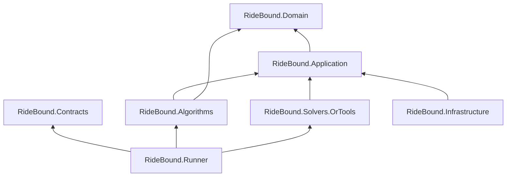

# Kiến trúc và publication flow

## Dependency boundary

Domain và Application không tham chiếu OR-Tools, EF Core, ASP.NET, map provider
hay simulator. `Application.Optimization` chỉ khai problem/result/port; package
`Google.OrTools 9.15.6755` chỉ tồn tại trong `RideBound.Solvers.OrTools`. Đây là
điểm quan trọng cho adapter tương lai: FleetPy/BeGo gọi cùng Runner thay vì viết
lại logic bằng Python hoặc backend-specific code.

## Một epoch đi qua hệ thống như thế nào

1. `ProtocolEnvelopeCodec` và payload codec reject unknown/missing/null/duplicate
   field, version/capability sai và số ngoài canonical range.
2. `RunnerSession` kiểm state machine, epoch/time/event sequence và exact retry.
3. `EventReducer` fold toàn batch vào immutable proposed state. Một event lỗi làm
   cả batch không advance.
4. `InsertionCandidateGenerator` dựng route thật từ frozen prefix + mutable
   suffix, chiếu schedule, physical-validate và ghi omission nếu bounded work/cap.
5. Named policy dùng cùng raw pool:
   B1 cost; B2 revision penalty; B3 freeze; B4 same-vehicle repair; B5 plan pool;
   C1 hard-vector; C2 warning trong hard-feasible set.
6. B1–B4/C1/C2 được map sang `CandidateSelectionProblem`; OR-Tools giải từng
   objective pass và chỉ khóa equality của pass đã `OPTIMAL`.
7. `SafeCandidateSelectionExecutor` không tin solver output: incumbent, no-op và
   từng single-request fallback đều phải qua independent fleet validator trong
   validation work budget.
8. Policy apply selection vào reduced state. `CommitmentDecisionValidator` của
   Runner dựng lại physical schedule, promise, lock, delta, budget và ledger trên
   toàn fleet; đây là publication gate thứ hai.
9. Runner tạo action, certificate và canonical state/decision hash, nhưng chỉ
   stage state trong `_pending`.
10. Retry cùng canonical batch trả đúng response cũ. Chỉ `decisionApplied` có
    đúng epoch/time/hash mới commit online state, ledger, plan pool và hash chain.

## Ba lớp không được trộn

| Lớp | Câu hỏi | Failure có nghĩa |
|---|---|---|
| Candidate | Có route khả thi nào đã được sinh/giữ? | Có thể do physical prune hoặc explicit candidate loss |
| Solver | Trong candidate set đó, hierarchy nào tốt nhất dưới work budget? | `FEASIBLE/UNKNOWN` là solver loss, không chứng minh candidate infeasible |
| Publication | Selection có đúng toàn bộ state/commitment contract không? | Không được publish, kể cả solver báo `OPTIMAL` |

`CandidateGenerationDiagnostics`, `CandidateSelectionExecutionDiagnostics` và
validator witnesses giữ ba failure class riêng. Vì vậy một bounded request
omission không bị báo nhầm là CP-SAT gap, và solver timeout không bị báo nhầm là
không có route vật lý.

## Determinism boundary

- identity/hash dùng UTF-8 framed SHA-256 có domain prefix;
- collection có semantic set/map được sort ordinal trước khi hash/solve;
- objective order là contract, không phụ thuộc dictionary enumeration;
- replay outcome dùng generation/validation/conflict/deterministic-time work,
  một worker và explicit seed; wall clock chỉ là metric;
- plan pool, ledger, incident và previous decision hash nằm trong canonical state;
- no-op/fallback order là objective vector rồi stable option IDs.

Determinism ở đây không có nghĩa latency giống nhau giữa máy. Nó có nghĩa cùng
version/config/input/work budgets không dùng observed wall time để đổi quyết định.

## Fail-closed invariants

- exact generation fail nếu phải omit;
- mỗi vehicle có đúng một selected option và mỗi request tối đa một vehicle;
- hard gate xảy ra trước C1/C2 ranking;
- C2 warning không cho phép vượt hard limit;
- solver `OPTIMAL` chỉ khi mọi lexicographic level được chứng minh;
- unvalidated incumbent không được apply;
- checkpoint bị cấm khi decision đang chờ ACK;
- manifest policy ID/version/config hash mismatch fail trước online state;
- matching ACK là điểm commit duy nhất.
