# Final logic review WP1–WP4

> Ngày review: 2026-08-03  
> Phạm vi: production code, contracts/schemas, configuration, tests, demos và
> evidence từ WP1 đến WP4  
> Baseline: `dotnet test RideBound.slnx` pass 557/557

## Kết luận

WP1–WP4 tạo thành một đường chạy online hoàn chỉnh và fail-closed. WP4 không chỉ
thêm vài nhánh điều kiện lên B1: nó thay Cartesian production selection bằng một
model solver-neutral, thêm bounded best-first generation có loss accounting,
forward-slack/cache/hold, repair neighborhood, versioned multiple-plan pool,
hard/warning-vector objectives và deterministic multi-pass CP-SAT. Mọi incumbent
hoặc fallback vẫn phải qua validator độc lập của WP3, certificate, state hash,
pending transaction và matching ACK trước khi trở thành state đã commit.

```mermaid
flowchart LR
    E["Strict NDJSON event"] --> R["Atomic reducer"]
    R --> G["Shared candidate generation"]
    G --> M["Named B1–B5/C1/C2 mechanism"]
    M --> S["Portable lexicographic model"]
    S --> O["Deterministic OR-Tools or validated fallback"]
    O --> V["Independent physical + commitment validator"]
    V --> C["Ledger + certificate + state/decision hash"]
    C --> P["Pending response"]
    P -->|"matching decisionApplied"| A["Atomic commit"]
```

Kết luận evidence được giới hạn đúng mức:

- correctness signal mạnh: 64-seed generator oracle, 64-seed actual OR-Tools
  differential, exact gap 0, mutation-killing hard gate, replay/checkpoint/tamper;
- performance signal ban đầu: synthetic p50 khoảng 2.4–91.0 ms ở 4–128 Boolean
  options trên máy audit, tất cả `OPTIMAL`;
- chưa chứng minh scale trên demand thật, service quality, non-inferiority, user
  satisfaction hay RideBound tốt hơn baseline trong paired Layer 1/2.

## Cách đọc folder

1. [01-architecture-and-flow.md](01-architecture-and-flow.md) — ownership và luồng
   từ byte input đến ACK.
2. [02-wp1-contracts.md](02-wp1-contracts.md) — strict protocol, canonical bytes,
   hash, retry và checkpoint shell.
3. [03-wp2-state-physical-b1.md](03-wp2-state-physical-b1.md) — state machine,
   physical feasibility, schedule và B1.
4. [04-wp3-commitment-publication.md](04-wp3-commitment-publication.md) — promise,
   10-vector, hard gate, ledger, certificate.
5. [05-wp4-optimization-and-solver.md](05-wp4-optimization-and-solver.md) — từng
   cơ chế WP4, objective hierarchy và safe fallback.
6. [06-file-map.md](06-file-map.md) — vai trò từng file production quan trọng và
   test bảo vệ nó.
7. [07-paper-to-code-audit.md](07-paper-to-code-audit.md) — paper nào ảnh hưởng
   thiết kế nào, phần nào không được suy diễn.
8. [08-evidence-gaps-and-debugging.md](08-evidence-gaps-and-debugging.md) — gate,
   microbenchmark, giới hạn và cách trace lỗi.

Review WP1–WP3 cũ ở [../wp1-wp3/README.md](../wp1-wp3/README.md) được giữ như
historical artifact. Những câu “WP4 chưa triển khai” trong đó không còn là trạng
thái hiện hành; folder này là review thay thế sau khi WP4 đóng.
