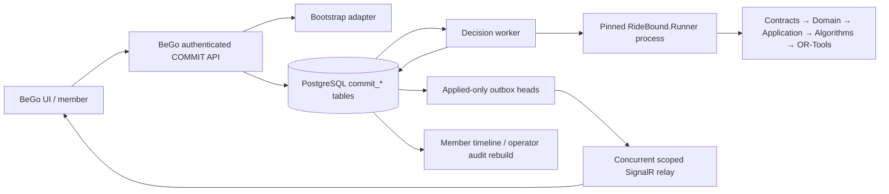

# Kiến trúc, execution flow và verdict

## 1. Ownership đúng



- RideBound sở hữu protocol, state transition, physical/commitment validation,
  policy, solver selection, certificate và checkpoint.
- BeGo sở hữu source mapping, authentication, idempotency, PostgreSQL durability,
  worker/process lifecycle, rollout và user-safe transport.
- BeGo không project-reference hoặc copy RideBound core. Nó gọi đúng Runner DLL
  được pin hash/core commit qua NDJSON.
- Domain/Application của RideBound không biết EF Core, ASP.NET, Npgsql, SignalR,
  OR-Tools hay simulator.

## 2. Correctness chain

Một quyết định chỉ có thể thành visible durable effect khi toàn bộ chuỗi sau đúng:

```text
strict input → ordered reducer → physical candidate
→ independent commitment validator → certificate
→ pending decision hash → DB T2
→ matching Runner decisionApplied + checkpoint → DB T3 Applied
→ applied-only outbox → user-safe SignalR envelope
```

Không block nào có quyền “bù” cho block trước. Solver trả `FEASIBLE` không thay thế
physical validator; certificate không thay thế ACK; T2 không cho phép publish trước
T3; SignalR send không được gọi là durable client receipt.

## 3. Vì sao đây không chỉ là if/else

Các ràng buộc được thực thi bằng nhiều lớp độc lập:

- immutable value objects và state transition graph;
- canonical UTF-8 JSON + domain-separated SHA-256;
- independent physical/commitment recomputation;
- lexicographic solver objective với safe integer dominance;
- PostgreSQL row lock, unique/foreign-key/check constraints và append-only trigger;
- database-time lease + owner/revision/attempt fence;
- process reconstruction từ exact hello/init/checkpoint/event bytes;
- typed divergence thay vì đoán pipe write thành công;
- source/config/assembly-bound self-verifying evidence artifact.

## 4. Verdict theo tầng

| Bước kế tiếp | Verdict | Lý do |
|---|---|---|
| WP6 refinement/harness design | **GO** | Contract, durable integration và evidence mechanics đủ ổn định để thiết kế scenario/result schema |
| WP7 FleetPy adapter | Chưa GO trực tiếp | Cần WP6 scenario/result boundary và capability preflight |
| WP8 pilot/prereg | Chưa GO | O-002/O-003/O-004 và variance/runtime chưa khóa |
| WP9 confirmatory experiments | **NO-GO hiện tại** | Chưa dataset pipeline, metric bundle, prereg và Layer-2 evidence |
| Production live rollout/SLA | **NO CLAIM** | Rollout mặc định Disabled; local curves không phải production load test |
| C1 effectiveness superiority | **NO CLAIM** | Paired artifact chỉ chứng minh fairness/determinism/mechanics |

## 5. Điều kiện làm verdict mất hiệu lực

Dừng và mở lại audit nếu protocol/hash/ACK/checkpoint đổi; Runner artifact đổi;
schema cho phép outbox không gắn operation hoặc publish trước `Applied`; BeGo tự
tạo certificate; benchmark normalizer làm mất raw input; hay WP6 chọn metric/
exclusion sau khi xem kết quả confirmatory.
