# Kiến trúc và luồng end-to-end

## 1. Quy tắc quan trọng nhất

Domain không biết EF Core, ASP.NET, OR-Tools, BeGo hay simulator. Application chỉ
điều phối domain/use-case và khai báo solver port. Algorithms tạo/chọn candidate.
Runner là composition root và protocol authority. Benchmarking chỉ khởi chạy artifact
Runner đã pin; nó không reference core để lén tính decision.

```mermaid
flowchart LR
    Data["Dataset/BeGo/simulator adapter"] --> NDJSON["Protocol NDJSON v1"]
    NDJSON --> Runner["RideBound.Runner"]
    Runner --> State["Reducer + immutable OnlineState"]
    State --> Gen["Candidate generation"]
    Gen --> Select["B1–B5/C1/C2 selection"]
    Select --> Gate["Physical + commitment validator"]
    Gate --> Decision["Decision + certificate"]
    Decision --> Ack["decisionApplied ACK"]
    Ack --> Commit["Committed state + checkpoint"]
    Commit --> Raw["Immutable transcript/observations"]
    Raw --> Metrics["Production metric + independent oracle"]
    Metrics --> Bundle["Strict BagIt-compatible bundle"]
```

## 2. Một epoch đi qua đâu?

1. `RunnerHost` đọc đúng một dòng UTF-8 NDJSON có giới hạn.
2. `RunnerSession` kiểm phase, schema/version, run/scenario/epoch/time và retry hash.
3. `OnlineEventMapper` đổi wire payload thành typed event; `EventReducer` áp cả batch
   trên biến cục bộ. Một event fail làm cả proposal fail, state committed không đổi.
4. `EventReductionCoordinator.Propose` giữ reduced state ở pending.
5. Candidate generator chỉ sửa mutable suffix và gọi `PhysicalPlanValidator`.
6. Policy chọn fleet candidate. Solver, nếu dùng, chỉ chọn trong model đã canonical.
7. `CommitmentDecisionValidator` tự tính lại physical/promise/delta/lock/budget trên
   toàn proposed fleet; kết quả filter trước đó không được tin làm certificate.
8. Runner tạo canonical actions/certificate/hash và chờ exact `decisionApplied`.
9. ACK đúng epoch/hash mới đưa pending thành committed. Checkpoint bị cấm khi còn
   pending decision.

Điểm này ngăn lỗi “đã trả decision nhưng process chết nên coi như đã commit”. Decision
và commit là hai trạng thái khác nhau.

## 3. Ba loại identity

- Protocol identity: manifest/state/decision/checkpoint hash cho một phiên Runner.
- Benchmark semantic identity: scenario/plan/run/transcript/decision/metric-set hash.
- Physical evidence identity: resource samples, logical manifest và bundle hash.

Hai lần chạy phải giống nhóm semantic. Resource/physical hash được phép khác vì CPU,
wall time và memory là quan sát thật. Verifier bắt chúng đầy đủ và tự nhất quán, không
ép chúng giả vờ deterministic.

## 4. Publication authority

Chỉ Runner được tạo decision/certificate. BeGo materializer kiểm hình dạng/hash để
lưu và phát user-safe projection, nhưng không được tự cấp certificate. WP6 parser và
metric calculator đọc raw output; chúng cũng không được biến failure thành decision.

## 5. Những gì kiến trúc chưa chứng minh

- Chưa có FleetPy closed-loop clock/vehicle progression: WP7.
- Chưa có pilot và preregistered margins: WP8.
- Chưa có confirmatory Layer 2/3: WP9/WP10.
- Không có incident recovery optimizer hoặc cross-vehicle reassignment.
