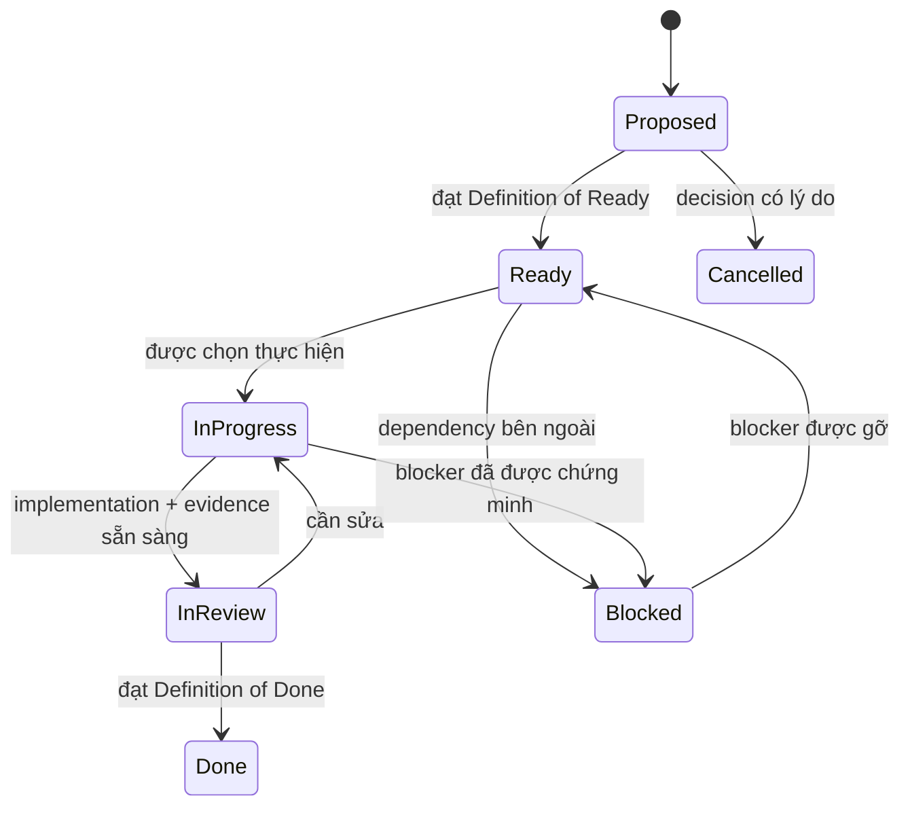

# Delivery backlog và quy tắc ticket

> Trạng thái: `BASELINE_V1`
> Cập nhật: 2026-08-24
> Nguồn tiến độ: [18-status-and-decision-log.md](../18-status-and-decision-log.md)
> Topic đã ticket hóa: [WP1 Contracts](24-wp1-contracts-ticket-plan.md) và
> [WP2 Online baseline](26-wp2-online-baseline-ticket-plan.md) và
> [WP3 ledger/certificate](28-wp3-ledger-certificate-ticket-plan.md) và
> [WP4 refinement](29-wp4-algorithms-solver-refinement.md) và
> [WP4 ordered queue](30-wp4-algorithms-solver-ticket-plan.md) và
> [WP5 ordered queue](32-wp5-bego-integration-ticket-plan.md) và
> [WP6 refinement](33-wp6-common-benchmark-harness-refinement.md) và
> [WP6 ordered queue](34-wp6-common-benchmark-harness-ticket-plan.md) và
> [WP7 refinement](35-wp7-fleetpy-layer2-refinement.md)
> và [WP7 ordered queue](36-wp7-fleetpy-layer2-ticket-plan.md)
> và [WP13 refinement](41-wp13-post-h6-mechanism-diagnostics-refinement.md)
> và [WP13 ordered queue](42-wp13-post-h6-mechanism-diagnostics-ticket-plan.md)

## 1. Mục đích

Tài liệu này chuyển roadmap nghiên cứu thành cơ chế delivery có thể thực hiện
tuần tự. Mỗi work package trong `16` là một **topic/epic**.

Backlog dùng **progressive elaboration**:

- toàn bộ topic chỉ có outcome, dependency và exit gate ở mức roadmap;
- chỉ topic hiện hành được chia thành ticket;
- mỗi ticket topic hiện hành có purpose, description, scope, dependency, rules,
  BDD, acceptance criteria, verification và rollback khi phù hợp;
- topic kế tiếp chỉ được refinement sau khi exit gate của topic trước đạt.

Quy tắc này tránh tạo false precision cho các topic xa (hiện là WP14–WP20) khi
contract và evidence đầu vào chưa tồn tại.

## 2. Nguồn sự thật và thứ tự ưu tiên

Khi có mâu thuẫn, dùng thứ tự:

1. claim boundary trong `01` và `03`;
2. protocol/model/algorithm chuẩn trong `04`, `06`, `07`, `08`;
3. decision log và trạng thái sống trong `18`;
4. roadmap/gate trong `16`;
5. execution plan của topic hiện hành;
6. nội dung ticket/PR.

Ticket không được tự ý đổi claim, unit, lifecycle, hash input, metric hoặc
repository boundary. Thay đổi như vậy cần ADR và cập nhật traceability trước
hoặc trong cùng ticket.

## 3. Mô hình trạng thái

Quy ước:

- Mỗi thời điểm chỉ có một work package chính `IN_PROGRESS`.
- Trong work package đó, mặc định chỉ có một ticket implementation
  `IN_PROGRESS`.
- Ticket docs/review có thể song song nếu không đổi contract chưa khóa.
- `Blocked` phải ghi blocker, evidence, owner và điều kiện gỡ.
- `Done` không đồng nghĩa work package complete; exit gate vẫn phải kiểm riêng.

## 4. Định danh và độ lớn

- Ticket ID: `RB-WP<work-package>-<số 3 chữ số>`.
- Một ticket mục tiêu từ nửa ngày tới hai ngày tập trung.
- Một ticket chỉ có một kết quả chính có thể review.
- Nếu dự kiến sửa nhiều boundary hoặc không mô tả được acceptance test, phải tách.
- Mỗi ticket nên tương ứng một PR/commit logic; không trộn cleanup không liên quan.

## 5. Definition of Ready

Ticket chỉ chuyển sang `READY` khi:

- mục đích và phạm vi có một cách hiểu;
- dependency đã `DONE` hoặc được chứng minh không cần;
- input/output và file dự kiến đã biết;
- acceptance criteria có thể kiểm tra;
- BDD/rules không mâu thuẫn tài liệu chuẩn;
- open decision ảnh hưởng ticket đã khóa hoặc chính là output của ticket;
- không yêu cầu secret, data, production access hoặc lựa chọn chưa có.

## 6. Definition of Done

Ngoài tiêu chí riêng, mọi ticket code phải:

- có test mới chứng minh behavior và giữ regression hiện có;
- chạy `dotnet test RideBound.slnx`;
- giữ Domain/Application độc lập framework và simulator;
- cập nhật `18`, decision liên quan và `19` nếu status/contract/claim/next action đổi;
- không để `TBD` trong contract đã khóa;
- không sửa/copy BeGo hoặc vendor ngoài phạm vi;
- ghi test đã chạy, test chưa chạy và evidence tạo ra.

Ticket tài liệu phải:

- không claim implementation chưa tồn tại;
- có link nội bộ hợp lệ;
- đồng bộ roadmap, status, decision và traceability bị ảnh hưởng;
- chỉ rõ ticket implementation tiếp theo.

## 7. Topic roadmap, chưa phải ticket backlog

| Topic | Outcome | Exit gate | Dependency |
|---|---|---|---|
| WP1 Contracts | Protocol và replay oracle xác định | Q1 | WP0 |
| WP2 Online baseline | B1 online chạy đúng state/route | một phần Q2 | WP1 |
| WP3 Ledger | Promise, budget và certificate độc lập | một phần Q2 | WP2 |
| WP4 Policies/solver | C1 và baselines so sánh công bằng | Q2 | WP3 |
| WP5 BeGo | Layer 1 paired replay và persistence | Q3 | WP4 |
| WP6 Harness | Scenario/result pipeline tái lập | Q2/Q3 support | WP4 |
| WP7 FleetPy | Layer 2 dùng cùng runner | Q4 | WP6 |
| WP8 Pilot/prereg | Khóa endpoint, margin, seed, config | go/no-go | WP5, WP7 |
| WP9 Main experiments | Bằng chứng confirmatory Layer 1/2 | Q6 phần chính | WP8 |
| WP10 Cross-system | Layer 3 và capability analysis | Q5 | WP7 |
| WP11 Product UX | UI/audit có rollback, không overclaim | product gate | WP5 |
| WP12 Paper/release | Claim traceable và artifact tái lập | Q6 | WP9, WP10 |
| WP13 Post-H6 diagnostics | Evidence sufficiency và mechanism record không causal | evidence gate | WP9, WP10 |
| WP14 Exploratory ablation/Pareto | Service–burden frontier trên development cells mới | ablation gate | WP13 |
| WP14R Resilient execution | Attempt ledger, supervision, fault/resource/freeze-v2 gates | reliability gate | WP14-v1 fail-closed |
| WP15–WP20 | Policy v2 → H7 → external/performance/rollout | roadmap gates | verified WP14R frontier/closure |

WP1–WP10 và WP13 đã đóng. WP11/WP12 vẫn deferred. WP14-v1 dừng fail-closed ở `009`.
ADR-071/072 mở WP14R successor theo progressive gate; `001..007 Done`, `008 Ready`
nhưng exact AC/host preflight phải pass trước launch; `009..012` unauthorized. WP15–WP20
giữ roadmap-level tới verified WP14R frontier/closure gate.

WP11 không nằm trên critical path nghiên cứu và không được làm chậm WP8–WP10.

## 8. Topic hiện hành

WP1 `RB-WP1-001..015` đã hoàn thành theo
[24-wp1-contracts-ticket-plan.md](24-wp1-contracts-ticket-plan.md).

WP2 `RB-WP2-001..012` đã hoàn thành. ADR-018–020 khóa và hiện thực state
ownership, atomic reducer, route prefix/suffix, O-001, physical validator,
deterministic B1, exact-small oracle và online replay. Phạm vi đóng chỉ là
physical/B1, chưa có hard commitment guarantee.

WP3 `RB-WP3-001..014` đã hoàn thành theo
[28-wp3-ledger-certificate-ticket-plan.md](28-wp3-ledger-certificate-ticket-plan.md).
Correctness boundary gồm incident separation, independent validator,
certificate/hash/ACK và checkpoint/restore; không bao gồm C1 solver quality.

Queue head hiện hành là **RB-WP14R-008 CLOSED — FAIL CLOSED**. Ngày 2026-08-29 host
preflight đã pass lần đầu, attempt 1 mở, nhưng child không verify được freeze v2 vì
`PROCESSOR_ARCHITECTURE` không nằm trong `inheritedEnvironmentNames`, nên
`platform.machine()` trả về rỗng và host fingerprint lệch. Cả hai attempt chết giống
nhau trong 32,5 s; job 1 `exhausted`; zero simulation, zero outcome. Đây là defect tất
định của protocol, không phải sự cố host. `009..012` không được authorize dưới freeze
v2; mở khoá cần **freeze v3 trước outcome** do chủ nghiên cứu quyết. Không hồi sinh job
đã exhausted, không sửa file freeze-bound giữa run.
WP14-v1 vẫn **RB-WP14-009 CLOSED — FAIL CLOSED**,
`010..014` không được
authorize. `RB-WP13-001..013` và
`RB-WP14-001..005/008` đã Done; `006/007` Deferred. Required .NET hiện là 908/908,
pinned Python/FleetPy hiện là 337/337. Comparator quét đủ 80
transcript và bind 40/40 pair mà không đổi frozen H6 receipts. `005` chỉ tính exact
recorded-witness clearance; `006` chỉ cross-tab pair-level evidence với immediate
relation, không suy candidate feasibility hay causation. `007` chứng minh count-only
generation complete/equal nhưng retained portfolio vẫn `notRecorded`; `008` đã version
evidence vNext; `009` đã freeze/execute E1 đủ 80/80 arm và independently inventory
44.156/44.156 v1.2 decisions, zero failure. `010` đã reject đúng typed code cho 31/31
mutant và xác nhận E1↔H6 80/80 same-arm behavioral equality. `011` aggregate 40/40
generated-set equality cùng 33 pruned, 7 eligible-not-selected, 1 selected và zero
absent, chỉ descriptive/non-additive. `012` đã audit 80 file, deep-verify H6/E1 và đóng
zero unresolved P0–P2; `013` đã khóa ba P3 limitation và ra verdict
`openExploratoryAblationOnly`. `RB-WP14-001` đã khoá factor matrix F1–F6 và loại bốn
factor bằng phép đo trên evidence đã ghi. `002` đã đóng tối ưu solver trung tính
giữa hai arm; `003` đóng full witness profile; `004` dựng 16 development cell rời
H6; `005` hiện thực F1/F2. `008` đã exclusive-freeze exact 160 job cùng analyzer,
runtime/source seals và resource envelope, receipt SHA `1ce26ff0…37a55`. `009`
đã dừng đúng contract sau 1 valid B1/1 partial C1; recovery không re-execute,
partial được giữ và không retry/replacement. Full matrix/frontier không tồn tại;
policy v2/H7/WP15 vẫn chưa active. ADR-071 mở successor riêng WP14R mà không rescue
freeze v1: `001` full-PDF/source refinement, `002` immutable two-attempt ledger và
`003` bounded incremental supervisor đã Done. Attempt không phải unit; exit 0 vẫn chờ
  bundle verifier. `004` đã đóng actual hard-kill/tree/recovery evidence; `005` đã
  dimension fixed mechanics corpus và optimize schema-validator cache; `006` đã thêm
  verifier read-only độc lập, sửa Windows junction/TOCTOU gaps và bắt đúng 15/15 retained
  mutation class. `007` đã bind exact source/mechanics/PDF evidence vào freeze v2,
  sửa stable recovery command/output wrapper và thêm AC/power/quiescence gate.
  Targeted WP14R 95/95; preflight fail đúng `POWER_SOURCE_NOT_AC`, zero attempt.
  Chỉ `008` Ready nhưng host-blocked; `009..012` scientific execution vẫn unauthorized.

WP6 đã đóng bằng:

> **RB-WP6-014 DONE — WP1–WP6 source and claim closure audit**

ADR-023/024 và `tasks/30` đã đóng WP4. ADR-025/`tasks/32` đã đóng WP5 với durable
Application/PostgreSQL/Runner/T2–T3/outbox/audit/rollout boundary, paired B1/C1,
independent crash/concurrency/mutation/local-curve evidence và closure source audit.
`tasks/33` vẫn là refinement-only; implementation evidence nằm tuần tự trong
`tasks/34`. `001..014` đã Done; không được diễn giải mechanical/performance-local
evidence thành effectiveness hoặc SLA. Closure đã đọc toàn bộ Markdown, audit
source/constraints/algorithms/claims WP1–WP6 và tạo final review folder.
WP7 đã chạy tuần tự theo `tasks/36` và `001..014` đều Done. Không tự tạo WP8 ticket từ
raw WP7 result; phải mở refinement riêng.

## 9. Template refinement cho topic kế tiếp

Khi một topic chuyển sang `READY`, execution plan phải có:

1. outcome và non-goals;
2. dependency/decision map;
3. ordered ticket queue;
4. cho từng ticket: purpose, description, in/out scope, artifacts, rules,
   BDD, acceptance criteria, verification, traceability và rollback;
5. topic-level risks;
6. exit-gate checklist;
7. handoff sang topic kế tiếp.

Không copy BDD của WP1 sang topic khác nếu semantics khác.

## 10. Quy tắc chọn ticket tiếp theo

1. Đọc `18` để lấy work package và ticket active.
2. Nếu không có ticket active, chọn ticket `READY` có ID nhỏ nhất trong topic.
3. Kiểm dependency và Definition of Ready.
4. Ghi ticket `IN_PROGRESS` trong `18` trước hoặc cùng thay đổi đầu tiên.
5. Chỉ chuyển ticket kế tiếp sau khi evidence của ticket hiện tại được review.
6. Chỉ đóng topic khi toàn bộ exit gate trong `16` đạt.

Theo trạng thái ngày 2026-08-13, `RB-WP5-014` đã đóng source/claim/exit-gate audit,
khắc phục ba boundary correctness và tạo review WP1–WP5. `RB-WP6-001` cũng đã
đóng refinement bằng ADR-026/contract v1. ADR-027/028 đã sửa hai contract conflict
phát hiện trong implementation. `RB-WP6-007` đã đóng append-only terminal store;
ADR-030/`RB-WP6-008` đã đóng production/reference-free metric equality. ADR-031/
`RB-WP6-009` đã đóng strict BagIt/semantic/clean-process verification. ADR-032/
`RB-WP6-010` đã đóng claim profile/checker. ADR-033/`RB-WP6-011` đã đóng tiny paired
exact Runner/store/oracle/bundle gate. ADR-034/`RB-WP6-012` đã đóng medium public
mechanical gate ở two-clean-root normalization và hai fresh Release processes với
required full solution 710/710. WP6 đã có strict contracts/vectors, verified public
download, normalized scenarios, deterministic plan/seed, exact external Runner
supervisor, terminal store, metric oracle/bundle verifier/claim checker cùng tiny/
medium mechanical results. ADR-035/
`RB-WP6-013` đã đóng executable warm-up, complete preflight, declared failure/
exclusion/mutation/source matrix và medium D/E 8/8 semantic reproduction với required
full solution 770/770. ADR-036/`RB-WP6-014` sau đó đã đóng source/claim closure bằng
fresh tiny + medium H/I trên exact source cuối, external verifier, final review và
required 770/770. Sau đó ADR-038 đóng WP7 `001..014` bằng Candidate source audit,
FleetPy actual same-Runner B1/C1 preflight/lifecycle/tiny/medium và verifier; required
suite 790/790, Python 49/49. ADR-039 sau đó khóa bằng ADR các thay đổi ngữ nghĩa còn
thiếu quyết định (`initialPromiseTrigger`, baseline lock exogenous, cancel-after-
acceptance, fail-closed C1, CLI flag Runner, event-induced plan update), thêm
work-profile gate và hoàn tất một vòng tối ưu hot path bất biến về kết quả; required
suite lên 798/798, Python 50/50 và mọi actual receipt chuyển sang Runner v8. ADR-040
sau đó mở WP8: `RB-WP8-001` Done và queue `RB-WP8-002..014` nằm ở `tasks/38`, chỉ `002`
Ready. Grid thí nghiệm dựng từ dữ liệu công khai thật (8 ngày), pilot `11-11`/`11-12`
tách khỏi confirmatory holdout `11-13`→`11-18`, và commitment budget sẽ suy từ chỉ dữ
liệu pilot. Chưa có production code WP8 và chưa có kết quả effectiveness nào.
