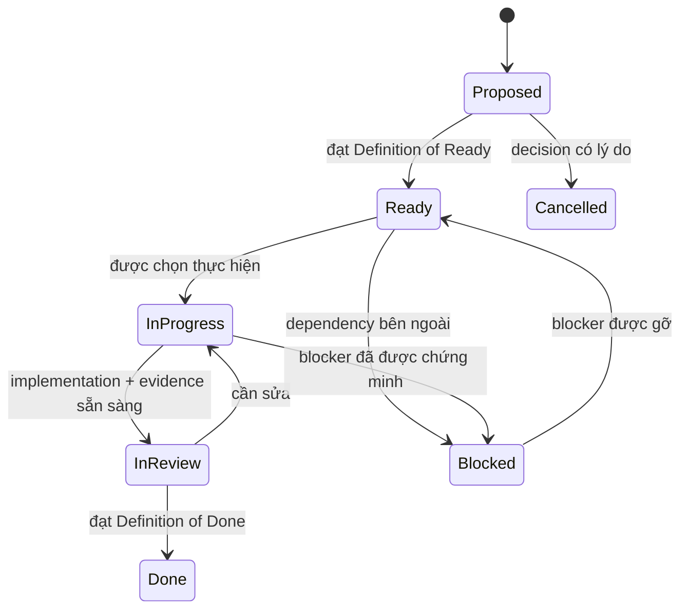

# Delivery backlog và quy tắc ticket

> Trạng thái: `BASELINE_V1`
> Cập nhật: 2026-07-29
> Nguồn tiến độ: [18-status-and-decision-log.md](../18-status-and-decision-log.md)
> Topic duy nhất đã ticket hóa: [WP1 Contracts và canonical replay](24-wp1-contracts-ticket-plan.md)

## 1. Mục đích

Tài liệu này chuyển roadmap nghiên cứu thành cơ chế delivery có thể thực hiện
tuần tự. Mỗi work package trong `16` là một **topic/epic**.

Backlog dùng **progressive elaboration**:

- toàn bộ topic chỉ có outcome, dependency và exit gate ở mức roadmap;
- chỉ topic hiện hành được chia thành ticket;
- mỗi ticket topic hiện hành có purpose, description, scope, dependency, rules,
  BDD, acceptance criteria, verification và rollback khi phù hợp;
- topic kế tiếp chỉ được refinement sau khi exit gate của topic trước đạt.

Quy tắc này tránh tạo false precision cho WP2–WP12 khi contract và evidence đầu
vào chưa tồn tại.

## 2. Nguồn sự thật và thứ tự ưu tiên

Khi có mâu thuẫn, dùng thứ tự:

1. claim boundary trong `01` và `03`;
2. protocol/model/algorithm chuẩn trong `04`, `06`, `07`, `08`;
3. decision log và trạng thái sống trong `18`;
4. roadmap/gate trong `16`;
5. execution plan của topic hiện hành;
6. nội dung ticket/PR.

Ticket không được tự ý đổi claim, unit, lifecycle, hash input, metric hoặc
repository boundary. Thay đổi như vậy cần ADR và cập nhật traceability trước
hoặc trong cùng ticket.

## 3. Mô hình trạng thái

Quy ước:

- Mỗi thời điểm chỉ có một work package chính `IN_PROGRESS`.
- Trong work package đó, mặc định chỉ có một ticket implementation
  `IN_PROGRESS`.
- Ticket docs/review có thể song song nếu không đổi contract chưa khóa.
- `Blocked` phải ghi blocker, evidence, owner và điều kiện gỡ.
- `Done` không đồng nghĩa work package complete; exit gate vẫn phải kiểm riêng.

## 4. Định danh và độ lớn

- Ticket ID: `RB-WP<work-package>-<số 3 chữ số>`.
- Một ticket mục tiêu từ nửa ngày tới hai ngày tập trung.
- Một ticket chỉ có một kết quả chính có thể review.
- Nếu dự kiến sửa nhiều boundary hoặc không mô tả được acceptance test, phải tách.
- Mỗi ticket nên tương ứng một PR/commit logic; không trộn cleanup không liên quan.

## 5. Definition of Ready

Ticket chỉ chuyển sang `READY` khi:

- mục đích và phạm vi có một cách hiểu;
- dependency đã `DONE` hoặc được chứng minh không cần;
- input/output và file dự kiến đã biết;
- acceptance criteria có thể kiểm tra;
- BDD/rules không mâu thuẫn tài liệu chuẩn;
- open decision ảnh hưởng ticket đã khóa hoặc chính là output của ticket;
- không yêu cầu secret, data, production access hoặc lựa chọn chưa có.

## 6. Definition of Done

Ngoài tiêu chí riêng, mọi ticket code phải:

- có test mới chứng minh behavior và giữ regression hiện có;
- chạy `dotnet test RideBound.slnx`;
- giữ Domain/Application độc lập framework và simulator;
- cập nhật `18`, decision liên quan và `19` nếu status/contract/claim/next action đổi;
- không để `TBD` trong contract đã khóa;
- không sửa/copy BeGo hoặc vendor ngoài phạm vi;
- ghi test đã chạy, test chưa chạy và evidence tạo ra.

Ticket tài liệu phải:

- không claim implementation chưa tồn tại;
- có link nội bộ hợp lệ;
- đồng bộ roadmap, status, decision và traceability bị ảnh hưởng;
- chỉ rõ ticket implementation tiếp theo.

## 7. Topic roadmap, chưa phải ticket backlog

| Topic | Outcome | Exit gate | Dependency |
|---|---|---|---|
| WP1 Contracts | Protocol và replay oracle xác định | Q1 | WP0 |
| WP2 Online baseline | B1 online chạy đúng state/route | một phần Q2 | WP1 |
| WP3 Ledger | Promise, budget và certificate độc lập | một phần Q2 | WP2 |
| WP4 Policies/solver | C1 và baselines so sánh công bằng | Q2 | WP3 |
| WP5 BeGo | Layer 1 paired replay và persistence | Q3 | WP4 |
| WP6 Harness | Scenario/result pipeline tái lập | Q2/Q3 support | WP4 |
| WP7 FleetPy | Layer 2 dùng cùng runner | Q4 | WP6 |
| WP8 Pilot/prereg | Khóa endpoint, margin, seed, config | go/no-go | WP5, WP7 |
| WP9 Main experiments | Bằng chứng confirmatory Layer 1/2 | Q6 phần chính | WP8 |
| WP10 Cross-system | Layer 3 và capability analysis | Q5 | WP7 |
| WP11 Product UX | UI/audit có rollback, không overclaim | product gate | WP5 |
| WP12 Paper/release | Claim traceable và artifact tái lập | Q6 | WP9, WP10 |

WP2–WP12 **chưa có ticket**. Khi topic được kích hoạt, refine vừa đủ từ
deliverable/exit gate của `16` và evidence thật của topic trước.

WP11 không nằm trên critical path nghiên cứu và không được làm chậm WP8–WP10.

## 8. Topic hiện hành

WP1 được chia thành 15 ticket tuần tự trong
[24-wp1-contracts-ticket-plan.md](24-wp1-contracts-ticket-plan.md).

Ticket đầu tiên đã hoàn thành:

> **RB-WP1-001 — Khóa protocol boundary và open decisions**

Ticket này là docs/ADR task. Không thêm contract code trước khi unit, position,
error taxonomy và hash framing được quyết định.

ADR-014 đã khóa các quyết định trên ngày 2026-07-29.
`RB-WP1-002..004` cũng đã hoàn thành. Ticket hiện tại là `RB-WP1-005` — đặc tả
schema và compatibility v1.

## 9. Template refinement cho topic kế tiếp

Khi một topic chuyển sang `READY`, execution plan phải có:

1. outcome và non-goals;
2. dependency/decision map;
3. ordered ticket queue;
4. cho từng ticket: purpose, description, in/out scope, artifacts, rules,
   BDD, acceptance criteria, verification, traceability và rollback;
5. topic-level risks;
6. exit-gate checklist;
7. handoff sang topic kế tiếp.

Không copy BDD của WP1 sang topic khác nếu semantics khác.

## 10. Quy tắc chọn ticket tiếp theo

1. Đọc `18` để lấy work package và ticket active.
2. Nếu không có ticket active, chọn ticket `READY` có ID nhỏ nhất trong topic.
3. Kiểm dependency và Definition of Ready.
4. Ghi ticket `IN_PROGRESS` trong `18` trước hoặc cùng thay đổi đầu tiên.
5. Chỉ chuyển ticket kế tiếp sau khi evidence của ticket hiện tại được review.
6. Chỉ đóng topic khi toàn bộ exit gate trong `16` đạt.

Theo trạng thái ngày 2026-07-29, ticket tiếp theo phải thực hiện là
**RB-WP1-005**.
