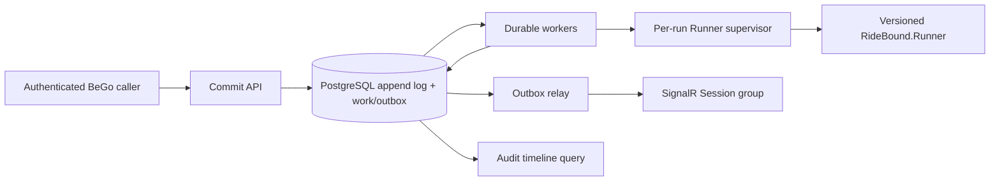
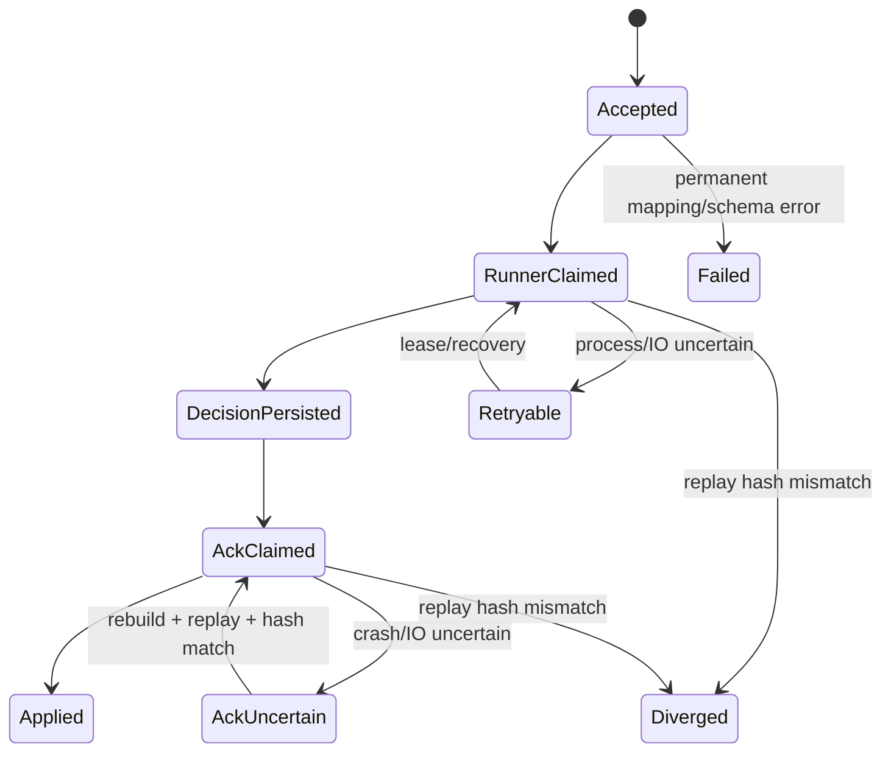

# WP5 — BeGo adapter, durable boundary và paired Layer-1 ticket plan

> Trạng thái topic: `COMPLETE` — 2026-08-09
> Refinement: `RB-WP5-001 DONE`
> Implementation/closure: `RB-WP5-002..014 DONE`
> Dependency: WP4 Complete, ADR-024; refinement ADR-025
> Source tiến độ: [18-status-and-decision-log.md](../18-status-and-decision-log.md)

## 1. Outcome

Tích hợp BeGo với đúng versioned `RideBound.Runner` qua long-lived NDJSON,
persist toàn bộ event/decision/certificate/ACK/checkpoint theo state machine có
thể recovery, publish realtime qua transactional outbox, giữ feature flag off
không đổi flow cũ, và tạo paired B1/C1 Layer-1 replay có cùng input/binary rules.

WP5 không đưa solver vào BeGo. BeGo là adapter, durable coordinator và query/UI
boundary; Runner vẫn là nguồn duy nhất của route, promise, ledger và certificate.

## 2. Non-goals và claim boundary

- không copy BeGo vào RideBound hoặc project-reference source xuyên repository;
- không cho BeGo gọi class Domain/Application/Algorithms nội bộ của RideBound;
- không dùng `Session`, `PickupRequest` hoặc snapshot cũ làm online aggregate/log;
- không tái tính/sửa ledger, certificate, promise delta hay solver result;
- không chọn O-002/O-003/O-004 từ paper hoặc microbenchmark;
- không mở reassignment O-001;
- không gọi paired replay là confirmatory effectiveness, production SLA hoặc
  user-satisfaction evidence;
- không làm UI product đầy đủ của WP11.

## 3. Repository và version boundary

| Thành phần | Checkout khóa tại refinement | Quy tắc thay đổi WP5 |
|---|---|---|
| RideBound | `E:\Code\RideBound`, origin `tsunflowerr/RideBound`, commit `44ef6a7cacdc58e7c6c0576430fcd7bb02e76c7a` | contract/core chỉ đổi nếu ticket phát hiện bug có ADR + regression; docs, replay harness và evidence nằm ở đây |
| BeGo | `E:\Code\BeGo`, origin `tsunflowerr/BeGo`, commit `ebe0d34365ec4751bd5c629677733032490a1a0d` | adapter/API/EF/SignalR nằm trong tracked `src`; không sửa/xóa untracked user docs/tools/tmp |
| Runner artifact | config gồm command path, artifact path, expected SHA-256, core commit, mode/policy/config hash | preflight fail closed nếu file/hash/version/hello capability lệch |

Baseline trước refinement, 2026-08-05:

```text
RideBound: dotnet test RideBound.slnx -> 557/557
BeGo backend: dotnet test src\OptiGo.slnx --no-restore --verbosity minimal -> 25/25
BeGo frontend: npm test -> 7/7
```

Số test hai repository không được cộng thành một “full solution”.

## 4. Kiến trúc khóa



Boundary bắt buộc:

- `OptiGo.Domain` không biết RideBound;
- `OptiGo.Application` chỉ có adapter-neutral command/result/port và không tham
  chiếu EF, Npgsql, ASP.NET, SignalR hoặc RideBound assembly;
- `OptiGo.Infrastructure` chứa EF store, mapping, Runner process client;
- `OptiGo.Api` chứa controller, auth policy và hosted workers/SignalR relay;
- RideBound Domain/Application tiếp tục không biết BeGo/EF/ASP.NET.

O-007 được khóa cho WP5: NDJSON child-process boundary đã đủ. HTTP/gRPC bị hoãn;
không thêm network transport khi chưa có cross-host operational requirement.

## 5. Durable state machine

### 5.1. Operation state



Chỉ `Applied` cho phép event kế tiếp của run tiến lên. `Failed`/`Diverged` không
tự động bỏ qua sequence. Lease expiry cho phép worker khác claim nhưng không đổi
business state.

### 5.2. Crash table

| Crash window | Durable fact có thể có | Recovery bắt buộc |
|---|---|---|
| trước T1 commit | không operation | client retry cùng key; không event mới |
| sau T1, trước Runner response | event + pending work | fresh/known Runner; checkpoint + suffix replay; gửi exact event |
| sau Runner response, trước T2 | chưa có decision DB | gửi lại exact event; Runner cache hoặc reconstruction phải trả exact decision |
| sau T2, trước ACK | persisted decision/outbox, unacked | không publish event kế tiếp; gửi matching ACK sau runner recovery |
| sau Runner ACK, trước T3 | DB vẫn unacked | bỏ uncertain process, reconstruct đến pending decision, compare hash, ACK lại |
| sau T3, trước SignalR | applied + pending outbox | relay retry; consumer dedup theo outbox ID |
| sau SignalR, trước mark-sent | pending outbox | publish lặp được; cùng stable message ID |

Không recovery branch nào tự append ledger/certificate hoặc gán ACK success.

## 6. Persistence model khóa

Các table dùng prefix `commit_`, JSON canonical lưu `jsonb` cùng exact UTF-8
canonical bytes/hash khi cần replay. Append-only table không update payload.

| Table | Authority và key/index tối thiểu |
|---|---|
| `commit_runs` | mutable coordinator projection; PK run; unique active session/policy; status, manifest/hash, epoch/next sequence, revision token, last checkpoint |
| `commit_subject_links` | restricted raw BeGo ID ↔ run-pseudonymous ID; unique `(run, source_type, source_id)`; không export mặc định |
| `commit_bootstrap_fields` | provenance per field: source/default profile, source value hash, canonical value/unit/rounding |
| `commit_events` | append-only; unique `(run,event_seq)` và `(run,epoch,canonical_batch_hash)`; canonical batch bytes/hash |
| `commit_operations` | idempotency scope/key/fingerprint, cached HTTP result, durable work state, lease owner/expiry/attempt; unique composite idempotency key; one active op/run |
| `commit_decisions` | append-only; unique `(run,epoch)`/decision hash; full Runner response, input/output state hashes, solver status |
| `commit_certificates` | append-only exact certificate JSON/hash linked decision; no BeGo-generated witness |
| `commit_checkpoints` | append-only exact checkpoint response/hash; unique `(run,epoch,checkpoint_hash)` |
| `commit_request_projection` | rebuildable user-safe current request/vehicle/promise fields; source decision/action IDs |
| `commit_timeline` | rebuildable ordered audit rows; no raw secret; indexed `(run,sequence)` and `(run,request_id,sequence)` |
| `commit_outbox` | stable message ID/type/payload, aggregate order, available/lease/published/attempt/error; index pending order |

DB guard:

- foreign keys không cascade-delete append-only evidence khi Session bị xóa;
- status/check constraints và UTC timestamps;
- application-managed `revision` concurrency token ở `commit_runs`;
- partial unique index ngăn hai operation active trên cùng run;
- database UTC là lease authority; caller wall clock không quyết định ownership;
- PostgreSQL-specific claim query dùng ordered `FOR UPDATE SKIP LOCKED` trong
  transaction ngắn rồi commit lease trước external I/O.

Rollback migration chỉ được drop schema khi chưa có evidence và có explicit
operator action. Runtime rollback bình thường là flag off; không xóa log.

## 7. Field-level bootstrap mapping

`POST /api/commit/runs` chỉ nhận `sessionId` + named policy/profile + optional
per-request explicit overrides. Adapter load BeGo Session/Venue/PickupRequest
trong server; client không gửi raw ledger/certificate/route JSON.

| BeGo/source | Protocol/record | Conversion/provenance | Thiếu/invalid |
|---|---|---|---|
| new run GUID | envelope `runId` | opaque `bego-run-{N}`; stored exact | server creates; never reuse |
| `Session.Id` + immutable bootstrap content | `scenarioId` + `scenarioContentHash` | scenario ID opaque; SHA-256 canonical source snapshot | session not found/phase incompatible -> 409/404 |
| BeGo commit | simulator `upstreamCommitSha` | configured + recorded checkout commit | missing -> preflight fail |
| Runner artifact | `binarySha256`, `coreCommitSha` | hash actual artifact before start; compare config | mismatch -> fail closed |
| `Member.Id` | `vehicleId`/`requestId` via link table | run-local pseudonymous ID; raw mapping restricted | duplicate/collision -> fail |
| member location | node map | decimal degrees → E7, ties-to-even, range check; source `member` | invalid coordinate -> fail |
| winning venue coordinate | destination node | same E7 conversion; source `venue` | missing venue/coordinate -> fail |
| `Member.GetSeatCapacity()` | vehicle capacity | integer exact; source `BeGo transport capacity v1` | <=0 driver excluded with reason |
| accepted pickup count | initial occupancy/accepted set | bootstrap remains pre-service; no fake onboard rider | onboard cannot be inferred; explicit operational event required |
| `PickupRequest.CreatedAt` | request arrival relative to simulation origin | checked UTC delta → ms ties-to-even | before origin clamps **not allowed**; choose earlier origin or fail |
| earliest/latest pickup | request contract | explicit request override or named stored bootstrap profile | no configured value -> 422, no hidden default |
| max ride time | request contract | explicit override or named stored bootstrap profile | no configured value -> 422 |
| party size | request contract | v1 BeGo member request = 1, provenance `bego-member-v1` | future group needs explicit source field/version |
| service/commitment class | request contract | named server profile ID, stored exact | unknown -> 422 |
| coordinates set | node IDs + `graphSnapshotHash` | canonical sorted source-key → node map hash | collision/nonfinite -> fail |
| `ITravelTimeService` matrix | directed travel arcs | seconds → integer ms ties-to-even; full ordered matrix; hash canonical arcs | null/sentinel/nonfinite/unreachable -> fail, never map `999999` silently |
| BeGo old route/snapshot | provenance only | may be stored for paired comparison | never import as fake RideBound ledger/promise |

Bootstrap epoch contains travel snapshot, all eligible request arrivals and
vehicle snapshots. Runner, không phải current BeGo assignment, chọn B1/C1 route.
Initial promise chỉ xuất hiện từ produced Runner actions/certificate và commit
qua matching ACK.

## 8. API/auth/idempotency contract

```text
POST /api/commit/runs
GET  /api/commit/runs/{runId}
POST /api/commit/runs/{runId}/events
GET  /api/commit/runs/{runId}/operations/{operationId}
GET  /api/commit/runs/{runId}/decisions/{epochId}
GET  /api/commit/runs/{runId}/timeline?after=&limit=&requestId=
POST /api/commit/runs/{runId}/finalize
```

- all endpoints authenticated; create/finalize require Session host;
- read/event require current session member; service ingestion, nếu thêm sau này,
  dùng policy/credential riêng chứ không giả member;
- event/create POST bắt buộc `Idempotency-Key` theo fixed validated format;
- composite lookup bind actor subject hash, route, run/session và key;
- canonical request fingerprint bind schema + body + path semantic identity;
- same key/same fingerprint: pending trả 202/operation; completed trả cached status/body;
- same key/different fingerprint: 422 Problem Details;
- concurrent event trong cùng run: 409/202 existing operation, không allocate seq;
- client không được cung cấp `eventSeq`; server allocate trong T1 và trả operation;
- raw decision/certificate audit chỉ operator/research policy; member timeline là
  user-safe projection.

Draft IETF Idempotency-Key đã expired ngày audit nên contract này là project
contract, không tuyên bố RFC compliance.

## 9. Outbox và observability

Decision/projection/outbox nằm cùng transaction. Relay publish at-least-once,
ordered theo `(run, aggregate_sequence, outbox_id)`, claim bằng lease và không
giữ row lock trong SignalR I/O. Message có `messageId`, `runId`, `epochId`,
`decisionHash`, user-safe payload; client dedup `messageId`.

Log/metric không chứa canonical request body, exact coordinate, token hoặc raw
certificate witness mặc định. Correlation:

```text
runId -> operationId -> epochId -> eventSeq -> decisionHash -> outboxId
```

Metrics tối thiểu: durable queue depth/oldest age, claim attempts/lease expiry,
Runner start/recovery/divergence, decision persistence latency, ACK lag, outbox
retry/age, API idempotent replay/conflict. Wall-clock latency không tham gia hash.

## 10. Paired Layer-1 protocol

Một source-controlled BeGo-derived pseudonymous scenario được freeze thành
canonical bootstrap/events. Harness chạy hai clean runs:

- B1 named config `rolling-cost`/registry equivalent;
- C1 named config `ridebound-hard-vector`;
- cùng input transcript, master seed, Runner artifact hash, core commit,
  scenario/graph/travel hashes, deterministic work budgets và machine context;
- chỉ policy/config identity khác theo manifest;
- lưu input/output/checkpoint hashes, exit status, failure/exclusion log, test
  counts và mechanical metrics.

Oracle:

1. mỗi transcript schema-valid và event sequence liên tục;
2. replay cùng arm hai process sạch byte/hash-equivalent;
3. every persisted decision/certificate/outbox binds exact Runner response;
4. recovery injection trước/sau T1/T2/ACK/T3 cho final committed hashes giống
   no-crash run;
5. B1/C1 input content hashes bằng nhau ngoài allowlist policy fields;
6. không có invalid published decision/certificate;
7. report khác biệt revision/service là descriptive Layer-1 signal, không kết luận.

## 11. Ordered ticket queue

### RB-WP5-001 — refinement BeGo adapter và persistence

**Status:** `DONE`

**Artifacts:** ADR-025, research evidence này, repository/baseline audit, mapping,
state/crash/transaction diagrams và queue `002..014`. Không production code.

**Verification:** RideBound 557/557, BeGo backend 25/25, frontend 7/7; Markdown
link/fence/diff gates trong refinement closure.

---

### RB-WP5-002 — adapter-neutral Application contracts và invariants

**Status:** `DONE` — 2026-08-05

**Purpose:** Tạo boundary typed trong BeGo Application cho run/operation,
idempotency result, bootstrap provenance, Runner request/response và audit query,
không kéo EF/ASP.NET/RideBound assembly vào Domain/Application.

**In scope:** immutable records/enums, ports, state transition guard, canonical
fingerprint interface, error taxonomy; architecture tests.

**Out:** EF entity, child process, controller.

**BDD:**

- Given cùng operation state, when transition không nằm trong graph, then fail
  không mutate.
- Given same idempotency key nhưng fingerprint khác, then conflict typed.
- Given Application assembly, then không reference EF/Npgsql/ASP.NET/SignalR hay
  RideBound projects/packages.

**Acceptance:** exhaustive transition table; no public raw setter; fixed limits
validated; existing BeGo + RideBound baseline pass.

**Implemented evidence:**

- BeGo Application thêm validated immutable run/operation/idempotency/hash/
  protocol/timeline contracts và ports, không reference EF/Npgsql/ASP.NET/
  SignalR/RideBound assembly;
- exhaustive operation/run transition matrices, terminal fail-closed state,
  monotonic UTC/revision và exact contiguous epoch/event advance;
- composite actor/resource/scope/key + canonical request fingerprint; pending/
  completed replay tách changed-payload conflict;
- strict UTF-8 SHA-256, no default-invalid value structs, single-line duplicate-
  free JSON object và declared/embedded `messageType` match;
- decision/certificate/outbox exact hash/order guards; ACK persistence bắt buộc
  exact `decisionApplied` command + checkpoint response thay vì đoán pipe write;
- 32 targeted Debug/Release tests, full BeGo 57/57, RideBound 557/557, targeted
  format sạch. Full BeGo Release `/warnaserror` còn fail bởi pre-existing
  transitive `Microsoft.OpenApi 2.0.0` advisory High; không ghi sai thành pass và
  phải xử lý trước WP5 closure/security gate.

**Rollback:** remove new isolated contracts/tests; no DB/runtime state.

---

### RB-WP5-003 — append-only EF model, migration và PostgreSQL constraints

**Status:** `DONE` — 2026-08-05
**Dependency:** `002 DONE`

**Purpose:** Hiện thực schema mục 6 và migration forward/rollback reviewable.

**Rules:** JSON schema/version/hash columns explicit; append rows immutable in
application; projection separate; no cascade delete; unique/partial/index/check
constraints live in migration, not tests only.

**BDD:** duplicate event/epoch/idempotency rejected; concurrent run revision
throws conflict; session deletion cannot erase evidence; migration up/down on
ephemeral PostgreSQL leaves expected schema.

**Verification:** model metadata/unit tests, generated migration SQL review,
real Npgsql migration/integration gate, both repository baselines.

**Evidence 2026-08-05:**

- BeGo Infrastructure có 11 entity/table `commit_*`, JSONB + exact canonical
  bytes/hash, application-managed concurrency token, partial unique queue/index
  và same-run composite FK cho operation/decision/checkpoint links;
- migration `20260805155554_AddCommitIntegrationPersistence` tạo năm PostgreSQL
  append-only trigger; Down cần explicit operator GUC và từ chối khi bất kỳ
  commit table nào có data;
- PostgreSQL 17 Alpine thật pass up/refused-down/empty-down/re-up, duplicate
  event/epoch/idempotency, active-operation, cross-run FK, optimistic concurrency,
  session `SET NULL`, evidence trigger và data-loss rollback cases;
- targeted Release `/warnaserror` với PostgreSQL thật 38/38; full BeGo 62 pass +
  1 integration test explicit skip khi thiếu opt-in connection; RideBound
  557/557; targeted format sạch.

---

### RB-WP5-004 — durable claim/lease/idempotency store

**Status:** `DONE` — 2026-08-05
**Dependency:** `003 DONE`

**Purpose:** T1 ingestion và worker claim có serialization per run, bounded
backpressure và crash-safe retry.

**Rules:** DB source of truth; `Channel` optional wake-up only; database UTC;
ordered `SKIP LOCKED`; lock released before external I/O; fingerprint conflict
không consume sequence.

**BDD:** 2 workers never own same operation/run; expired lease reclaim works;
same key returns same op; changed payload conflicts; two runs progress without
head-of-line blocking; crash after T1 does not lose work.

**Evidence 2026-08-05:**

- `PostgresCommitIntakeStore` khóa đúng row run, kiểm tra exact eventBatch
  fingerprint/epoch/time/contiguous range rồi commit run + event evidence +
  operation trong một T1; retry được resolve trước current-sequence validation;
- bounded global pending capacity dùng transaction advisory lock ngắn; claim
  dùng database `transaction_timestamp()`, canonical `bytea`, ordered
  `FOR UPDATE SKIP LOCKED`, commit lease trước khi trả về;
- real PostgreSQL gate cover pending/completed replay, changed-payload conflict,
  no sequence consumption, busy run, time regression, expired reclaim, lock
  release, two-worker/two-run isolation, capacity và crash-after-T1 recovery;
- concurrency/migration gate pass 5/5 database-clean iterations; targeted Release
  PostgreSQL thật 40/40; full BeGo 64 pass + 1 explicit opt-in skip; RideBound
  557/557; targeted format sạch.

---

### RB-WP5-005 — pinned long-lived Runner process client/supervisor

**Status:** `DONE` — 2026-08-05
**Dependency:** `002`, `004 DONE`

**Purpose:** One Runner session per active run, exact line framing, timeout/
stderr separation, artifact hash preflight và lifecycle cleanup.

**Rules:** no per-event spawn happy path; stdout protocol only; bounded stderr;
command path separate artifact hash path; hello/init selection exact; process
pool bounded by explicit config; uncertain session discarded, not reused.

**BDD:** hash mismatch blocks start; malformed/oversize/unexpected response fails
typed; cancellation kills owned process tree; two events reuse PID; two runs are
isolated; stderr cannot corrupt NDJSON; no secret/path in API error.

**Evidence 2026-08-05:**

- `RunnerProcessClient` giữ đúng một process/session mỗi run, pool bounded và
  preflight cả command/artifact absolute path, exact artifact SHA-256 cùng core
  commit trước start;
- strict UTF-8 NDJSON có input/output byte bound, stdout protocol tách stderr
  drain bounded, command timeout và caller cancellation đều discard session;
- hello/init khóa schema, exact capability selection, manifest/binary/core hash;
  event response khóa run/scenario/epoch/time và ACK+checkpoint là một critical
  section, không tái dùng state không chắc chắn;
- lifecycle audit sửa hai race dispose/start và buộc kill toàn process tree;
  process stub thật cover PID reuse/isolation, saturation, malformed/oversize/
  wrong-schema/context/manifest, cancellation, stderr flood và child cleanup;
- published `RideBound.Runner` Release thật chạy online
  `hello→initialize→bootstrap→decision→decisionApplied→checkpoint`; targeted
  Debug/Release `/warnaserror` 17/17, full Release với PostgreSQL + Runner thật
  82/82 không skip, BeGo frontend 7/7, targeted format/diff sạch.

---

### RB-WP5-006 — BeGo bootstrap mapping và provenance

**Status:** `DONE` — 2026-08-05
**Dependency:** `003`, `005 DONE`

**Purpose:** Map Session/member/venue/request/travel matrix theo mục 7 thành exact
hello/init/bootstrap event, không bịa missing data.

**Rules:** run-local pseudonym, E7/ms ties-to-even, range/finite checks, complete
directed matrix, explicit named/override time window and max ride, old snapshot
provenance-only.

**BDD:** reordering BeGo collections không đổi canonical hashes; half-tie rounds
even; missing defaults fails 422; sentinel/unreachable travel fails; raw account
ID absent from protocol/export; exact bootstrap replay deterministic.

**Closure evidence — 2026-08-05:**

- mapper tách `Prepare` đồng bộ để chụp semantic source bất biến trước external
  I/O và `CompleteAsync` để lấy đúng một complete directed matrix; chỉ venue,
  eligible vehicle và passenger có active request mới tạo graph node;
- HMAC-SHA256 key run-local tạo pseudonym, key/buffer được zero sau dùng; raw ID,
  tên, email và legacy snapshot không vào protocol. Subject-link restricted và
  field-level hash provenance giữ khả năng audit mà không nhập old assignment,
  route hoặc ledger vào RideBound state;
- E7 và giây→ms dùng ties-to-even, collision/range/UTC/overflow/finite/sentinel/
  full-matrix/scale bound fail closed. Full-matrix node cap được kiểm trước travel
  I/O để giữ chi phí O(n²) hữu hạn;
- canonical manifest dùng exact `helloAck` selection, source conversions sort
  semantic, và `RideBound.ManifestHash.v1` domain-separated hash. Sửa vòng phụ
  thuộc sai trước đó: manifest hash chỉ được tính sau capability negotiation;
- collection reorder cho cùng bytes/hash; bootstrap event sequence liên tục và
  deterministic. 16 mapper cases cùng 15 supervisor cases pass; generated
  bootstrap chạy xuyên published RideBound Runner. Full BeGo Release với fresh
  PostgreSQL 17 + Runner thật pass 98/98 không skip; required RideBound 557/557.

---

### RB-WP5-007 — authenticated API và idempotent HTTP behavior

**Status:** `DONE` — 2026-08-05
**Dependency:** `004`, `006 DONE`

**Purpose:** Implement API mục 8 với Problem Details, host/member authorization
và stable cached responses.

**BDD:** non-member forbidden; member cannot read another session; missing key
400; key reuse changed payload 422; in-flight duplicate 202/409; completed
duplicate exact status/body; concurrent POST gets one event sequence.

**Rules:** no client eventSeq/ledger/certificate input; rate policy explicit;
request size/field format bounded; existing Sessions endpoints unchanged.

**Closure evidence — 2026-08-05:**

- Application service enforce host cho create/finalize, current member cho read/
  event, và từ chối restricted timeline evidence; controller dùng auth fallback,
  strict DTO unknown-field rejection, 32 KiB write bound và RFC Problem Details;
- member event v1 chỉ nhận typed `timerTick`; client không có trường `eventSeq`,
  ledger, certificate hoặc raw Runner frame. Server cấp epoch/sequence từ run
  cursor và PostgreSQL T1 giữ one-active-operation;
- sửa invariant WP5-004: semantic HTTP request fingerprint độc lập canonical
  eventBatch hash, vì sequence là server-owned. Retry lookup xảy ra trước allocate;
  same key/same semantics trả cùng operation/body, changed semantics trả 422;
- create-run composite idempotency có transaction advisory lock trước lookup/
  insert nên concurrent multi-process không phụ thuộc unique-index check order;
  run + bootstrap event + operation + subject links + field evidence commit atomic;
- controller expose user-safe run/operation/decision/timeline views và stable exact
  cached bytes. Policy 30 writes/phút thực sự được exercise; audit sửa lỗi route-
  level policy `standard` từng ghi đè action policy;
- pin trực tiếp patched `Microsoft.OpenApi 2.7.5`; `dotnet list ... --vulnerable`
  báo 0 package. Targeted HTTP/Application/PostgreSQL/Runner gates pass; full
  Release `/warnaserror` với fresh PostgreSQL 17 + published Runner pass 116/116,
  frontend 7/7 và required RideBound 557/557.

---

### RB-WP5-008 — decision transaction, ACK/checkpoint và crash recovery

**Status:** `DONE` — 2026-08-09
**Dependency:** `005..007 DONE`

**Purpose:** Implement T2/T3 and recovery proof across every crash window.

**Rules:** Runner call outside transaction; exact response persisted without
semantic rewrite; decision/certificate/projection/outbox atomic; next event waits
`Applied`; uncertain ACK forces fresh reconstruction; replay hash mismatch
`Diverged` fail closed.

**BDD:** failpoints at before/after Runner/T2/ACK/T3 converge to no-crash final
hash or typed divergence; no duplicate evidence/outbox; wrong decision hash
never ACK; certificate missing/invalid response never publish.

**Outcome:**

- `CommitDecisionWorker` chạy Runner ngoài transaction, T2 ghi exact decision,
  certificate, user-safe projection, timeline và outbox trong một transaction;
  T3 chỉ ghi checkpoint/cached result sau matching `decisionApplied`.
- Claim dùng database time, owner + revision + unexpired lease làm fence. EF tracking
  snapshot sau raw-SQL claim được xóa có guard để T2/T3 không đọc revision cũ;
  stale fence bị PostgreSQL từ chối ở cả hai durable boundary.
- Recovery luôn bỏ process outcome không chắc chắn, mở Runner mới, phát lại exact
  hello/initialize/checkpoint/event và so decision byte/hash exact trước ACK. Lệch
  replay chuyển `Diverged`; không có exactly-once delivery claim.
- Migration lưu exact hello/initialize recovery frames, khóa outbox về đúng
  same-run operation, giữ identity/payload immutable và từ chối Down có dữ liệu nếu
  operator chưa bật explicit data-loss guard.
- Boundary validator tái lập nested route/promise/vector/certificate semantics,
  gồm unique service stop, đúng một drop, tối đa một pickup, pickup-before-drop và
  exact request/stop binding; malformed/missing certificate không qua T2.
- Real PostgreSQL 17 + published Runner kiểm đủ tám failpoint trước/sau Runner,
  T2, ACK và T3; recovered decision/certificate/checkpoint bytes/hashes khớp clean
  oracle, không trùng effect/outbox/timeline. Full BeGo Debug và Release
  `/warnaserror` đều 125/125, 0 skip; frontend 7/7; required RideBound 557/557;
  targeted format và vulnerability audit sạch.

---

### RB-WP5-009 — transactional outbox + idempotent SignalR relay

**Status:** `DONE` — 2026-08-09
**Dependency:** `008 DONE`

**Purpose:** Publish user-safe events without commit/publish gap.

**Rules:** at-least-once named honestly; lease/batch/order; stable message ID;
no row lock over SignalR; mark sent only after send; raw witness not broadcast.

**BDD:** crash after send causes duplicate same ID, not new message; failed send
retries; per-run ordering stable; slow run does not block all runs; outbox absent
when T2 rollback; unauthorized group cannot join (existing guard retained).

**Outcome:**

- Application relay contract có bounded batch/lease/owner, monotonic attempt fence,
  typed retry/disposition/failpoint và exact canonical user-safe payload allowlist;
- PostgreSQL claim chỉ exact unpublished per-run head bằng `DISTINCT ON` + ordered
  `FOR UPDATE SKIP LOCKED`, dùng DB time, commit lease trước I/O, mark/reschedule
  dưới exact attempt/owner/expiry fence và exponential backoff có cap;
- SignalR publisher dùng canonical Session GUID group, không log payload, không
  broadcast route/node/budget/certificate witness/raw identity. Migration trigger
  cấm retarget run sang Session khác; existing authenticated member guard được giữ;
- crash sau send/reclaim phát lại exact immutable message/payload/hash. Logic audit
  phát hiện sender cũ có thể hoàn tất muộn sau lease expiry, nên wire thêm stable
  `aggregateSequence`/payload hash và frontend delivery gate bỏ duplicate/stale
  callback theo run. SignalR enqueue vẫn không được gọi là durable client receipt;
- real PostgreSQL cover stale fence, retry delay, per-run order, cross-run
  non-blocking, no-audience row, Session retarget mutation và T2 rollback atomicity;
- full BeGo Debug và Release `/warnaserror` trên hai fresh DB + published Runner
  đều 131/131, 0 skip. Frontend 9/9, lint, `tsc`, Next production build pass;
  NuGet/npm audit đều 0 vulnerability. Audit đã nâng Next 16.3.0, NextAuth
  beta.32 và patched transitives; required RideBound 557/557.

---

### RB-WP5-010 — rebuildable audit timeline, privacy và observability

**Status:** `DONE` — 2026-08-09
**Dependency:** `008`, `009 DONE`

**Purpose:** Timeline query/index/projection rebuild plus privacy-safe diagnostics.

**Rules:** cursor `(sequence,id)`, bounded limit, deterministic order; member sees
own/user-safe rows; operator policy sees raw evidence; pseudonymous export;
rebuild result hash; exact coordinate/subject/token absent logs.

**BDD:** rebuild from append logs equals live projection; pagination no gap/
duplicate under concurrent append; cross-request access denied; log capture secret/
coordinate mutation killed; indexed query plan checked on representative rows.

**Implementation outcome:**

- strict canonical cursor `(sequence,id)`, UTF-8/query bounds và server-owned
  member/operator scope; member ownership được suy từ raw pickup links nhưng raw ID
  không rời restricted store;
- PostgreSQL row-value keyset trên `(run,sequence,id)`, request-aware composite
  index, page-level evidence join và no-N+1 bound. JSONB được canonicalize rồi kiểm
  lại hash + user-safe allowlist trước khi trả;
- operator-only exact decision/certificate evidence, repeatable-read rebuild từ
  append-only source với epoch/previous/state/materializer chain, rebuilt/live
  hash comparison và fail-closed pseudonymous export khi drift;
- recursive export/privacy guard, stable typed telemetry và exception logging không
  echo secret/subject/coordinate/raw evidence. Commit authorization default deny;
- migration `Down` guard được chuyển lên trước drop để rollback bị từ chối không
  thể để schema ở trạng thái hạ cấp dở dang;
- real PostgreSQL concurrent append, live-drift mutation/restore, raw authorization,
  migration up/down/re-up và 12.000-row `EXPLAIN` gates pass. Full BeGo Debug và
  Release `/warnaserror` trên fresh DB + published Runner: 138/138, 0 skip;
  frontend 9/9 + lint/TypeScript/build, NuGet/npm audit 0, RideBound 557/557.

**Logic audit fixes:** member cùng Session không còn đọc request của member khác;
PostgreSQL-rendered `jsonb` không còn ghép với hash của canonical bytes khác; LINQ
OR cursor không còn tạo prefix filter sau run index; policy handler không eager
resolve HMAC service; commit exception message không còn điều khiển HTTP class;
guard downgrade không còn chạy sau thao tác phá schema.

---

### RB-WP5-011 — feature flag, compatibility và operational rollback

**Status:** `DONE` — 2026-08-09
**Dependency:** `007..010 DONE`

**Purpose:** Default-off rollout, shadow/no-publish option, health/preflight và
rollback without corrupting evidence or old endpoints.

**Rules:** flag off registers no active workers/process and does not change
Session flow; migration may exist harmlessly; shadow writes namespace and never
mutates old Session route; disabling stops new claims gracefully, leases expire.

**BDD:** full old endpoint contract/regression with flag off; restart flag off
leaves pending work recoverable; hash preflight health unhealthy when enabled;
rollback preserves append logs; existing 25+7 baseline unchanged.

**Implementation outcome:**

- `Mode` mặc định `Disabled`; không có COMMIT hosted worker, member COMMIT API bị
  gate trước Runner/service resolution. Existing Session endpoints và old health
  response giữ nguyên;
- `Shadow` đăng ký decision worker nhưng không relay; `Live` mới đăng ký cả hai.
  Exact artifact hash preflight được cache có bound và là gate chung trước claim;
- durable `rollout_namespace` (`Shadow`/`Live`) được ghi trên run, immutable bằng DB
  trigger. Decision claims lọc exact namespace; outbox store chỉ có thể claim Live,
  nên shadow row không bị publish sau restart/chuyển mode;
- migration backfill existing rows thành Shadow rồi bỏ default, unique active run
  theo `(session,policy,namespace)`, guarded Down chạy trước mọi drop;
- shutdown cancellation không claim vòng mới; lease cũ hết hạn được worker cùng
  namespace reclaim bằng owner/revision fence. PostgreSQL gate giữ old Session
  latest/final route snapshots exact và shadow outbox `attempt_count=0`;
- source audit phát hiện/sửa constraint-name mapping sau khi index đổi, để active
  conflict vẫn trả typed `RunUnavailable` thay vì generic storage conflict;
- full BeGo Debug/Release `/warnaserror` trên fresh PostgreSQL + published Runner:
  147/147, 0 skip. Frontend 9/9 + lint/TypeScript/build; NuGet/npm audit 0;
  targeted WP5 format sạch; RideBound required 557/557.

---

### RB-WP5-012 — paired B1/C1 BeGo Layer-1 replay harness

**Status:** `DONE` — 2026-08-09
**Dependency:** `008`, `010`, `011 DONE`

**Purpose:** Execute protocol mục 10 with source-controlled pseudonymous fixture
and clean Runner processes.

**Rules:** same input/binary/work rules; allowlist manifest policy differences;
failure/exclusion explicit; repeat each arm; no effectiveness wording.

**BDD:** changed non-policy input fails pairing; repeated arm exact hashes;
binary/config mismatch fails preflight; B1/C1 both certificate-valid; artifact
manifest verifies all files/checksums.

**Implementation outcome:** BeGo thêm source-controlled fixture/provenance và
`OptiGo.PairedReplay`. Preflight bind raw + canonical workload/config hashes,
effective policy config, exact Runner SHA/core commit và chỉ allowlist `policyId`;
execution stage exact input copies để đóng TOCTOU, rồi chạy B1/C1 × hai process
sạch. BeGo exact materializer kiểm toàn decision/certificate, checkpoint validator
tính lại hash/state chain; normalized protocol input giống nhau và mỗi arm lặp exact
input/output/decision/checkpoint hashes. Bundle final tự enumerate mọi file, kiểm
size/SHA + sidecar, snapshot harness source và executing assembly hashes; tamper test
phải fail. Final artifact manifest SHA-256:
`b843bd20cbe9bf887d00998d4eaad54258848eb41d87ae49fd18a2142a0cb807`.
BeGo Debug/Release fresh PostgreSQL + published Runner 152/152, 0 skip; required
RideBound 557/557. Kết quả chỉ là Layer-1 mechanical/correctness evidence.

---

### RB-WP5-013 — independent failure, concurrency và performance evidence

**Status:** `DONE` — 2026-08-09
**Dependency:** `012 DONE`

**Purpose:** Không dựa chỉ happy-path tests: independent model/oracle cho state
transition/claim, mutation-killing transaction gates, restart stress và bounded
local performance curves.

**Evidence:** randomized operation histories; 2–4 worker contention; kill process
at every durable boundary; mutate unique index/ACK gate/outbox transaction/
fingerprint/hash check and require tests fail; queue/latency curves with machine/
config, no production SLA claim.

**Gate:** zero lost/duplicate committed effect, zero invalid publication, recovery
final hashes exact; every required mutation killed; resource/process handles clean.

**Outcome:** Test-owned transition oracle chạy 256 seed × 64 bước (12.261 valid,
4.123 invalid) mà không dùng production transition table. PostgreSQL claim oracle
so exact expected/observed set với 2/3/4 worker và queue 24/36/48, không duplicate.
`OptiGo.CommitFaultHarness` là child process riêng, `FailFast` tại đủ 8 decision +
4 outbox boundary; fresh Runner recovery giữ exact decision/certificate/checkpoint,
stable duplicate-after-send semantics, stale fences bị từ chối và không còn orphan
process/session/DB connection. Năm explicit mutant unique/ACK/outbox/fingerprint/
hash bị giết 5/5.

Curve `8/32/64 × 1/2/4 worker` dùng deterministic randomized order, 1 warm-up +
5 measured repetitions, giữ raw samples và machine/PostgreSQL/row-count config.
Trong lần local audit, median claim-drain ms theo worker 1/2/4 là `5.553/7.130/
7.246` (queue 8), `8.848/8.822/7.867` (queue 32), `10.920/10.957/8.938`
(queue 64): worker overhead có hại ở queue nhỏ, bốn worker có lợi ở queue lớn hơn.
Đây không phải end-to-end throughput hay production SLA.

Final artifact:
`E:\Code\BeGo\artifacts\ridebound\wp5-independent-v1\wp5-013-20260809-final`;
manifest SHA-256
`e21fb0877fbc6d61bf6f1e24adcda24e09a29fea95a9f44d1b61bf4fc1061ca2`;
18 files, independent rehash 0 mismatch. Targeted gate pass; full BeGo Debug và
Release `/warnaserror` fresh DB + Runner pass 153/153, 0 skip; required RideBound
pass 557/557; targeted format, diff và NuGet vulnerability audits sạch. Frontend
không đổi surface nên giữ baseline 9/9 thay vì chạy lại vô nghĩa.

---

### RB-WP5-014 — WP5 closure, WP1–WP5 audit và WP6 handoff

**Status:** `DONE` — 2026-08-09
**Dependency:** `002..013 DONE`

**Purpose:** Source-level review toàn WP1–WP5, not test-count review; decide
go/no-go for WP6/WP7/WP8 and write detailed code guide.

**Required:** ADR closure; `docs/reviews/wp1-wp5-final/`; per-file explanation,
invariant/optimization/paper-to-code matrix, unresolved risk/debt, paired replay
result and honest feasibility verdict; update `00/14/15/16/18/19/21/23`;
exactly one next refinement ticket READY only if exit gate passes.

**Outcome:** Source audit phát hiện và sửa ba boundary thật: authorization mapping
`commit_subject_links` thành append-only; `commit_outbox.operation_id` bắt buộc,
claim chọn absolute head trước rồi chỉ nhận khi head operation cùng run đã `Applied`;
outbox batch xử lý mỗi run bằng scope/
DbContext độc lập để loại cross-run head-of-line blocking. Full BeGo Debug/Release
đạt 154/154, 0 skip; frontend/format/vulnerability gates sạch. Review chi tiết ở
`docs/reviews/wp1-wp5-final/`; verdict là GO cho refinement WP6, nhưng NO-GO cho
main experiment, production SLA hoặc effectiveness claim. Tạo đúng một ticket
`RB-WP6-001 READY` tại `tasks/33-wp6-common-benchmark-harness-refinement.md`.

## 12. Ticket execution rule

1. Chỉ ticket status `READY` nhỏ nhất được chuyển `IN_PROGRESS`.
2. Mỗi ticket code chạy test targeted, BeGo backend, RideBound required suite;
   frontend khi API/type/SignalR surface đổi.
3. Ticket migration/transaction/recovery phải có real PostgreSQL evidence; unit
   fake không đủ.
4. Sau mỗi ticket audit logic/invariant/complexity/resource behavior rồi mới đổi
   ticket tiếp theo thành `READY`.
5. Cập nhật `18`, ADR/decision và `19` trong cùng ticket.
6. Không cộng số test hai repository và không ghi pass cho gate chưa chạy.

## 13. WP5 exit gate

- migration up/down + real PostgreSQL concurrency/constraint tests pass;
- existing BeGo endpoints and default-off flow unchanged;
- exact Runner artifact hash/version/hello/init binding demonstrated;
- all crash windows recover without double committed effect/publication;
- decision + certificate + projection + outbox atomic, ACK only after commit;
- audit timeline rebuild/pagination/auth/privacy gates pass;
- paired B1/C1 clean replay and same-input allowlist proof pass;
- backend/frontend/RideBound baselines independently green;
- final review concludes no unresolved correctness blocker for WP6/WP7;
- claims remain Layer-1 mechanical/descriptive until WP8/WP9.

## 14. Rollback và stop conditions

Stop/fail closed nếu:

- BeGo source provenance/baseline changes unexpectedly mid-ticket;
- Runner binary/core/config hash cannot be bound;
- missing bootstrap field has no explicit source/profile;
- real PostgreSQL cannot enforce serialization/constraints;
- recovery produces different decision/checkpoint hash;
- feature flag off changes existing behavior;
- paired arms differ outside policy allowlist.

Rollback runtime là flag off + stop claiming + preserve evidence. Không drop data,
reset sequence hoặc manufacture ACK để làm run “xanh”.
