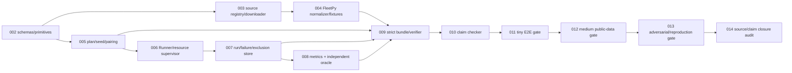

# WP6 — common benchmark harness ordered ticket plan

> Trạng thái plan: `COMPLETE`  
> Work package: `WP6`  
> Refinement dependency: `RB-WP6-001` / ADR-026 `DONE`  
> Contract: [WP6 common benchmark contract v1](../benchmarking/wp6-contract-v1.md)  
> Ticket cuối: `RB-WP6-014 DONE`; không có ticket active

## 1. Outcome toàn work package

WP6 hoàn tất khi repository có common executable path:

```text
verified source → canonical scenario → paired exact Runner processes
→ typed raw/failure/exclusion evidence → independently checked metrics
→ strict self-verifying BagIt-compatible bundle
```

và pass tiny/medium public-data mechanical gates. WP6 không chạy confirmatory
experiment, không chọn O-002/O-003/O-004, không triển khai FleetPy control adapter và
không claim effectiveness/non-inferiority/SLA.

## 2. Dependency graph



Không chuyển ticket sau sang `READY` trước khi dependency trực tiếp `DONE` và required
baseline của ticket trước đã ghi evidence.

## 3. Global implementation rules

1. Mọi code change chạy `dotnet test RideBound.slnx`.
2. Contract/schema/CLI unknown field, duplicate, overflow và semantic mismatch phải
   fail closed.
3. Benchmark code nằm ngoài Domain/Application policy core; harness gọi exact pinned
   Runner process, không gọi policy class trực tiếp.
4. Không copy BeGo-specific source/mapping vào RideBound. Generic reuse phải có
   provenance, characterization test và không kéo BeGo entity type.
5. Không overwrite/delete raw source, old result, failure, exclusion hoặc bundle.
6. Không dùng test pass để tự nhận logic đúng; mỗi ticket có source review, mutation/
   differential/conservation evidence phù hợp.
7. Khi phát hiện contract conflict, stop và amend ADR-026; không tạo local exception.

## 4. Ordered tickets

### RB-WP6-001 — common harness refinement

**Status:** `DONE`  
**Evidence:** ADR-026, contract v1, research evidence và plan này.

Outcome đã khóa:

- scenario/dataset/demand/pairing/seed/Runner/failure/exclusion/metric/result/bundle/
  resource/fixture/claim contracts;
- FleetPy Manhattan v1/CC BY 4.0 public source;
- HMAC addressable seed hierarchy;
- independent raw-to-metric oracle;
- strict BagIt-compatible no-extra bundle;
- đúng `RB-WP6-002` Ready.

### RB-WP6-002 — schema, canonical primitives and identity vectors

**Status:** `DONE`  
**Depends on:** `RB-WP6-001`  
**Type:** smallest implementation ticket; no downloader/process/experiment.

Outcome:

- add solver/simulator-neutral benchmark-contract project and tests;
- implement strict types/codecs plus draft-2020-12 schemas for dataset descriptor,
  normalization report, scenario, benchmark plan/arm, run record, observation index,
  failure, exclusion, metric row and logical bundle manifest;
- implement WP6 framed scenario/plan/run/metric/bundle identities;
- preserve strict integer/string canonical subset; no float/null/unknown field;
- add schema inventory, positive/negative fixtures and cross-process identity vectors;
- update architecture allowlist without allowing Domain/Application dependency back.

Acceptance:

- runtime codec and every schema agree on required/optional/conditional fields;
- duplicate property, invalid Unicode, noncanonical integer, overflow, wrong enum,
  unknown field and self-hash misuse fail with typed path/code;
- two clean processes produce byte-identical canonical/hash vectors;
- no process/filesystem/simulator type appears in contract project;
- required full solution passes.

BDD:

```gherkin
Given two semantically equal scenario JSON documents with different property order
When both are decoded and re-encoded
Then canonical bytes and scenario hash are exact equal
And duplicate fields, floats, nulls and unknown fields are rejected
```

Rollback/stop: no database/migration. If v1 contract cannot encode a required existing
Runner value, stop and amend ADR-026 rather than widening canonical rules implicitly.

Closure evidence ngày 2026-08-09:

- thêm pure `RideBound.Benchmarking.Contracts` chỉ phụ thuộc `RideBound.Contracts`;
- 10 typed document models/codecs, semantic validator và 6 domain-separated identity
  helpers; no null/float/numeric enum/unknown/duplicate/self-hash escape;
- 11 Draft 2020-12 schema assets (10 document + common), exact inventory, 10 positive
  và 9 negative fixtures;
- published six-identity vector được hai clean tool process tái tạo byte-exact;
- 28 targeted tests pass, `dotnet format RideBound.slnx --verify-no-changes` pass,
  required full solution pass 586/586 (Architecture 10, Contracts 133, Domain 135,
  Application 69, Benchmarking.Contracts 28, Algorithms 134, Solvers 6, Runner 71).

### RB-WP6-003 — dataset registry, verified download and safe extraction

**Status:** `DONE`  
**Depends on:** `RB-WP6-002`

Outcome:

- source registry with locked FleetPy Manhattan descriptor and CC BY attribution;
- allowlisted HTTP downloader using temp → length/MD5/SHA-256 verify → atomic
  content-addressed promotion;
- immutable ignored raw cache and exact retrieval receipt;
- ZIP inventory/extractor rejects traversal, absolute path, symlink/reparse, duplicate,
  case collision, count/size/ratio bomb and mismatching member bytes;
- datasheet/provenance record and explicit no-PII/no-satisfaction-claim caveat;
- deterministic offline tests use crafted archives; public download is opt-in command.

Acceptance:

- good fixture round-trips with exact inventory hash;
- all archive attack mutations fail before write outside staging root;
- checksum mismatch never overwrites an existing valid cache entry;
- rerun against exact bytes is idempotent and records no new semantic identity;
- license not accepted means typed exclusion, not auto-download;
- required full solution passes.

Closure evidence ngày 2026-08-09:

- registry khóa Zenodo record `15187906`, exact length `408878341`, publisher MD5
  `8b11882ae9c6d87f666bf6e006806744` và local SHA-256
  `d9e86f33645e5eec287d387f8d63ad41ddf41d4ef648138b65d636482e2c599e`;
- opt-in downloader hỗ trợ validated HTTP Range resume, rehash toàn object trước reuse,
  fail-closed khi cache bị sửa và không ghi raw bytes vào repository;
- public ZIP đã được tải/xác minh/extract: 335 members, `1022750557` uncompressed
  bytes, inventory SHA-256
  `f9b28bb17850881e2e1a0784d7ff0aa1885b7175ab9be8db5e8ac6d969240bbd`;
- rerun thực tế không chạm network, trả `ReusedExistingBytes=true` và
  `ReusedExistingExtraction=true` nhưng vẫn rehash object/inventory;
- 26 targeted downloader/archive attack tests, format sạch và required full solution
  612/612 (Architecture 10, Contracts 133, Domain 135, Application 69,
  Benchmarking.Contracts 28, Benchmarking 26, Algorithms 134, Solvers 6, Runner 71).

### RB-WP6-004 — FleetPy Manhattan normalizer and public derivatives

**Status:** `DONE`  
**Depends on:** `RB-WP6-003`

Outcome:

- inspect and bind exact FleetPy archive member inventory/version;
- parse network, travel-time and demand files needed by contract v1;
- ties-to-even unit conversion, pseudonymous request IDs and stable source ordinals;
- strongly connected/reachability validation with typed source exclusions;
- HMAC-ranked policy-independent source selection;
- emit normalization conservation report and canonical tiny/medium public derivatives
  with CC BY attribution/transformation recipe;
- normalizer never invents reverse/zero/Euclidean arcs or observed user budget.

Acceptance:

- `input = eligible + excluded`; every eligible row selected/not-selected exactly once;
- same verified archive/config in two clean processes produces exact bytes/hashes;
- shuffled source enumeration does not change output;
- missing/malformed/timezone/DST/unreachable/duplicate/overflow cases are typed;
- tiny stays within 8/2/16/256 bound; medium targets 128/32/96/9,120 bound or ticket
  stops with evidence as contract requires;
- public derivative includes DOI/license/citation and source-selection hash;
- required full solution passes.

Closure evidence ngày 2026-08-09:

- source review phát hiện hash cycle `scenario → report → scenario` mà fake fixtures
  không lộ; ADR-027/schema `1.0.1` sửa thành provenance DAG một chiều và thêm direct
  regression, republished clean-process identity vector;
- normalizer rehash exact four registered archive members, strict-parse CSV, bỏ source
  self-loop theo declared rule, kiểm directed SCC, không reverse/zero/Euclidean arc;
- deterministic node-pool optimizer greedily tối đa induced eligible-request coverage
  dưới node cap, rồi HMAC-rank rows độc lập policy; HMAC khác dùng pseudonymous request
  ID, source ordinal không phụ thuộc filesystem enumeration;
- ties-to-even decimal-second/factor → integer-ms; typed missing/tamper/malformed,
  duplicate, overflow, unreachable, timezone và DST evidence; directed asymmetry test
  chứng minh không copy reverse time;
- two clean public normalizer processes byte-exact: tiny 8/2/16/240, scenario
  `3371cfd2...7b83e`; medium 128/32/96/9120, scenario
  `88a8730a...0e88`; cả hai bảo toàn 21400 input = 21400 eligible + 0 excluded;
- source-controlled derivatives có exact config, full selected/not-selected frame,
  report, DOI/CC-BY attribution, transform recipe và `syntheticPolicyOverlay` caveat;
- Benchmarking targeted 32/32, Contracts targeted 29/29, format sạch và required full
  solution 619/619.

### RB-WP6-005 — benchmark plan, seed hierarchy and pairing compiler

**Status:** `DONE`  
**Depends on:** `RB-WP6-002`

Outcome:

- HMAC-SHA-256 seed derivation and exact component/int32 vectors;
- benchmark plan/arm compiler validates policy/config/candidate/validator/solver/work/
  capability hashes and pairing classes;
- deterministic HMAC arm counterbalancing and run IDs;
- planned-grid materializer emits warm-up/measured runs before any outcome exists;
- no hidden RNG/order static/runtime guard;
- B1/B2/B3/B4/C1/C2 common-candidate comparability separated from B5.

Acceptance:

- label/address stability and avalanche vectors pass across process/platform fixture;
- permutation and parallel materialization produce the same run set/order per plan;
- changing any scenario/arm/repeat/component changes the appropriate seed/run identity;
- asymmetric work/config/capability rejects paired class;
- no O-002/O-003/O-004 value is introduced;
- required full solution passes.

Closure evidence ngày 2026-08-09:

- pure HMAC-SHA-256 address derivation implements exact framed scenario/repeat/
  component/stable-item inputs and big-endian non-negative int32 conversion;
- six published vectors cover master/scenario/repeat/component/item changes; runtime
  and two clean tool processes are byte-exact, direct avalanche guard passes;
- compiler hashes canonical caller policy/capability bytes and binds policy identity,
  launch protocol, candidate, validator, solver/work, capability and pairing semantics
  into effective configuration; it never supplies O-002/O-003/O-004 values;
- semantic validator and compiler both reject common-pair asymmetry and B5 mixing;
  noncanonical bytes, duplicate scenario/arm and oversized >1,000,000-run grid fail
  before materialization;
- complete warm-up/measured grid is materialized before outcomes, using collision-free
  repeat address ranges, unique run IDs and per-scenario/repeat HMAC arm order; paired
  arms share adapter/simulator seeds but use arm-addressed solver/failure seeds;
- permutation and 32-way parallel compilation produce identical canonical plan,
  plan hash and run sequence; static source guard finds no clock/GUID/global RNG/
  process/thread/hash-order source;
- Contracts targeted 32/32, Benchmarking targeted 37/37, format clean and required
  full solution 627/627.

### RB-WP6-006 — exact Runner and bounded resource supervisor

**Status:** `DONE`  
**Depends on:** `RB-WP6-005`

Contract correction found during source implementation: ADR-028 / umbrella contract
`1.0.2` / `FailureRecord` `1.0.1` / `wp6-failure-v1.0.1` explicitly types caller
cancellation, process-count and each stream-byte breach. These cases must not be
collapsed into crash/protocol failures.

Outcome:

- bounded external-process supervisor with isolated writable root per run;
- exact Runner assembly/runtime/config/source preflight and postflight;
- hello/initialize/event/decision/ACK/checkpoint/shutdown orchestration using protocol;
- fixture-driver interface supplies exogenous events and consumes decisions without
  reimplementing policy/core;
- monotonic wall, CPU, working-set, process-count, stdin/stdout/stderr byte accounting;
- process-tree termination on limit/cancel; enforcement kind recorded honestly;
- no shared mutable cache between arms/repeats.

Acceptance:

- published Runner path passes one clean fixture run;
- fake child tests cover hang, stderr flood, stdout overflow, crash, child process,
  cancellation, postflight mutation and incomplete output;
- resource limits yield typed terminal failure and complete raw evidence;
- same input never falls back to linked core;
- local timings are labeled controls, not SLA;
- required full solution passes.

Closure evidence ngày 2026-08-09:

- ADR-028 / umbrella contract `1.0.2` / failure record `1.0.1` sửa typed taxonomy
  gap trước terminal artifact đầu tiên; plan identity vector được republish và hai
  clean vector processes byte-exact;
- supervisor tạo root mới ngoài repository, clear environment, pin executable +
  artifact inventory, hash pre/postflight và ghi stdin/stdout/stderr/resource NDJSON;
- actual gate hash 189 file .NET 10.0.9 runtime, 12 non-PDB Runner deployment file,
  policy config và published WP3 source; exact external Runner hoàn tất
  hello/init/4 event/4 decision/dynamic ACK/checkpoint/shutdown;
- harness decode/kiểm độc lập capability selection, manifest hash, decision hash,
  checkpoint manifest/epoch/previous-decision; source project không reference Runner/
  Domain/Application/core implementation;
- 15 supervisor cases cover clean, wall, CPU, memory, stdin/stdout/stderr, crash,
  descendant, cancel, postflight mutation, incomplete output, existing root,
  unpinned executable và actual Runner; process tree bị kill, bounded partial bytes
  và terminal samples vẫn còn;
- Contracts 37/37, Benchmarking 52/52, format clean, required full solution 647/647
  (Architecture 10, Contracts 133, Domain 135, Application 69,
  Benchmarking.Contracts 37, Algorithms 134, Solvers 6, Runner 71, Benchmarking 52).
  Windows Application Control `0x800711C7` không tái hiện.

### RB-WP6-007 — append-only raw result, failure and exclusion store

**Status:** `DONE`  
**Depends on:** `RB-WP6-006`

Contract correction found during crash-recovery implementation: ADR-029 / umbrella
contract `1.0.3` / `FailureRecord` `1.0.2` / `wp6-failure-v1.0.2` adds
`harness.persistence-incomplete` so a harness write crash is never mislabeled as a
Runner process crash. It also fixes certificate observation locator bytes.

Outcome:

- hierarchical per-run raw files and immutable observation index;
- exactly one terminal run record per planned run;
- typed failure/exclusion rules from contract v1;
- append-only sequence/hash chain for plan-level failure/exclusion logs;
- planned/succeeded/failed/excluded conservation checker;
- authorized rerun creates new attempt/grid and preserves superseded evidence;
- safe messages/logs omit raw location/subject/token/private witness values.

Acceptance:

- crash at each write boundary recovers to one complete or typed incomplete attempt,
  never a silently missing planned run;
- concurrent arms cannot overwrite/cross-link run directories;
- failure never creates zero outcome metric;
- outcome-based exclusion rule is rejected;
- append tamper/reorder/gap and denominator mismatch fail verification;
- required full solution passes.

Closure evidence ngày 2026-08-11:

- `AppendOnlyRunStore` materialize immutable plan intents, six raw evidence roles,
  regenerated observation index, exactly one terminal record and conditional typed
  failure/exclusion detail; plan verifier enforces exact run conservation and no metric
  artifact for failed/excluded runs;
- plan-level failure/exclusion log uses one gapless sequence plus previous-entry SHA
  chain; exact idempotent retry reuses terminal bytes while any divergent retry fails;
- seven injected write boundaries recover to one complete terminal; sealing converts
  missing intent to `harness.persistence-incomplete`, and a coordinated seal/in-flight
  commit test proves the per-run lock retains exactly one winner;
- concurrent 12-arm commit cannot overwrite/cross-link. Raw paths are exact run-bound,
  layout junction/symlink redirection is rejected, source pin/copy hashes stream without
  whole-file buffering, malformed resource rows and private safe text fail closed;
- success validation independently rebinds transcript to planned scenario/config/
  Runner binary, exact event/decision/ACK/checkpoint applied-state chain, rederived
  runtime inventory and the same pre/post launch command;
- authorized rerun atomically publishes the new plan with `supersedes.json`, rejects
  selective cells/denominator changes/duplicate in-plan attempts, recursively verifies
  complete prior evidence and preserves the old plan;
- 23 append-only store cases plus 2 supervisor-to-store mapper cases; all Benchmarking
  tests 77/77, Benchmarking.Contracts 38/38, format verifier clean;
- required `dotnet test RideBound.slnx` passed 673/673 (Architecture 10, Contracts 133,
  Domain 135, Application 69, Benchmarking.Contracts 38, Algorithms 134, Solvers 6,
  Runner 71, Benchmarking 77), 0 failed/skipped. Windows Application Control
  `0x800711C7` did not recur.

### RB-WP6-008 — deterministic metric calculator and independent oracle

**Status:** `DONE`  
**Depends on:** `RB-WP6-007`

Outcome:

- versioned mechanical metric registry from contract v1;
- production raw transcript/index → exact integer metric rows;
- independent oracle executable/test source with no reference to production
  calculator/models;
- exact numerator/denominator/missing/window/unit/overflow semantics;
- metric-set hash and canonical row comparison;
- adapter extension registry requires raw provenance and explicit definition.

Acceptance:

- production/oracle match every tiny row byte-for-byte;
- mutation of request/action/promise/vector/window/denominator/order is detected;
- denominator zero is missing, never 0 rate;
- large sums use checked wider intermediates and typed overflow;
- self-reported Runner/simulator aggregate cannot enter registry without raw oracle;
- failed/excluded runs remain terminal records, not success metrics;
- required full solution passes.

Closure evidence (2026-08-11):

- immutable LF-framed canonical registry contains 36 definitions; production emits
  exactly 132 sorted canonical run rows with integer unit/window/numerator/
  denominator/missing semantics and domain-separated semantic/resource evidence;
- request outcomes use arrival cohorts; decisions/promises use decision time;
  transcript epoch/time, accept/reject/defer/complete lifecycle and resource terminal
  invariants are checked before any row is emitted;
- `RideBound.Wp6MetricOracle` is a separate executable with no ProjectReference or
  production model/calculator call. It independently canonicalizes/parses/hashes raw
  files and matches all 132 production rows, evidence hashes and metric-set hash;
- McKeeman-style differential gate plus mutations cover request/action/promise/vector/
  window/order/resource/denominator-zero, failed/excluded terminals and checked
  `BigInteger` overflow; mismatch is typed `metric.oracle-mismatch`;
- self-reported aggregates remain forbidden without registered raw evidence/oracle;
  research applies Dolan–Moré only to retained run-level/pairing/denominator structure,
  not to an unpreregistered WP6 performance-profile claim;
- Benchmarking 86/86, format verifier clean, Release build `-warnaserror` clean and
  required `dotnet test RideBound.slnx` passed 682/682 (Architecture 10, Contracts 133,
  Domain 135, Application 69, Benchmarking.Contracts 38, Algorithms 134, Solvers 6,
  Runner 71, Benchmarking 86), 0 failed/skipped; WAC `0x800711C7` did not recur.

### RB-WP6-009 — strict BagIt bundle builder and verifier

**Status:** `DONE`  
**Depends on:** `RB-WP6-004`, `005`, `007`, `008`

Outcome:

- deterministic strict BagIt-compatible layout and SHA-256 manifests;
- logical bundle manifest with artifact role/type/producer/source derivation;
- exact source/config/harness/oracle/Runner/assembly/runtime/machine provenance;
- verifier implements ordered path/inventory/hash/semantic/metric checks;
- verification source/script included and hash-bound;
- existing bags are immutable; external verification emits sidecar/new derived bag.

Acceptance:

- fresh bundle verifies in a clean process;
- every missing/extra/tamper/length/type/path/traversal/symlink/case/provenance/
  transcript/metric mutation fails at the expected stage;
- logical manifest self-reference is resolved only through BagIt payload hash;
- working-tree source is bound by exact inventory, not falsely represented by base
  commit alone;
- required full solution passes.

Closure evidence 2026-08-11:

- `StrictBagItBundleBuilder` pin/copy/recheck source bytes, dùng deterministic
  BagIt 1.0/LF/SHA-256 payload+tag manifests, logical manifest không self-hash,
  exact `Payload-Oxum`, reviewed `verify.ps1`, per-destination build lock, private
  staging và atomic publication; existing/stale destination không bị overwrite;
- `BundleSourceInventoryCapture` lấy exact Git HEAD + raw porcelain hash/dirty flag
  và path/length/SHA của mọi selected harness/oracle/verifier source file, cấm
  traversal/reparse/case/Unicode/Windows-device collision; plan source identities
  được rederive từ entry frames thay vì tin base commit hoặc hash tự báo;
- logical/provenance layer cross-bind plan/scenario/dataset, runtime inventory,
  Runner/Contracts/harness/oracle/verifier assemblies, machine, metric registry và
  exact exported run-store plan/denominator/grid;
- verifier chạy đúng ordered stage 1..10: path → layout → BagIt → logical →
  provenance → grid/terminal → raw transcript/ACK/checkpoint → global failure/
  exclusion order → metric. Stage metric vừa yêu cầu production=oracle byte-exact,
  vừa tái tính production từ raw evidence nên correlated edits không qua được;
- `RideBound.Wp6BundleVerify` chạy fresh process, tự hash chính verifier assembly,
  chỉ tạo new sidecar ngoài sealed bag và không rewrite/overwrite bundle/report;
- valid fixtures gồm deterministic 3-repeat all-success và mixed success/failure/
  exclusion; mutation matrix chặn missing, extra, tamper, length, media type,
  traversal, case collision, junction/reparse, script, scenario/provenance, grid/seed,
  transcript, terminal-log, oracle-only và correlated production+oracle edits tại
  đúng stage;
- in-app Browser đối chiếu RFC 8493 và Library of Congress BagIt conformance-suite;
  profile RideBound giữ RFC completeness/validity nhưng siết portability/semantic
  checks, không diễn giải checksum thành scientific validity;
- Benchmarking 92/92; format verifier sạch; Release build `-warnaserror` 0 warning/
  error; required `dotnet test RideBound.slnx` pass 688/688, 0 failed/skipped;
  Windows Application Control `0x800711C7` không tái hiện.

### RB-WP6-010 — artifact claim checker

**Status:** `DONE`  
**Depends on:** `RB-WP6-009`

Outcome:

- machine-readable `wp6-mechanical-only-v1` claim profile;
- scan bundle manifest, README/report labels and provenance flags;
- require caveats for public trips, same-team repeatability, local resource controls,
  non-confirmatory status and no ACM/independent reproduction claim;
- reject forbidden/synonym patterns with typed path/witness;
- future profile extension requires ADR and evidence, not a CLI switch.

Acceptance:

- allowed precise wording passes;
- effectiveness/non-inferiority/SLA/production/novelty/user-satisfaction/ACM badge/
  reproduced/replicated mutations fail;
- obfuscated case/punctuation/common synonyms are covered without scanning raw user
  data or source code prose;
- claim failure blocks bundle validity;
- required full solution passes.

Closure evidence ngày 2026-08-11:

- ADR-032 khóa `wp6-mechanical-only-v1` trong source/verifier; builder sinh exact
  `data/provenance/claim-profile.json` và `data/claim-check.json`, rồi bind profile
  SHA-256 trong `reproducibility.json` schema `1.0.1`; caller/CLI không thể thay profile;
- checker chỉ đọc README, manifest/plan/report labels và selected provenance flags;
  không đọc run transcript, scenario, dataset trip rows hay source-code prose. Sáu
  caveat exact được mask trước forbidden scan để câu phủ định bắt buộc không tự fail;
- bounded NFKC/casefold/diacritic + punctuation-separated/punctuation-joined skeleton,
  common Greek/Cyrillic confusable mapping và rejection control/format/private/
  unassigned code point trả typed code/rule/category/path/selector/original witness;
- case/punctuation/confusable/default-ignorable, effectiveness/non-inferiority/SLA/
  production synonym/novelty/satisfaction/ACM/reproduced/replicated, missing caveat,
  report label, provenance label, forged report và profile-switch mutations đều bị
  stage 10 chặn sau khi checksum/logical manifest đã được reseal hợp lệ;
- in-app Browser đối chiếu ACM badge terminology, NASEM 2019, Unicode UTS #39,
  Peng 2011 và Munafò et al. 2017; clean-process reproducibility không bị gọi thành
  correctness, validity, effectiveness hoặc independent replication;
- Benchmarking 95/95; format sạch; Release build `-warnaserror` 0 warning/error;
  required `dotnet test RideBound.slnx` pass 691/691, 0 failed/skipped; WAC
  `0x800711C7` không tái hiện.

### RB-WP6-011 — tiny paired end-to-end reproduction gate

**Status:** `DONE`  
**Depends on:** `RB-WP6-010`

Outcome:

- run source-controlled tiny fixture through B1/C1 exact pinned Runner processes;
- three measured repeats in each of two clean harness processes;
- independent ACK/checkpoint/hash validation, metric oracle and strict bundle verify;
- required failure mutations: timeout, crash, solver unknown, incomplete output,
  input/postflight drift, metric mismatch, missing/extra/tamper bundle;
- publish a small mechanical-only bundle under ignored `artifacts/` and record its
  manifest hash/path in status.

Acceptance:

- exact scenario/input/output/decision/metric/bundle identities where contract says
  deterministic; resource timestamps may differ but their semantics/provenance hold;
- run-grid conservation exact;
- all mutations typed and no selective rerun;
- claim checker passes mechanical wording only;
- required full solution passes.

Closure evidence ngày 2026-08-12:

- ADR-033/contract `1.0.4` khóa correction này. Source-controlled fixture có 1 xe,
  3 request, 2 complete travel snapshot, 6 epoch
  và 16 event. Cả B1/C1 đều đi qua accept, capacity reject, promise revision và
  lifecycle hoàn chỉnh; epoch 2 buộc request mới được chèn trước pickup incumbent,
  tạo `decisionDelta.prePickupInsertedStopCount=1` trong khi exogenous projection
  riêng là pickup `+50 ms`, drop `+150 ms`. Đây là kết quả candidate/solver/
  validator thật, không phải metric hoặc nhánh `if` gán sẵn;
- plan bind exact WP3 commitment config cùng B1/C1 WP4 config bằng
  `ridebound-wp4-policy-binding-v1`; mỗi run truyền derived `solver-rng` int32 qua
  initialize manifest và Runner opt-in `manifest-master-seed`. Sáu run = B1/C1 ×
  ba measured repeat chạy thành công trong mỗi clean harness process;
- hai Release harness process độc lập khớp exact plan/scenario/source fixture/
  runtime/source inventory/run-grid/transcript/decision/semantic-metric identities
  và toàn bộ per-run input/output/observation/decision/semantic-metric hashes.
  Full resource rows, logical manifest và physical bundle hash được phép khác vì
  chứa monotonic/resource samples thật; provenance và semantic metric vẫn exact;
- independent metric-oracle process phát per-run execution summary bind oracle
  assembly, raw resource evidence, semantic evidence, row count và metric-set hash;
  strict verifier tái tính và kiểm union exact. Timeout/process-tree, crash,
  `solver.unknown`, incomplete output, postflight drift, transcript/input drift,
  correlated/uncorrelated metric mismatch, missing/extra/tamper bundle và selective
  rerun đều có typed regression tại đúng contract stage;
- bundle mechanical-only đã publish tại
  `artifacts/wp6/tiny-paired-20260812-release/`; receipt tại
  `artifacts/wp6/tiny-paired-20260812-release.receipt.json`. Bundle SHA-256
  `0936f8c26b9edb1086696e5a33a99a3a158459fbc1f31a3f53ce147fb03a1671`,
  logical manifest SHA-256
  `f1c6642e91468d666f0078abf8863617625e8a36be0bdf875f565c7700660023`,
  plan SHA-256
  `6016ad1064d69f16d7c3b4ede227557cc123bad8ff759ec40f8b458abecfaf09`;
  fresh Release verifier sidecar trả cùng bundle hash và claim report `passed`;
- `TinyPairedHarnessProcessTests` pass; Benchmarking 104/104; Algorithms 136/136;
  format sạch; Release harness build `-warnaserror` 0 warning/error; required
  `dotnet test RideBound.slnx` pass 705/705, 0 failed/skipped. Windows Application
  Control `0x800711C7` không tái hiện.

### RB-WP6-012 — medium FleetPy public-data mechanical gate

**Status:** `DONE`  
**Depends on:** `RB-WP6-011`

Outcome:

- opt-in retrieve/verify actual FleetPy Manhattan v1 archive;
- generate medium 128-request public derivative twice from clean staging roots;
- compare exact normalizer/scenario/Runner-input identities;
- execute the contract-supported mechanical fixture/driver path for at least three
  repeats without calling it a FleetPy Layer-2 effectiveness run;
- compute/oracle metrics, failure/exclusion/resource records and strict bundle;
- record source SHA-256, derivative hash, commands, machine metadata and caveats.

Acceptance:

- Zenodo MD5 and local SHA-256 verified;
- two clean normalizations byte-identical;
- no silent raw-row loss and exact exclusion/selection conservation;
- raw-to-metric and bundle verification pass;
- no claim exceeds public-derivative/mechanical scope;
- required full solution passes.

Closure evidence ngày 2026-08-12:

- Zenodo artifact `408878341` bytes đạt publisher MD5
  `8b11882ae9c6d87f666bf6e006806744`, local SHA-256
  `d9e86f33645e5eec287d387f8d63ad41ddf41d4ef648138b65d636482e2c599e`
  và `CC-BY-4.0`. Hai clean cache/extraction root sinh exact scenario
  `88a8730afb6149052fbe97672e5cf77f9bd352b47a7039735b7e985140370e88`
  cùng report `177e5c38f9e0d6f982fd71b63816d774a8d56e037ae7a93faaad61f8cf1ddbae`;
  21.400 input = 21.400 eligible + 0 excluded, 128 selected, 32 vehicle, 96 node,
  9.120 directed arc;
- exact Runner mechanical conversation kiểm capability/init/decision/ACK/checkpoint,
  action-to-request/vehicle/candidate/plan binding và lifecycle drain. Config riêng
  bind đúng synthetic policy; draft dùng nhầm `uniform-v1` đã fail
  `FLEET_SELECTION_CONFLICT` và được sửa ở identity boundary, không nới validator/data;
- hai fresh Release harness B/C đều đạt B1/C1 × 3 = 6/6 success, 0 failure/exclusion;
  exact plan/scenario/source/runtime/grid/transcript/decision/semantic metric identities
  và mọi per-run semantic hash. Resource rows/full metric/logical/physical bundle hash
  khác đúng contract vì chứa monotonic resource samples thật. External verifier xác
  nhận bundle B `4f3aa1fd...aa90` và C `193c5616...b44` valid;
- attempt A fail-closed ở bundle preflight do unsorted source entity IDs và không được
  báo thành pass. Fix sort ordinal + early preflight được cover trước hai evidence run;
- driver là `wp6-public-derivative-instant-drain-driver-v1`: hoàn tất lifecycle cùng
  source timestamp chỉ để kiểm mechanics. Zero wait/ride không-vật-lý bị cấm dùng làm
  KPI/effectiveness; FleetPy closed-loop thuộc WP7;
- format pass; required `dotnet test RideBound.slnx` cuối pass 710/710. Một run trước
  đó fail medium test do wall-time 120 giây dưới full-suite contention, không phải WAC;
  CPU ceiling vẫn 120 giây, wall headroom 180 giây, full rerun 710/710. WAC
  `0x800711C7` không tái hiện. Chi tiết/hashes/commands tại
  [WP6-012 evidence](../benchmarking/wp6-012-public-medium-evidence-2026-08-12.md).

### RB-WP6-013 — adversarial determinism, failure and resource closure

**Status:** `DONE`  
**Depends on:** `RB-WP6-012`

Outcome:

- property/permutation/parallel tests for canonicalization, selection, seeds and logs;
- mutation matrix covers every failure/exclusion/bundle/metric branch;
- fresh-process reproduction on tiny and medium with exact semantic hashes;
- randomized arm execution order, warm-up and repeated raw resource samples;
- source audit confirms no hidden RNG, outcome exclusion, linked policy path, metric
  duplication or unbound artifact;
- local quality/runtime curves are diagnostic only and retain all negative strata.

Acceptance:

- required mutation set is 100% killed; report it as required-mutant result, not a
  general mutation score;
- every planned run/accounting invariant reconciles;
- public/fixture evidence reproduces from documented command in fresh directory;
- resource data is raw and caveated, with no SLA assertion;
- required full solution plus Release/format/dependency/schema/link gates pass.

Closure evidence ngày 2026-08-12:

- ADR-035/contract `1.0.6` sửa năm gap audit thật: warm-up từng khai báo bằng zero;
  claims/pins/sources chưa cùng được sorted/unique preflight; public policy mismatch
  còn fail muộn; conversation code ngoài taxonomy có thể lọt tới store; conservation
  hard-code sáu terminal. Plan hiện có B1/C1 × (1 warm-up + 3 measured) = 8 run,
  isolated process/root từng run và conservation lấy exact compiled grid;
- 10 document types chịu nested-property reversal và 16-way parallel decode exact;
  plan permutation/32-way parallel compile exact; HMAC counterbalance có cả B1-first
  và C1-first. Source audit cấm mutable RNG/runtime hash, chỉ allowlist cryptographic
  staging randomness, temp-root GUID và UTC provenance không tham gia semantic key;
- đủ 21 canonical failure/stage cases, 8 pre-outcome exclusion rules và 21 terminal
  raw-evidence mappings được test. Actual supervisor cover start/crash/cancel, wall/
  CPU/memory/process/stdin/stdout/stderr, postflight, incomplete và unsupported driver
  code; store/bundle/metric/claim matrices giữ typed failure tại đúng boundary;
- fresh public-medium Release D/E đều 8/8 success, 0 failure/exclusion. So sánh 13
  top-level semantic fields và 8 per-run semantic records có 0 mismatch; 8/8 full
  resource metric hashes khác đúng contract. Strict external verifier và claim report
  đều valid. D/E bundle hashes lần lượt `cb6597d8...24a0` và `27c7f69e...514e`;
- raw measured strata giữ kết quả âm: C1 dùng wall/CPU lớn hơn B1 ở cả 6 local pair.
  Instant-drain không cho phép effectiveness, service, non-inferiority hay SLA claim;
- required-mutant result là 100% của **declared matrix**, không phải general mutation
  score. Release build 0 warning/error, format sạch, dependency audit không
  vulnerability, schema 4/4, Markdown 91 file/180 internal link/0 broken/0 unbalanced
  fence và required exact full solution cuối 770/770. Một run trước đó 769/770 do
  medium CPU control, chạy riêng pass và exact rerun pass; không bị báo sai thành WAC;
- authoritative report:
  [WP6-013 evidence](../benchmarking/wp6-013-adversarial-closure-evidence-2026-08-12.md).

### RB-WP6-014 — WP1–WP6 source and claim closure audit

**Status:** `DONE`  
**Depends on:** `RB-WP6-013`

Outcome:

- line-by-line dependency/source review of all WP6 projects and touched WP1–WP5
  boundaries;
- prove harness always calls same Runner and does not weaken WP3 publication gate;
- review constraints/algorithms for semantic substance, comparator fairness and no
  “if/else-only novelty” misclaim;
- rerun end-to-end tiny/medium plus complete full solution and artifact verifier;
- create `docs/reviews/wp1-wp6-final/` with architecture flow, WP-by-WP file guide,
  code walkthrough, paper-to-code mapping, benchmark interpretation, risks and exact
  reproduction instructions in accessible Vietnamese;
- sync `00/09/10/11/15/16/18/19/20/21/22/23`, README and benchmark docs;
- close ADR-026/WP6 only if requirement-by-requirement evidence is complete.

Implementation outcome (2026-08-13):

- source/dependency/constraint audit không tìm thấy unresolved correctness hoặc
  contract defect; không thêm heuristic chỉ từ paper/search result;
- fresh tiny 8/8, bundle `79cb321a...b04`, external verifier valid;
- fresh public-medium H/I trên exact source cuối đều 8/8; 16/16 top-level và 72/72
  per-run semantic fields exact, 8/8 full resource rows khác hợp lệ; bundles
  `89a43921...d9d8` và `a954db62...94e9` external-verify valid;
- exact required `dotnet test RideBound.slnx` pass 770/770, WAC không tái hiện;
- ADR-036, closure evidence và `docs/reviews/wp1-wp6-final/` đã được tạo; WP7 giữ
  `NOT_STARTED`, không có effectiveness/SLA claim.

Acceptance:

- no unresolved correctness/contract/claim issue is hidden by test pass;
- final test inventory/counts and bundle hashes are recorded from current state;
- public data/license/provenance and every WP6 ticket have authoritative evidence;
- WP7 remains Not Started unless a new refinement ticket is explicitly opened;
- required full solution passes.

## 5. Ticket transition protocol

For each ticket:

1. set only that ticket `IN_PROGRESS` in this file/status log;
2. implement within declared scope;
3. run targeted tests, source audit and required `dotnet test RideBound.slnx`;
4. record exact command/count/hash/limitations;
5. mark it `DONE` only when acceptance is evidenced;
6. move exactly the next dependency-satisfied ticket to `READY`.

Failure to download the public dataset, ambiguous license, impossible normalizer
semantics, metric denominator conflict, hidden simulator RNG or source/binary mismatch
does not authorize a smaller substitute presented as success. Keep the ticket open,
record evidence and amend the decision boundary if necessary.
