# WP7 — Candidate core và FleetPy Layer 2 ordered ticket plan

> Trạng thái plan: `COMPLETE`  
> Work package: `WP7`  
> Refinement dependency: `RB-WP7-001` / ADR-037 `DONE`; closure: ADR-038 `ACCEPTED`  
> Active queue head: `NONE`  
> `RB-WP7-001..014` đã Done theo dependency graph; work tiếp theo là WP8 khi được mở rõ ràng

## 1. Outcome toàn work package

WP7 hoàn tất khi repository có adapter FleetPy 1.0.2 thực:

```text
FleetPy callbacks + directed-edge progress + travel times
→ canonical eventBatch → exact pinned Runner B1/C1
→ validated decisionApplied/checkpoint
→ non-forced FleetPy VehiclePlan
→ reconciled raw FleetPy/WP6 result evidence
```

và Candidate portfolio v1 đã chứng minh bounded service-set coverage/cost substitution
under cap. WP7 không chạy
confirmatory experiment, không mở reassignment O-001 và không dùng native FleetPy
optimizer thay RideBound.

## 2. Dependency graph

```mermaid
flowchart LR
    T001["001 refinement"] --> T002["002 Candidate portfolio gate"]
    T002 --> T003["003 pin + environment + capability"]
    T003 --> T004["004 strict mappings/contracts"]
    T004 --> T005["005 Runner process client"]
    T005 --> T006["006 FleetControl request/event lifecycle"]
    T006 --> T007["007 offer/booking/cancellation"]
    T006 --> T008["008 position/travel snapshot"]
    T007 --> T009["009 plan/lock reconciliation"]
    T008 --> T009
    T009 --> T010["010 checkpoint/failure/restart"]
    T010 --> T011["011 ten capability preflights"]
    T011 --> T012["012 tiny actual closed loop"]
    T012 --> T013["013 medium + adversarial reproduction"]
    T013 --> T014["014 source/claim closure audit"]
```



## 3. Global implementation rules

1. Mọi code change chạy `dotnet test RideBound.slnx`; Python change chạy toàn bộ
   adapter tests trong pinned environment.
2. Python adapter không tham chiếu/port Domain/Application algorithm; chỉ map protocol
   và gọi external Runner.
3. Vendor checkout/environment/result nằm external, không copy FleetPy tree/data vào
   repository.
4. Unknown field/type/range/callback order/lock mismatch fail closed với typed code.
5. Ties seconds→milliseconds dùng decimal round-ties-to-even, không binary float round.
6. Không gọi `force_assign=True`; active locked leg phải exact-equivalent.
7. Initial promise chỉ bắt đầu tại booking confirmation; offer trước đó provisional.
8. Cùng policy pair dùng exact Runner/config/candidate/work hashes; Python native
   algorithm chỉ được chạy optional sanity và phải label riêng.
9. Không xóa raw/failure/negative-result artifact; không đổi failure thành reject/zero.
10. Test pass chỉ là một evidence; mỗi ticket có source invariant, mutation hoặc
    differential/reconciliation phù hợp.

## 4. Ordered tickets

### RB-WP7-001 — refinement Candidate core và FleetPy Layer 2

**Status:** `DONE`  
**Evidence:** ADR-037, `tasks/35`, Browser source/paper audit và plan này.

Đã khóa paper adopt/reject/defer, Candidate dominance/stability/oracle gate, 14
adapter decisions, 10 preflights, stop/rollback và queue tuần tự.

### RB-WP7-002 — bounded Candidate service-set/stability portfolio

**Status:** `DONE`  
**Depends on:** `RB-WP7-001`

Outcome:

- thêm config-bound `CandidateRetentionStrategy`;
- legacy config thiếu field giữ exact old behavior;
- portfolio theo accepted-count tier: cost anchor từng service set → stability anchor
  → legacy fill;
- stability profile gồm incumbent prefix, inserted-before-pickup và integer schedule
  shift, không đọc policy arm/outcome;
- exact omission conservation/digest giữ nguyên.

Evidence:

- B1 per-set dominance test ở mọi cap của published adversarial portfolio;
- exact fleet adversarial cùng cap tăng accepted request `2 → 4`;
- 32 exact-small C1 seed qua real validator + production policy: không regression,
  có strict-positive objective không tính CandidateId tie-break;
- permutation/conservation/config legacy-vs-opt-in regressions;
- Algorithm 141/141, Runner 73/73, full solution 776/776, format sạch; WAC không
  tái hiện.

Rollback: field mới chỉ opt-in; nếu later FleetPy medium tìm quality regression ngoài
predeclared bound, giữ raw negative evidence và quay WP7 config về legacy, không sửa
old config/hash.

### RB-WP7-003 — FleetPy source pin, environment lock và executable capability probe

**Status:** `DONE`  
**Depends on:** `RB-WP7-002`

Outcome:

- pin tag `1.0.2`, annotated tag object, commit
  `053aa9d4fcfde91c5d303435d5748f9206c071b0`, MIT;
- external clean checkout receipt và source hashes;
- Python 3.10 exact environment lock + portable bootstrap instructions;
- import/class/abstract-callback/position tuple/lock behavior probes trên actual source;
- machine-readable capability matrix với typed failure/downgrade.

Acceptance:

- fresh external environment reproduces every locked package/import;
- `NetworkBase` + `SimulationVehicle` probe chứng minh node/edge/fraction semantics;
- unknown tag/commit/source/env drift fail trước adapter import;
- không sửa vendor checkout và full solution pass.

Evidence:

- external clean checkout khớp exact tag, annotated tag object, commit và six source
  hash; environment source/license hash cũng được bind;
- source-controlled Python 3.10 `win-64` lock tái tạo exact direct + FleetPy pip
  dependencies; all declared imports/version checks pass;
- actual FleetPy `_move` đổi edge progress `0.375 → 0.625`, 13 callback và
  non-forced assignment delegation được executable probe;
- commit/tag/dirty/package drift mutations fail trước adapter import với stable code;
  Python 4/4, capability report pass; required full solution 776/776.

### RB-WP7-004 — strict FleetPy↔RideBound mapping primitives

**Status:** `DONE`

Implement framed request/vehicle/node/stop identity registry, decimal ties-even time,
position union, request/vehicle/route/travel codecs, canonical JSON and typed errors.
Property/mutation tests cover tuple IDs, float edge cases, duplicates, negative/
overflow, nonfinite values, sparse directed arcs and deterministic permutation.

### RB-WP7-005 — exact external Runner process client

**Status:** `DONE`

Implement bounded stdin/stdout/stderr NDJSON client, hello/init identity checks,
event→decision, decisionApplied, checkpoint/shutdown, timeout/crash/partial-line/extra-
output handling, process-tree cleanup and pre/post binary/runtime/config hash checks.
No linked-core fallback.

### RB-WP7-006 — RideBoundFleetControl lifecycle and ordered event batching

**Status:** `DONE`

Register FleetPy dev module, subclass `FleetControlBase`, implement all abstract
callbacks without native RPBO module, gapless event sequence, epoch clock and exact
status/finished-leg buffering. Duplicate/out-of-order callbacks fail closed.

### RB-WP7-007 — offer, confirmation and cancellation semantics

**Status:** `DONE`

Map Runner accept/reject/defer actions to FleetPy offer/rejection, derive wait/ride
from selected plan, call service accepted only on confirmation, emit bookingConfirmed
once, remove cancellation safely and prove initial promise is not counted as revision.

### RB-WP7-008 — directed-edge progress and travel snapshots

**Status:** `DONE`

Extract `(start,end,relative)` exactly, validate direction/fraction/current route,
encode node fallback only when declared, build directed travel snapshot from routing
engine with ties-even ms and explicit version/hash/update ordering. No reverse/
Euclidean/zero invention.

### RB-WP7-009 — Runner suffix to FleetPy VehiclePlan and lock reconciliation

**Status:** `DONE`

Create PlanStop/VehiclePlan with exact request membership/time bounds; preserve active
locked VRL and started boarding; map mutable suffix only; call `assign_vehicle_plan`
without force; post-assign round-trip and request→vehicle index must reconcile.

### RB-WP7-010 — checkpoint, restart and typed failure retention

**Status:** `DONE`

Bind Runner checkpoint to adapter event/identity/plan state; restart only at safe
callback boundary; preserve pending decision/ACK rules; retain simulator/adapter/
Runner failure evidence and prevent partial plan publication.

### RB-WP7-011 — ten actual FleetPy capability preflights

**Status:** `DONE`

Run the ten tests in `tasks/35` against the pinned checkout/environment and actual
Runner. Add mutation cases for callback order, edge fraction, travel direction,
request identity, offer, locked leg, plan membership, binary/config drift and raw
reconciliation.

### RB-WP7-012 — tiny actual FleetPy B1/C1 closed loop

**Status:** `DONE`

Create a source-controlled tiny scenario/config (not vendor code), run FleetPy event
clock through both exact Runner configs, exercise accept/reject/confirm/board/alight/
travel update/checkpoint, reconcile output and reproduce semantic hashes twice.

### RB-WP7-013 — medium public-data closed loop and adversarial reproduction

**Status:** `DONE`

Run medium B1/C1 on the verified WP6 public derivative with physical FleetPy
movement, same Runner/config/candidate/work bounds, at least three measured repeats,
independent raw reconciliation, failure/resource records and strict bundle. Add two
clean environment/process runs, callback/lock/travel mutations and retain negative
runtime/quality strata. Mechanical Layer-2 only; no effectiveness claim.

### RB-WP7-014 — WP1–WP7 source, logic and claim closure audit

**Status:** `DONE`

Review all adapter/core/Runner boundaries line by line, re-run Candidate oracles,
10 preflights, tiny/medium, external bundle verifier, Python tests and full solution;
create Vietnamese WP7 review/file walkthrough; sync docs/ADR/traceability. Close WP7
only when every exit gate has authoritative current-state evidence.

## 5. Ticket transition protocol

1. chỉ queue head dependency-satisfied được `READY/IN_PROGRESS`;
2. ghi source invariant và negative evidence trước khi Done;
3. chạy targeted Python/.NET, format và required full solution;
4. cập nhật `18`, ADR, `19` và plan này;
5. chỉ chuyển đúng ticket tiếp theo sang `READY`;
6. blocker môi trường không cho phép thay actual FleetPy bằng fake rồi gọi WP7 pass.

## 6. Closure evidence — 2026-08-15

- `004–010`: strict mapping, framed Runner client, ordered `FleetControl` callbacks,
  booking-only initial promise, directed edge progress, non-forced `VehiclePlan`
  reconciliation and checkpoint/restart are implemented under
  `simulators/fleetpy-ridebound/ridebound_fleetpy/`. Python contains no Candidate,
  validator or policy port; it starts the external pinned Runner and rejects drift.
- `011`: source/environment capability probe passes FleetPy `1.0.2`, annotated tag
  object `ca5a245...beeff`, commit `053aa9...71b0`, six source hashes, 13 callbacks,
  `(11,12,0.375) → (11,12,0.625)` progress and non-forced assignment. Actual B1/C1
  Runner/FleetControl preflights and six-case lifecycle matrices pass.
- `012`: actual FleetPy clock B1 and C1 each reproduce two exact semantic hashes;
  both exercise offer, confirmation, boarding, alighting, travel update and checkpoint.
- `013`: immutable `candidate-portfolio-v6` Runner DLL hash
  `8a227fcd44e2c8e9814821bce317ea07f59c6fe9766dd26b6b8533a8129b75a2` drives
  public-medium B1/C1 physical loops. Each arm passes three semantic-identical repeats;
  independent verifier checks 128 requests, 13,277 events, 3,082 frames and 1,025
  epochs per repeat. Raw transcripts, run/resource records and manifests remain at
  `E:\RideBoundData\wp7\results\candidate-portfolio-v6-20260815`.
- `014`: format is clean; at ADR-038 closure the full `.NET` suite passed 790/790 and
  the pinned Python actual suite passed 49/49 with no skip. Detailed source/claim
  walkthrough and current commands are in `docs/reviews/wp1-wp7-final/` and
  `docs/benchmarking/wp7-014-fleetpy-layer2-closure-evidence-2026-08-15.md`.
- post-`014` (ADR-039, 2026-08-17): current source is 798/798 and 50/50 on Runner v8;
  receipts and the cross-binary differential are in
  `docs/benchmarking/wp7-015-hot-path-and-semantics-closure-evidence-2026-08-17.md`.

This is a mechanical Layer-2 closure. It does not establish a transport-effectiveness,
non-inferiority, SLA, fairness, satisfaction or novel-algorithm claim.
